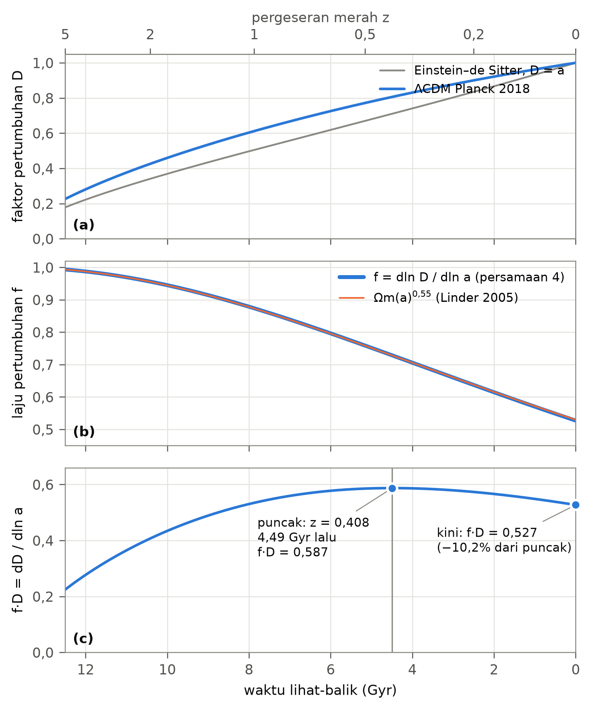
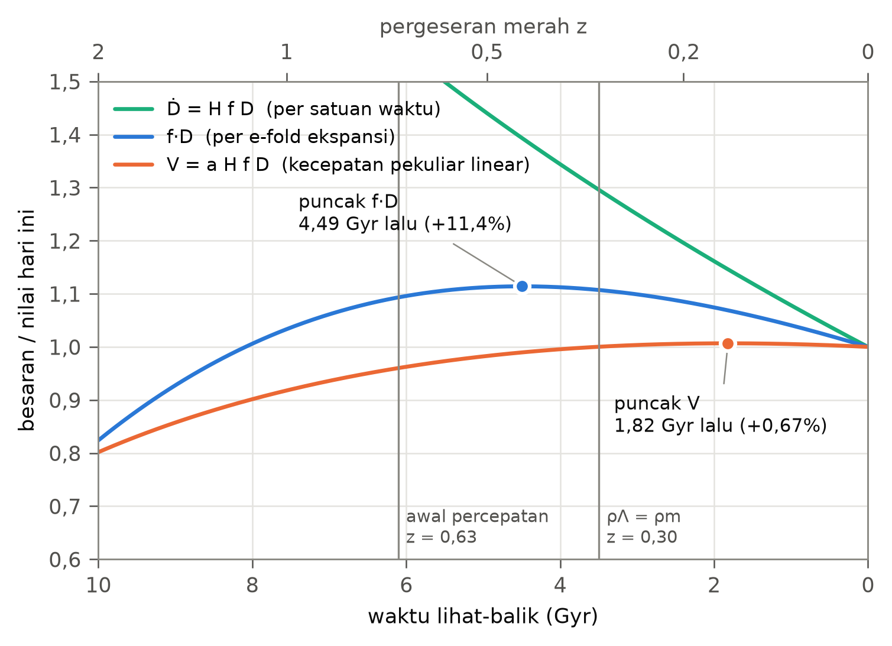
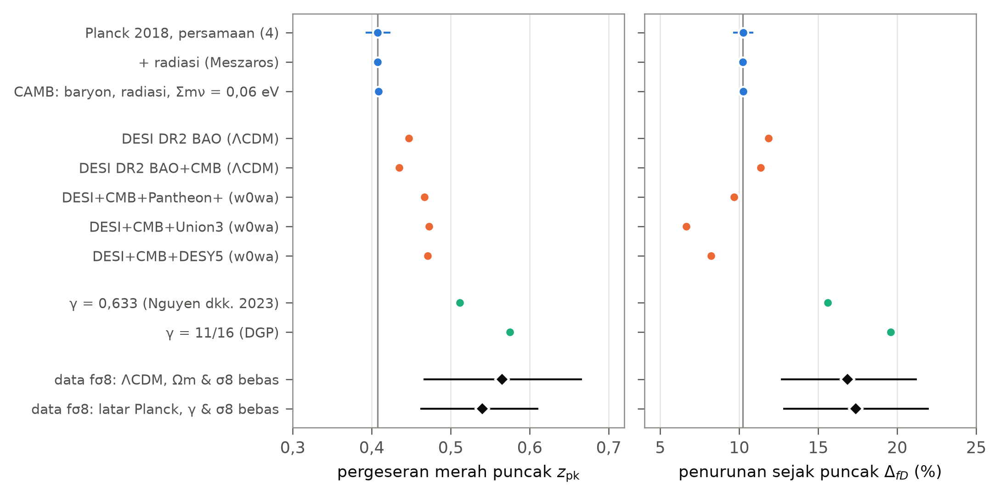
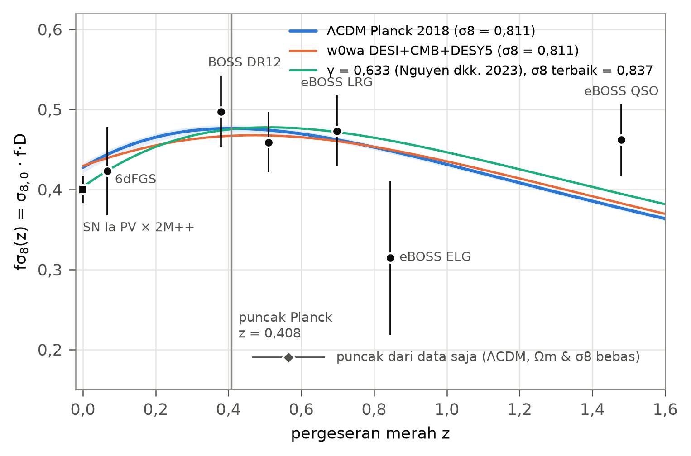
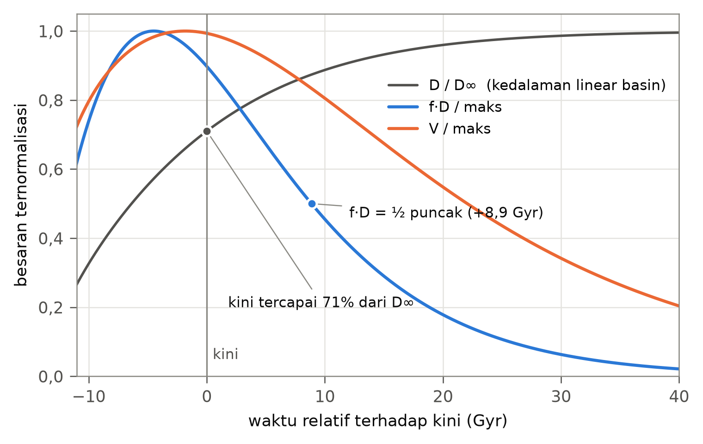

# Puncak dan Perlambatan Pertumbuhan Struktur di Basin Great Attractor: Sejarah Laju Pertumbuhan Linear f·D dalam Kosmologi ΛCDM

**Muhammad Farhan H**\
MAN Insan Cendekia Gorontalo, Indonesia

*Draf naskah, 26 September 2026*

## Abstract

**Context.** The Great Attractor (GA) is the centre of the gravitational basin that governs the motion of galaxies across the local supercluster, the Milky Way among them. Kinematic studies map where matter flows today, but not how that flow has changed over time.

**Aims.** This study asks when structure growth in the GA basin was strongest, how far it has declined since, and what exactly is declining.

**Methods.** The linear growth equation is solved numerically in a Planck 2018 ΛCDM background, following the growth rate $f$ and the growth factor $D$. We track $f\cdot D = dD/d\ln a$, the growth of the density contrast per e-fold of expansion, which equals $f\sigma_8/\sigma_{8,0}$. The solution is validated against the exact integral solution and the Boltzmann code CAMB; parameter uncertainties are propagated by Monte Carlo; DESI DR2 dark-energy models and alternative growth indices are tested; and the curve is compared with redshift-space-distortion and peculiar-velocity measurements of $f\sigma_8$.

**Results.** The product $f\cdot D$ peaked at $z = 0.408 \pm 0.016$, $4.49 \pm 0.10$ Gyr ago, and has fallen by $10.2 \pm 0.6\%$ since. In flat ΛCDM the peak occurs exactly when $\Omega_m(a) = 0.562$, i.e. when the dark-energy density reaches 78% of the matter density, whatever the present-day $\Omega_m$. The linear infall-velocity amplitude $aHfD$ peaked only 1.8 Gyr ago and lies 0.67% below its maximum, whereas the growth rate per unit time has declined monotonically. DESI DR2 cosmologies move the peak to $z = 0.43$–$0.47$ with declines of 6.7–11.8%; $f\sigma_8$ data alone, without CMB information, place it at $z = 0.56 \pm 0.10$, consistent within $1.6\sigma$. The linear density contrast of the basin can grow by at most 41% more.

**Conclusions.** Growth in the Great Attractor basin is past its maximum. The Milky Way sits in a basin that still deepens, but ever more slowly: what is slowing is the accretion of new material, not the Great Attractor's gravity itself. Because the linear growth equation is scale-independent, this history characterises the cosmological environment in which the basin grows, and it is shared by other structures at the same epoch.

**Keywords:** large-scale structure of Universe – cosmology: theory – dark energy – growth rate – Great Attractor

## Abstrak

**Latar.** Great Attractor (GA) adalah pusat basin gravitasi yang mengatur gerak galaksi di superkluster lokal, termasuk Bima Sakti. Kajian kinematik memetakan ke mana materi mengalir hari ini, tetapi tidak bagaimana aliran itu berubah terhadap waktu.

**Tujuan.** Penelitian ini menanyakan kapan pertumbuhan struktur di basin GA paling kuat, seberapa jauh pertumbuhan itu telah menurun, dan apa sebenarnya yang menurun.

**Metode.** Persamaan pertumbuhan linear diselesaikan secara numerik untuk latar ΛCDM Planck 2018 dengan melacak laju pertumbuhan $f$ dan faktor pertumbuhan $D$. Besaran yang diikuti adalah $f\cdot D = dD/d\ln a$, yaitu pertambahan kontras kerapatan per e-fold ekspansi, yang sama dengan $f\sigma_8/\sigma_{8,0}$. Solusi divalidasi terhadap solusi integral eksak dan kode Boltzmann CAMB; ketidakpastian parameter dipropagasi secara Monte Carlo; model energi gelap DESI DR2 dan indeks pertumbuhan alternatif diuji; dan kurvanya dibandingkan dengan pengukuran $f\sigma_8$ dari distorsi ruang-pergeseran merah dan kecepatan pekuliar.

**Hasil.** $f\cdot D$ mencapai puncak pada $z = 0{,}408 \pm 0{,}016$, yaitu $4{,}49 \pm 0{,}10$ Gyr lalu, dan sejak itu turun $10{,}2 \pm 0{,}6\%$. Dalam ΛCDM datar puncak itu terjadi tepat ketika $\Omega_m(a) = 0{,}562$, yakni saat kerapatan energi gelap mencapai 78% kerapatan materi, berapa pun nilai $\Omega_m$ hari ini. Amplitudo kecepatan jatuh linear $aHfD$ baru memuncak 1,8 Gyr lalu dan kini hanya 0,67% di bawah maksimumnya, sedangkan laju pertumbuhan per satuan waktu terus menurun secara monoton. Kosmologi DESI DR2 menggeser puncak ke $z = 0{,}43$–$0{,}47$ dengan penurunan 6,7–11,8%; data $f\sigma_8$ saja, tanpa informasi CMB, menempatkannya pada $z = 0{,}56 \pm 0{,}10$, konsisten dalam $1{,}6\sigma$. Kontras kerapatan linear basin paling banyak hanya dapat tumbuh 41% lagi.

**Kesimpulan.** Pertumbuhan di basin Great Attractor telah melewati puncaknya. Bima Sakti berada di basin yang masih terus mendalam, tetapi makin lambat: yang melambat adalah akresi material baru, bukan gravitasi Great Attractor itu sendiri. Karena persamaan pertumbuhan linear tidak bergantung pada skala, sejarah ini mencirikan lingkungan kosmologis tempat basin tumbuh dan berlaku pula bagi struktur lain pada epoch yang sama.

**Kata kunci:** struktur skala besar – kosmologi – energi gelap – laju pertumbuhan – Great Attractor

## 1. Pendahuluan

Great Attractor merupakan basin gravitasi yang menarik galaksi di sekitarnya dan memengaruhi dinamika galaksi di lingkungan superkluster lokal. Dalam perkembangan kajiannya, Great Attractor dipahami bukan sebagai satu benda tunggal, melainkan sebagai pusat sebuah daerah tangkapan. Bayangkan sebuah lembah luas yang diguyur hujan: air di seluruh lerengnya mengalir turun dan berkumpul di dasar lembah. Galaksi-galaksi di sekitar Great Attractor bergerak dengan cara serupa. Dari gambaran itu muncul dua pertanyaan. Pertama, kapan lembah itu paling cepat terisi, yakni kapan pertumbuhan struktur di sekitarnya mencapai puncak? Kedua, bila pertumbuhan itu kini melambat, apa sebenarnya yang melambat: tarikan gravitasi Great Attractor, atau aliran material baru ke dalamnya?

Keberadaan Great Attractor pertama kali disimpulkan dari gerak, bukan dari cahaya. Pengukuran jarak galaksi elips yang tidak bergantung pada pergeseran merah memperlihatkan aliran koheren berskala puluhan megaparsek (Dressler dkk. 1987), yang kemudian dimodelkan sebagai jatuhnya galaksi menuju satu konsentrasi massa besar ke arah Centaurus (Lynden-Bell dkk. 1988). Karena arah itu tertutup debu bidang Galaksi, pusat massanya lama sulit diamati. Survei di balik bidang Galaksi kemudian menemukan gugus Norma (ACO 3627) sebagai gugus paling masif di kawasan tersebut (Kraan-Korteweg dkk. 1996); analisis dinamika terhadap 296 anggotanya memberikan kecepatan rerata $4871 \pm 54$ km/s dan dispersi kecepatan 925 km/s (Woudt dkk. 2008). Sejak awal pula disadari bahwa tidak seluruh gerak Grup Lokal dapat dibebankan pada Great Attractor: superkluster Shapley yang lebih jauh ikut menarik (Scaramella dkk. 1989; Raychaudhury 1989; Kocevski & Ebeling 2006).

Katalog kecepatan pekuliar modern mengubah cara Great Attractor dipahami. Dengan data Cosmicflows, Tully dkk. (2014) mendefinisikan superkluster sebagai daerah tangkapan aliran, yaitu basin tarikan, dan menunjukkan bahwa Bima Sakti berada di dalam Laniakea, basin yang pusat alirannya terletak di kawasan Great Attractor. Rekonstruksi medan kecepatan dari katalog yang sama memperlihatkan bahwa gerak kita bukan hanya ditarik oleh daerah padat, tetapi juga didorong menjauh dari daerah kurang padat, yang disebut *dipole repeller* (Hoffman dkk. 2017). Katalog Cosmicflows-4 memperluas peta ini hingga sekitar 30 000 km/s (Tully dkk. 2023), dan analisis probabilistik atasnya menunjukkan bahwa batas basin-basin tarikan, termasuk basin tempat Bima Sakti berada, masih mengandung ketidakpastian yang berarti (Valade dkk. 2024). Namun seluruh konstruksi ini bersifat kinematik dan memotret satu epoch, yaitu hari ini: ia menjawab ke mana materi mengalir sekarang, bukan bagaimana laju aliran itu berubah terhadap waktu.

Evolusi terhadap waktu itu diatur oleh teori pertumbuhan struktur linear. Selama era dominasi materi, kontras kerapatan tumbuh sebanding dengan faktor skala; setelah energi gelap mendominasi, pertumbuhan itu teredam (Peebles 1980). Laju pertumbuhan $f = d\ln D/d\ln a$ dalam relativitas umum dapat didekati dengan $\Omega_m(a)^{0,55}$ (Linder 2005), dan kombinasinya dengan amplitudo fluktuasi kini diukur langsung melalui distorsi ruang-pergeseran merah (misalnya Alam dkk. 2021). Di sini perlu dibedakan dua hal yang sering tercampur. Ekspansi dipercepat (Riess dkk. 1998; Perlmutter dkk. 1999) tidak mengurangi massa Great Attractor dan tidak mengubah potensial gravitasi intinya yang sudah runtuh. Yang teredam adalah pertumbuhan kontras kerapatan di lingkungan linear sekitarnya, dan bersamanya laju material baru yang jatuh ke dalam basin. Kembali ke analogi lembah: yang berkurang bukan kedalaman lembahnya, melainkan debit air yang masih mengalir ke sana.

Kajian kinematik tentang Great Attractor jarang menempatkan basin ini secara eksplisit dalam sejarah pertumbuhan tersebut. Penelitian ini melakukannya dengan menyelesaikan secara numerik persamaan pertumbuhan linear untuk kosmologi Planck 2018 (Planck Collaboration 2020), lalu melacak hasil kali $f\cdot D = dD/d\ln a$ (pertambahan kontras kerapatan per e-fold ekspansi) untuk menentukan kapan pertumbuhan mencapai puncak dan seberapa jauh ia menurun hingga kini. Hasil itu kami uji terhadap dua pilihan "jam" lain untuk mengukur akresi, terhadap kode Boltzmann penuh, terhadap ketidakpastian parameter dan kosmologi alternatif dari DESI DR2, serta terhadap pengukuran $f\sigma_8$ yang, dengan normalisasi $D(1) = 1$, mengukur bentuk kurva $f\cdot D$ secara langsung. Bagian 2 menyajikan metode, Bagian 3 hasil, Bagian 4 keterbatasan pendekatan linear dan kaitannya dengan penelitian terdahulu, dan Bagian 5 kesimpulan.

## 2. Metode

### 2.1 Model kosmologi

Perhitungan memakai kosmologi ΛCDM datar dengan parameter Planck 2018 (Planck Collaboration 2020): $\Omega_m = 0{,}315$, $\Omega_\Lambda = 0{,}685$, dan $h = 0{,}674$. Laju ekspansi dinormalisasi terhadap nilai hari ini,

$$
E^2(a) \equiv \left[\frac{H(a)}{H_0}\right]^2 = \Omega_m\,a^{-3} + \Omega_\Lambda \tag{1}
$$

sehingga parameter kerapatan materi pada faktor skala $a$ adalah

$$
\Omega_m(a) = \frac{\Omega_m\,a^{-3}}{E^2(a)} \tag{2}
$$

dan

$$
\frac{d\ln H}{d\ln a} = -\frac{3}{2}\,\Omega_m(a) \tag{3}
$$

### 2.2 Persamaan pertumbuhan linear

$$
\frac{d^2\delta}{d(\ln a)^2} + \left(2 + \frac{d\ln H}{d\ln a}\right)\frac{d\delta}{d\ln a} - \frac{3}{2}\,\Omega_m(a)\,\delta = 0 \tag{4}
$$

Syarat awal pada era dominasi materi, $a_i = 10^{-3}$:

$$
\delta(a_i) = a_i, \qquad \left.\frac{d\delta}{d\ln a}\right|_{a_i} = a_i \tag{5}
$$

Integrasi numerik adaptif (toleransi relatif $10^{-10}$), lalu normalisasi

$$
D(a) = \frac{\delta(a)}{\delta(a=1)} \tag{6}
$$

### 2.3 Laju pertumbuhan dan besaran f·D

$$
f(a) \equiv \frac{d\ln D}{d\ln a} \tag{7}
$$

Uji: $f(1) = 0{,}527$ terhadap $\Omega_m^{0,55} = 0{,}530$ (Linder 2005).

$$
f(a)\,D(a) = \frac{dD}{d\ln a} \tag{8}
$$

yaitu pertambahan kontras kerapatan per e-fold ekspansi.

### 2.4 Epoch puncak, waktu lihat-balik, dan penurunan

$$
\left.\frac{d\,(fD)}{d\ln a}\right|_{a = a_{\mathrm{pk}}} = 0 \tag{9}
$$

dicari dengan maksimisasi numerik pada $0{,}2 \le a \le 1{,}2$, lalu dipertajam dengan mencari akar persamaan (9), yang ruas kirinya dihitung langsung dari persamaan (4).

$$
t(a) = \frac{1}{H_0}\int_0^{a}\frac{da'}{a'\,E(a')}, \qquad t_{\mathrm{lb}}(a) = t(1) - t(a), \qquad z = \frac{1}{a} - 1 \tag{10}
$$

$$
\Delta_{fD} = 1 - \frac{(fD)_{a=1}}{(fD)_{\max}} \tag{11}
$$

### 2.5 Rezim keberlakuan

Persamaan (4) linear dan tidak bergantung skala, sehingga hanya berlaku untuk $|\delta| \ll 1$, yaitu lingkungan basin di luar inti yang sudah runtuh. Inti Great Attractor (gugus Norma, dispersi kecepatan 925 km/s; Woudt dkk. 2008) telah tervirialisasi dan lepas dari ekspansi Hubble; potensial gravitasinya, $\Phi = -GM/r$, tidak dipengaruhi $D(a)$. Penurunan $f\cdot D$ karenanya ditafsirkan sebagai perlambatan pertumbuhan dan akresi material baru ke dalam basin, bukan melemahnya gravitasi inti. Karena persamaan (4) hanya memuat parameter kosmologi latar, hasilnya mencirikan lingkungan kosmologis tempat basin tumbuh dan berlaku sama bagi struktur lain pada epoch yang sama; keterbatasan ini dibahas di Bagian 4.

### 2.6 Tiga "jam" akresi

Memilih $\ln a$ sebagai jam bukan satu-satunya pilihan yang wajar, sehingga perlu diperiksa apakah puncak $f\cdot D$ hanyalah artefak pilihan itu. Tinjau bola berjari-jari komoving tetap $R$ yang berpusat di basin. Dalam teori linear, kelebihan massa di dalamnya adalah

$$
\delta M(<R, a) = \frac{4\pi}{3}\,\bar\rho_0\,R^3\,\Delta_0(R)\,D(a) \tag{12}
$$

dengan $\bar\rho_0$ kerapatan materi rerata hari ini dan $\Delta_0(R)$ kontras kerapatan rerata linear di dalam $R$ pada $a = 1$. Karena $\bar\rho_0 R^3$ tetap, seluruh perubahan $\delta M$ berasal dari materi yang melintasi permukaan bola; $\delta M$ adalah ukuran linear material yang telah diakresi basin. Laju akresi itu dapat dibaca dengan dua jam,

$$
\frac{d\,\delta M}{d\ln a} \propto f D, \qquad \frac{d\,\delta M}{dt} \propto \dot D = H f D \tag{13}
$$

sedangkan aliran yang membawa material itu memiliki kecepatan pekuliar radial (Peebles 1980)

$$
v_{\mathrm{pek}}(R, a) = -\frac{1}{3}\,H(a)\,f(a)\,aR\,\Delta_0(R)\,D(a) \;\propto\; V(a) \equiv a\,E(a)\,f(a)\,D(a) \tag{14}
$$

Jadi $f\cdot D$, $\dot D/H_0 = E f D$, dan $V$ adalah tiga cara membaca akresi yang sama: per e-fold ekspansi, per satuan waktu kosmik, dan sebagai kecepatan aliran pada jarak komoving tetap. Ketiganya hanya berbeda oleh faktor latar $E(a)$ dan $a$, dan ketiganya terhubung oleh kekekalan massa: fluks massa melalui kulit bola, $\bar\rho_0 a^{-3}\,4\pi (aR)^2\,|v_{\mathrm{pek}}|$, sama dengan $d\,\delta M/dt$. Pembanding alami adalah alam semesta Einstein–de Sitter ($\Omega_m = 1$, $D = a$), tempat $f\cdot D \propto a$ dan $V \propto a^{1/2}$ tumbuh tanpa batas, sedangkan $\dot D \propto a^{-1/2}$ menurun sejak awal. Karena itu penurunan $f\cdot D$ dan $V$ merupakan jejak energi gelap, sedangkan penurunan $\dot D$ tidak. Puncak $V$ dicari seperti persamaan (9); untuk $\dot D$ kami memeriksa apakah ia turun secara monoton pada $0{,}05 \le a \le 1$.

### 2.7 Validasi numerik dan ketidakpastian parameter

Untuk ΛCDM tanpa radiasi, persamaan (4) memiliki solusi integral eksak (Heath 1977)

$$
D(a) \propto E(a)\int_0^{a}\frac{da'}{\left[a'E(a')\right]^3} \tag{15}
$$

yang kami pakai untuk memvalidasi integrasi numerik. Kepekaan terhadap syarat awal diperiksa dengan $a_i = 10^{-4}$, $10^{-3}$, dan $10^{-2}$, dan kepekaan terhadap toleransi dengan $10^{-8}$ hingga $10^{-12}$. Pengaruh radiasi diuji dengan menambahkan $\Omega_r = 9{,}2\times10^{-5}$ (foton dan tiga spesies neutrino tak bermassa) ke persamaan (1) dan memulai integrasi pada $a = 10^{-6}$ dari mode tumbuh Meszaros, $\delta \propto 1 + 3y/2$ dengan $y = a/a_{\mathrm{eq}}$ (Meszaros 1974). Pengaruh baryon, radiasi, dan neutrino masif ($\Sigma m_\nu = 0{,}06$ eV) sekaligus diuji dengan kode Boltzmann CAMB (Lewis dkk. 2000), yang menghitung $f\sigma_8(z)$ secara langsung dari parameter dasar Planck 2018; puncak kurva $f\sigma_8(z)/\sigma_{8,0}$ dari CAMB dicari dengan spline kubik dalam $\ln a$.

Ketidakpastian parameter Planck dipropagasi secara Monte Carlo dengan $2\times10^5$ sampel. Untuk ΛCDM datar, $z_{\mathrm{pk}}$ dan $\Delta_{fD}$ hanya bergantung pada $\Omega_m$, sedangkan waktu lihat-balik berskala $1/h$. Karena CMB mengukur skala sudut akustik dengan sangat presisi, $\Omega_m$ dan $h$ terdegenerasi di sepanjang arah $\Omega_m h^3 \approx$ konstan (Planck Collaboration 2020). Kami karena itu mengambil $\Omega_m \sim \mathcal{N}(0{,}315;\,0{,}0073)$ dan $h = 0{,}674\,(0{,}315/\Omega_m)^{1/3}$; resep ini menghasilkan $\sigma(H_0) = 0{,}52$ km s$^{-1}$ Mpc$^{-1}$, sesuai dengan 0,54 km s$^{-1}$ Mpc$^{-1}$ dari Planck. Untuk $f\sigma_8$ juga diambil $\sigma_{8,0} \sim \mathcal{N}(0{,}811;\,0{,}006)$.

### 2.8 Kosmologi alternatif dan indeks pertumbuhan

Kebergantungan pada model latar diuji dengan memperluas persamaan (1) menjadi energi gelap berparameter $w(a) = w_0 + w_a(1-a)$ (Chevallier & Polarski 2001; Linder 2003):

$$
E^2(a) = \Omega_m a^{-3} + (1-\Omega_m)\,a^{-3(1+w_0+w_a)}\,e^{-3w_a(1-a)} \tag{16}
$$

dengan $d\ln H/d\ln a = -\tfrac{3}{2}\left[\Omega_m(a) + (1+w)\,\Omega_{\mathrm{DE}}(a)\right]$ menggantikan persamaan (3). Energi gelap diasumsikan tidak menggumpal sehingga persamaan (4) tetap berlaku. Kami memakai lima kosmologi dari rilis data kedua DESI (DESI Collaboration 2025; Tabel 1). Untuk model yang nilai $H_0$-nya tidak kami kutip, $h$ diturunkan dari kerapatan materi fisis CMB, $\Omega_m h^2 = 0{,}1430$; pilihan ini hanya memengaruhi waktu lihat-balik, tidak $z_{\mathrm{pk}}$ maupun $\Delta_{fD}$.

Kemungkinan bahwa gravitasi menyimpang dari relativitas umum pada skala kosmologis diuji dengan parameterisasi indeks pertumbuhan (Linder 2005; Linder & Cahn 2007),

$$
f(a) = \Omega_m(a)^{\gamma}, \qquad \ln D(a) = -\int_{\ln a}^{0}\Omega_m(a')^{\gamma}\,d\ln a' \tag{17}
$$

pada latar Planck 2018, untuk $\gamma = 0{,}55$ (pendekatan relativitas umum), $\gamma = 0{,}633$ (nilai yang disukai kombinasi data menurut Nguyen dkk. 2023), dan $\gamma = 11/16$ (gravitasi DGP; Linder & Cahn 2007).

**Tabel 1.** Kosmologi latar yang dipakai. Tanda $^a$: $h$ diturunkan dari $\Omega_m h^2 = 0{,}1430$ (lihat teks).

| Model | $\Omega_m$ | $h$ | $w_0$ | $w_a$ | Sumber |
|:-------------------------------|-------:|-------:|-------:|-------:|:-------------------------|
| Planck 2018 (fiducial) | 0,315 | 0,674 | $-1$ | 0 | Planck Collaboration (2020) |
| DESI DR2 BAO (ΛCDM) | 0,2975 | 0,693$^a$ | $-1$ | 0 | DESI Collaboration (2025) |
| DESI DR2 BAO+CMB (ΛCDM) | 0,3027 | 0,6817 | $-1$ | 0 | DESI Collaboration (2025) |
| DESI+CMB+Pantheon+ ($w_0w_a$) | 0,3114 | 0,678$^a$ | $-0{,}838$ | $-0{,}62$ | DESI Collaboration (2025) |
| DESI+CMB+Union3 ($w_0w_a$) | 0,3275 | 0,661$^a$ | $-0{,}667$ | $-1{,}09$ | DESI Collaboration (2025) |
| DESI+CMB+DESY5 ($w_0w_a$) | 0,3191 | 0,669$^a$ | $-0{,}752$ | $-0{,}86$ | DESI Collaboration (2025) |

### 2.9 Perbandingan dengan data fσ8

Dengan normalisasi $D(1) = 1$, amplitudo fluktuasi pada epoch $a$ adalah $\sigma_8(a) = \sigma_{8,0}\,D(a)$, sehingga besaran yang diukur survei distorsi ruang-pergeseran merah (Kaiser 1987; Song & Percival 2009) adalah

$$
f\sigma_8(z) = \sigma_{8,0}\,f(a)\,D(a) \tag{18}
$$

Artinya $f\cdot D$ tidak lain adalah $f\sigma_8$ yang dibagi $\sigma_8$ hari ini: data $f\sigma_8$ mengukur bentuk kurva $f\cdot D$ secara langsung, dan rasio $f\sigma_8$ pada dua epoch tidak bergantung pada $\sigma_{8,0}$. Kami memakai tujuh pengukuran (Tabel 2): $f\sigma_8$ dari kecepatan pekuliar supernova Ia yang dibandingkan dengan medan rekonstruksi 2M++ (Boruah dkk. 2020), dari distorsi ruang-pergeseran merah 6dFGS (Beutler dkk. 2012), serta hasil konsensus BOSS dan eBOSS (Alam dkk. 2017, 2021). Nilai BOSS dan eBOSS diambil dari berkas rilis resmi SDSS, termasuk kovarians antara dua bin BOSS (koefisien korelasi 0,48); nilai eBOSS ELG diperoleh dengan memarginalkan likelihood kisi resminya terhadap parameter jarak. Titik kecepatan pekuliar penting bagi penelitian ini karena diukur dalam volume lokal ($z < 0{,}067$) yang aliran besarnya didominasi kawasan Great Attractor dan Shapley; titik ini adalah ujung kurva $f\cdot D$ hari ini yang diukur di lingkungan basin itu sendiri.

**Tabel 2.** Pengukuran $f\sigma_8$ yang dipakai. Dua bin BOSS berkorelasi dengan koefisien 0,48.

| Survei | Jenis | $z_{\mathrm{eff}}$ | $f\sigma_8$ | Rujukan |
|:---------------------------|:-------------------|-------:|:----------------|:-----------------------|
| SN Ia × rekonstruksi 2M++ | kecepatan pekuliar | $\approx 0$ | $0{,}400 \pm 0{,}017$ | Boruah dkk. (2020) |
| 6dFGS | RSD | 0,067 | $0{,}423 \pm 0{,}055$ | Beutler dkk. (2012) |
| BOSS DR12 | RSD | 0,38 | $0{,}497 \pm 0{,}045$ | Alam dkk. (2017, 2021) |
| BOSS DR12 | RSD | 0,51 | $0{,}459 \pm 0{,}038$ | Alam dkk. (2017, 2021) |
| eBOSS LRG | RSD | 0,698 | $0{,}473 \pm 0{,}044$ | Alam dkk. (2021) |
| eBOSS ELG | RSD | 0,845 | $0{,}315 \pm 0{,}096$ | Alam dkk. (2021) |
| eBOSS QSO | RSD | 1,48 | $0{,}462 \pm 0{,}045$ | Alam dkk. (2021) |

Kami melakukan tiga uji: (i) $\chi^2$ kurva Planck 2018, tanpa parameter bebas, terhadap ketujuh titik; (ii) rasio $f\sigma_8$ lokal terhadap rerata terbobot dua bin BOSS, yang bebas dari $\sigma_{8,0}$; dan (iii) dua analisis posterior kisi dengan prior datar, yaitu ΛCDM datar dengan $\Omega_m$ dan $\sigma_{8,0}$ bebas, serta latar Planck dengan $\gamma$ dan $\sigma_{8,0}$ bebas. Dari masing-masing posterior diturunkan distribusi $z_{\mathrm{pk}}$ dan $\Delta_{fD}$. Analisis ΛCDM pada uji (iii) tidak memakai informasi CMB sama sekali, sehingga menjadi pembanding yang independen terhadap prediksi Planck.

### 2.10 Masa depan dan implementasi

Untuk melihat ke mana sejarah ini menuju, persamaan (4) diintegrasikan hingga $a = 10^3$, tempat $D$ telah konvergen ke nilai asimtotiknya $D_\infty$ (koreksinya berorde $a^{-3}$). Dari situ dihitung sisa pertumbuhan $D_\infty/D(1)$ dan waktu ketika $f\cdot D$ turun ke fraksi tertentu dari puncaknya. Seluruh perhitungan memakai Python dengan SciPy (integrator Runge–Kutta DOP853) dan CAMB 2.0.4; kode, hasil numerik, dan tujuh uji otomatisnya tersedia bersama naskah ini (lihat bagian Ketersediaan kode dan data).

## 3. Hasil

### 3.1 Sejarah pertumbuhan dan puncak f·D

**Gambar 1.** Sejarah pertumbuhan linear untuk kosmologi Planck 2018 terhadap waktu lihat-balik (sumbu atas: pergeseran merah). (a) Faktor pertumbuhan $D(a)$, dinormalisasi $D(1) = 1$, dibandingkan dengan solusi Einstein–de Sitter $D = a$. (b) Laju pertumbuhan $f$ dari persamaan (4) dan pendekatan $\Omega_m(a)^{0,55}$; keduanya berimpit dalam 0,5%. (c) $f\cdot D = dD/d\ln a$; titik menandai puncak ($z = 0{,}408$; 4,49 Gyr lalu) dan nilai hari ini, 10,2% di bawah puncak.

Gambar 1 memperlihatkan $D(a)$, $f(a)$, dan $f\cdot D$ untuk kosmologi Planck 2018. Dinormalisasi pada hari ini, faktor pertumbuhan ΛCDM lebih besar daripada solusi Einstein–de Sitter di sepanjang masa lalu (panel a); artinya, sebagian besar pertumbuhan telah terjadi lebih awal dan pertumbuhan belakangan berjalan lebih lambat. Laju pertumbuhan hari ini adalah $f(1) = 0{,}527$, sedangkan pendekatan Linder memberi 0,530 (panel b); sepanjang sejarah keduanya berimpit dalam 0,5%.

Hasil kali $f\cdot D$ (panel c) naik selama era materi, ketika $D$ tumbuh lebih cepat daripada $f$ menurun, lalu berbalik ketika penurunan $f$ mendominasi. Puncaknya berada pada $a_{\mathrm{pk}} = 0{,}710$ atau $z_{\mathrm{pk}} = 0{,}408$, yaitu 4,49 Gyr lalu ketika alam semesta berumur 9,30 Gyr. Pada puncak, $f = 0{,}728$ dan $D = 0{,}806$, sehingga $(f\cdot D)_{\max} = 0{,}587$; hari ini $f\cdot D = 0{,}527$. Penurunan sejak puncak adalah $\Delta_{fD} = 10{,}2\%$. Tabel 3 merangkum angka-angka ini beserta ketidakpastian 68% yang berasal dari parameter Planck.

**Tabel 3.** Hasil utama untuk kosmologi Planck 2018. Ketidakpastian adalah selang 68% dari Monte Carlo (§2.7).

| Besaran | Nilai |
|:----------------------------------------|:------------------------------------------------|
| Laju pertumbuhan hari ini, $f(1)$ | $0{,}527 \pm 0{,}007$ (pendekatan $\Omega_m^{0,55} = 0{,}530$) |
| Faktor skala puncak, $a_{\mathrm{pk}}$ | 0,710 |
| Pergeseran merah puncak, $z_{\mathrm{pk}}$ | $0{,}408 \pm 0{,}016$ |
| Waktu lihat-balik puncak, $t_{\mathrm{lb}}$ | $4{,}49 \pm 0{,}10$ Gyr (umur alam semesta saat itu 9,30 Gyr) |
| $\Omega_m(a_{\mathrm{pk}})$ | 0,5619 (sama untuk setiap ΛCDM datar; §3.2) |
| $(f\cdot D)_{\max}$ dan $(f\cdot D)_{a=1}$ | $0{,}587 \pm 0{,}003$ dan $0{,}527 \pm 0{,}007$ |
| Penurunan sejak puncak, $\Delta_{fD}$ | $10{,}2 \pm 0{,}6\%$ |
| Prediksi $f\sigma_8$ hari ini | $0{,}427 \pm 0{,}006$ |
| Puncak $V = aHfD$: $z_V$, $t_{\mathrm{lb}}$, penurunan | $0{,}138 \pm 0{,}013$; $1{,}82 \pm 0{,}14$ Gyr; $0{,}67 \pm 0{,}12\%$ |

### 3.2 Puncak terjadi pada Ωm(a) yang universal

Syarat puncak (9) dapat ditulis ulang dengan bantuan persamaan (4). Karena $d(fD)/d\ln a = d^2D/d(\ln a)^2$, persamaan (3) dan (4) memberikan

$$
\left.\frac{d\,(fD)}{d\ln a}\right|_{a_{\mathrm{pk}}} = 0 \quad\Longleftrightarrow\quad f(a_{\mathrm{pk}}) = \frac{3\,\Omega_m(a_{\mathrm{pk}})}{4 - 3\,\Omega_m(a_{\mathrm{pk}})} \tag{19}
$$

Dalam ΛCDM datar tanpa radiasi, persamaan (4) bergantung pada waktu hanya melalui $\Omega_m(a) = 1/(1+y^3)$, dengan $y = a/a_{\Lambda}$ dan $a_\Lambda = (\Omega_m/\Omega_\Lambda)^{1/3}$ faktor skala saat kerapatan materi dan energi gelap setara. Dinyatakan dalam $y$, persamaan itu sama sekali tidak memuat parameter; akibatnya $f$ adalah fungsi universal dari $\Omega_m(a)$, dan persamaan (19) mempunyai satu akar yang sama untuk setiap nilai $\Omega_m$ hari ini:

$$
\Omega_m(a_{\mathrm{pk}}) = 0{,}5619, \qquad \frac{\rho_\Lambda}{\rho_m}\bigg|_{a_{\mathrm{pk}}} = 0{,}780
$$

Secara numerik akar ini tetap sama hingga sepuluh angka desimal untuk $0{,}20 \le \Omega_m \le 0{,}45$. Dengan pendekatan $f \approx \Omega_m(a)^{0,55}$, persamaan (19) menjadi $1{,}5\,x^{0,45} + 1{,}5\,x = 2$ dengan akar $x = 0{,}5618$, sangat dekat dengan nilai eksak. Pergeseran merah puncak karenanya mempunyai bentuk tertutup

$$
1 + z_{\mathrm{pk}} = \left[\frac{1-\Omega_m}{\Omega_m}\cdot\frac{0{,}5619}{0{,}4381}\right]^{1/3} \tag{20}
$$

yang untuk $\Omega_m = 0{,}315$ memberi $z_{\mathrm{pk}} = 0{,}408$. Persamaan (20) juga menjelaskan kepekaan $z_{\mathrm{pk}}$ terhadap $\Omega_m$, yaitu $dz_{\mathrm{pk}}/d\Omega_m = -2{,}17$: nilai $\Omega_m$ yang lebih kecil memindahkan dominasi energi gelap, dan bersama itu puncak $f\cdot D$, ke masa lalu. Sebaliknya penurunan $\Delta_{fD}$ bergantung pada letak "hari ini" di kurva universal itu, dengan $d\Delta_{fD}/d\Omega_m = -0{,}88$. Makna fisis persamaan (19)–(20) sederhana: pertumbuhan per e-fold berhenti meningkat ketika kerapatan energi gelap mencapai sekitar empat perlima kerapatan materi.

### 3.3 Tiga jam dan urutan peristiwa

**Gambar 2.** Tiga "jam" akresi basin (§2.6), masing-masing dinormalisasi ke nilai hari ini: $f\cdot D$ (per e-fold ekspansi), $\dot D = HfD$ (per satuan waktu; terus naik ke masa lalu melewati batas panel), dan $V = aHfD$ (kecepatan pekuliar linear pada jarak komoving tetap). Garis tegak menandai awal percepatan ekspansi ($z = 0{,}63$) dan kesetaraan kerapatan materi dan energi gelap ($z = 0{,}30$).

Gambar 2 membandingkan tiga pembacaan akresi dari §2.6, dan Tabel 4 menempatkan puncak-puncaknya dalam urutan peristiwa latar. Hasilnya memang bergantung pada jam, dan perbedaan itu sendiri informatif.

1. Diukur per e-fold ekspansi, akresi memuncak 4,49 Gyr lalu; nilainya saat itu 11,4% di atas nilai kini.
2. Diukur per satuan waktu kosmik, laju akresi $\dot D$ turun secara monoton sepanjang sejarah. Pada epoch puncak $f\cdot D$, $\dot D$ 39% lebih tinggi daripada hari ini. Kira-kira separuh dari selisih itu akan terjadi juga di alam semesta Einstein–de Sitter, tempat $\dot D \propto a^{-1/2}$ memberi 19%; sisanya akibat energi gelap.
3. Diukur sebagai kecepatan aliran pada jarak komoving tetap, $V = aHfD$ baru memuncak 1,82 Gyr lalu ($z = 0{,}138$), ketika $\rho_\Lambda/\rho_m = 1{,}47$, dan kini hanya 0,67% di bawah maksimumnya. Pada epoch puncak $f\cdot D$, $V$ justru 1,0% lebih rendah daripada hari ini.

**Tabel 4.** Urutan peristiwa dalam kosmologi Planck 2018. Kolom $\Omega_m(a)$ dan $\rho_\Lambda/\rho_m$ sama untuk setiap ΛCDM datar; kolom $z$ dan $t_{\mathrm{lb}}$ berlaku untuk $\Omega_m = 0{,}315$, $h = 0{,}674$.

| Peristiwa | Syarat | $\Omega_m(a)$ | $\rho_\Lambda/\rho_m$ | $z$ | $t_{\mathrm{lb}}$ (Gyr) |
|:------------------------------|:-------------------|--------:|--------:|--------:|--------:|
| Awal percepatan ekspansi | $\ddot a = 0$ | 2/3 | 0,50 | 0,632 | 6,10 |
| Puncak $f\cdot D$ | persamaan (19) | 0,562 | 0,78 | 0,408 | 4,49 |
| Kesetaraan materi–energi gelap | $\rho_\Lambda = \rho_m$ | 1/2 | 1,00 | 0,296 | 3,50 |
| Puncak $V = aHfD$ | $dV/d\ln a = 0$ | 0,404 | 1,47 | 0,138 | 1,82 |
| Hari ini | — | 0,315 | 2,17 | 0 | 0 |

Urutan pada Tabel 4 bersifat universal untuk ΛCDM datar, karena setiap peristiwa terjadi pada nilai $\Omega_m(a)$ yang tetap. Puncak pertumbuhan per e-fold tertinggal 1,6 Gyr dari awal percepatan ekspansi: percepatan tidak langsung meredam pertumbuhan, karena $f\cdot D$ masih naik selama $D$ tumbuh lebih cepat daripada $f$ turun.

### 3.4 Uji ketahanan

**Gambar 3.** Uji ketahanan untuk pergeseran merah puncak $z_{\mathrm{pk}}$ (kiri) dan penurunan sejak puncak $\Delta_{fD}$ (kanan). Biru: Planck 2018 dengan selang 68%, dengan radiasi, dan dari CAMB; oranye: kosmologi DESI DR2; aqua: indeks pertumbuhan alternatif; hitam: posterior dari data $f\sigma_8$ (§3.5). Garis tegak menandai nilai fiducial.

**Validasi numerik.** Solusi numerik persamaan (4) cocok dengan solusi integral Heath (15) hingga $2\times10^{-10}$, baik pada $D$ maupun $f$. Mengubah $a_i$ antara $10^{-4}$ dan $10^{-2}$ serta toleransi antara $10^{-8}$ dan $10^{-12}$ menggeser $z_{\mathrm{pk}}$ kurang dari $3\times10^{-9}$ dan $\Delta_{fD}$ kurang dari $2\times10^{-7}$.

**Radiasi dan fisika Boltzmann.** Menambahkan radiasi menggeser puncak ke $z_{\mathrm{pk}} = 0{,}407$ dengan penurunan 10,23%. CAMB, yang memuat baryon, radiasi, dan neutrino masif, memberi $z_{\mathrm{pk}} = 0{,}409$ dan $\Delta_{fD} = 10{,}27\%$ untuk parameter dasar Planck 2018 ($\Omega_m$ efektif 0,3152, $\sigma_{8,0} = 0{,}811$, $f\sigma_8$ hari ini 0,428), sedangkan persamaan (4) dengan $\Omega_m$ yang sama memberi 0,407 dan 10,22%. Selisih $\Delta z = 0{,}001$ ini kurang dari sepersepuluh ketidakpastian statistik dan berasal terutama dari neutrino masif: tanpa neutrino masif, CAMB dan persamaan (4) sepakat hingga 0,0002 pada $z_{\mathrm{pk}}$.

**Ketidakpastian parameter.** Monte Carlo memberi $z_{\mathrm{pk}} = 0{,}408 \pm 0{,}016$, $t_{\mathrm{lb}} = 4{,}49 \pm 0{,}10$ Gyr, dan $\Delta_{fD} = 10{,}2 \pm 0{,}6\%$ (Tabel 3).

**Kosmologi DESI.** Kelima kosmologi DESI DR2 menempatkan puncak lebih awal, pada $z_{\mathrm{pk}} = 0{,}435$–$0{,}473$ atau 4,7–4,9 Gyr lalu (Tabel 5, Gambar 3). Untuk dua model ΛCDM, pergeseran ini sepenuhnya dijelaskan oleh $\Omega_m$ yang lebih kecil melalui persamaan (20), dan penurunannya sedikit lebih besar (11,4–11,8%). Tiga model $w_0w_a$ menunjukkan pola lain: puncaknya paling awal ($z_{\mathrm{pk}} \approx 0{,}47$), tetapi penurunannya lebih kecil (6,7–9,7%). Dalam model-model ini $w$ melintasi $-1$ pada $z \approx 0{,}35$–$0{,}44$ dan sejak itu $w > -1$, sehingga kerapatan energi gelap menurun menuju hari ini; pada $z = 0{,}4$ kerapatannya 7–19% lebih tinggi daripada sekarang. Akibatnya dominasi energi gelap datang lebih awal, tetapi peredaman pertumbuhan belakangan lebih lemah daripada dalam ΛCDM. Semua model DESI tetap menempatkan puncak di masa lalu dengan penurunan 7–12%.

**Indeks pertumbuhan.** Pendekatan $\gamma = 0{,}55$ memberi $z_{\mathrm{pk}} = 0{,}403$ dan $\Delta_{fD} = 9{,}75\%$; pendekatan Linder dengan demikian sedikit meremehkan penurunan dibandingkan solusi eksak persamaan (4). Pertumbuhan yang lebih teredam (γ lebih besar) memindahkan puncak ke masa lalu dan memperdalam penurunan: $\gamma = 0{,}633$ memberi $z_{\mathrm{pk}} = 0{,}511$ (5,29 Gyr lalu) dan $\Delta_{fD} = 15{,}6\%$, sedangkan $\gamma = 11/16$ memberi 0,575 dan 19,6%. Besaran $V$ jauh lebih peka terhadap $\gamma$ daripada terhadap latar: untuk $\gamma = 0{,}633$ puncaknya bergeser ke $z = 0{,}38$ dan penurunannya naik menjadi 4,6%. Pada semua model, $\dot D$ tetap turun secara monoton.

**Tabel 5.** Kepekaan epoch puncak dan penurunan terhadap metode, model latar, dan indeks pertumbuhan. Kolom $z_V$ dan $\Delta_V$ berlaku untuk $V = aHfD$.

| Model atau uji | $z_{\mathrm{pk}}$ | $t_{\mathrm{lb}}$ (Gyr) | $\Delta_{fD}$ (%) | $z_V$ | $\Delta_V$ (%) |
|:------------------------------------------|----------:|-------:|-------:|-------:|-------:|
| Planck 2018, persamaan (4) | 0,408 | 4,49 | 10,24 | 0,138 | 0,67 |
| + radiasi (mode Meszaros) | 0,407 | 4,49 | 10,23 | 0,138 | 0,67 |
| CAMB ($\Sigma m_\nu = 0{,}06$ eV) | 0,409 | — | 10,27 | — | — |
| DESI DR2 BAO (ΛCDM) | 0,447 | 4,70 | 11,84 | 0,170 | 0,98 |
| DESI DR2 BAO+CMB (ΛCDM) | 0,435 | 4,68 | 11,35 | 0,161 | 0,88 |
| DESI+CMB+Pantheon+ ($w_0w_a$) | 0,467 | 4,87 | 9,68 | 0,166 | 0,83 |
| DESI+CMB+Union3 ($w_0w_a$) | 0,473 | 4,94 | 6,65 | 0,160 | 0,64 |
| DESI+CMB+DESY5 ($w_0w_a$) | 0,471 | 4,91 | 8,21 | 0,164 | 0,74 |
| $\gamma = 0{,}55$ | 0,403 | 4,46 | 9,75 | 0,109 | 0,38 |
| $\gamma = 0{,}633$ | 0,511 | 5,29 | 15,61 | 0,377 | 4,56 |
| $\gamma = 11/16$ (DGP) | 0,575 | 5,73 | 19,59 | 0,516 | 8,57 |
| Data $f\sigma_8$: ΛCDM, $\Omega_m$ dan $\sigma_{8,0}$ bebas | $0{,}56 \pm 0{,}10$ | — | $17 \pm 4$ | — | — |
| Data $f\sigma_8$: latar Planck, $\gamma$ dan $\sigma_{8,0}$ bebas | $0{,}54^{+0,07}_{-0,08}$ | — | $17 \pm 5$ | — | — |

### 3.5 Perbandingan dengan data fσ8

**Gambar 4.** $f\sigma_8(z) = \sigma_{8,0}\,f\cdot D$: data kecepatan pekuliar (kotak) dan distorsi ruang-pergeseran merah (lingkaran) dibandingkan dengan ΛCDM Planck 2018 (biru; pita 68% dari ketidakpastian $\Omega_m$ dan $\sigma_8$), model $w_0w_a$ DESI+CMB+DESY5 dengan $\sigma_{8,0}$ yang sama (oranye), dan $\gamma = 0{,}633$ dengan $\sigma_{8,0}$ terbaik (aqua). Garis tegak menandai puncak Planck; belah ketupat di bagian bawah menunjukkan posisi puncak (median dan selang 68%) yang diturunkan dari data saja.

Gambar 4 membandingkan kurva $\sigma_{8,0}\,f\cdot D$ dengan ketujuh pengukuran. Kurva Planck 2018, tanpa parameter bebas, memberi $\chi^2 = 9{,}1$ untuk 7 titik ($p = 0{,}25$). Prediksinya untuk hari ini, $f\sigma_8 = 0{,}427 \pm 0{,}006$, lebih tinggi $1{,}5\sigma$ daripada nilai kecepatan pekuliar lokal $0{,}400 \pm 0{,}017$. Rasio yang bebas dari $\sigma_{8,0}$, yaitu $f\sigma_8$ lokal terhadap rerata BOSS pada $z_{\mathrm{eff}} = 0{,}47$, bernilai $0{,}85 \pm 0{,}07$ dalam data dan 0,90 dalam model. Data dengan demikian memperlihatkan penurunan sejak $z \approx 0{,}5$ pada tingkat $2{,}1\sigma$, dan besarnya konsisten dengan prediksi dalam $0{,}7\sigma$.

Jika bentuk kurva ditentukan oleh data saja (ΛCDM datar, $\Omega_m$ dan $\sigma_{8,0}$ bebas), posteriornya memberi $\Omega_m = 0{,}246^{+0,039}_{-0,034}$ dan $\sigma_{8,0} = 0{,}865 \pm 0{,}057$, dengan $\chi^2_{\min} = 5{,}1$ untuk 5 derajat kebebasan. Posterior itu menempatkan puncak $f\cdot D$ pada $z_{\mathrm{pk}} = 0{,}56 \pm 0{,}10$ dengan penurunan $\Delta_{fD} = 17 \pm 4\%$, konsisten dengan prediksi Planck dalam sekitar $1{,}6\sigma$ pada keduanya. Analisis dengan latar Planck serta $\gamma$ dan $\sigma_{8,0}$ bebas memberi $\gamma = 0{,}66 \pm 0{,}06$, $z_{\mathrm{pk}} = 0{,}54^{+0,07}_{-0,08}$, dan $\Delta_{fD} = 17 \pm 5\%$; nilai $\gamma$ ini sejalan dengan 0,633 dari Nguyen dkk. (2023) dan berjarak $1{,}7\sigma$ dari 0,55. Kedua analisis sepakat bahwa data sedikit menyukai puncak yang lebih awal dan penurunan yang lebih besar daripada ΛCDM Planck, tetapi belum pada tingkat yang signifikan.

### 3.6 Masa depan basin

**Gambar 5.** Masa depan pertumbuhan linear basin: $D/D_\infty$, $f\cdot D$ dibagi maksimumnya, dan $V$ dibagi maksimumnya, terhadap waktu relatif terhadap kini. Hari ini 71% dari $D_\infty$ telah tercapai; $f\cdot D$ turun ke separuh puncaknya 8,9 Gyr lagi.

Gambar 5 memperpanjang sejarah ke masa depan. Faktor pertumbuhan mendekati nilai akhir $D_\infty = 1{,}408\,D(1)$: kontras kerapatan linear di lingkungan basin hanya dapat tumbuh 41% lagi, untuk selamanya. Hari ini 71% dari pertumbuhan akhir itu telah tercapai, dan pada epoch puncak $f\cdot D$ baru 57%. $f\cdot D$ akan turun ke separuh puncaknya 8,9 Gyr lagi dan ke sepersepuluhnya 25,6 Gyr lagi; $D$ mencapai 99% dari $D_\infty$ dalam 32,9 Gyr. Kecepatan aliran $V$ turun lebih lambat daripada $f\cdot D$, karena faktor $aH$ yang tumbuh secara eksponensial sebagian mengimbangi turunnya $f D$; namun karena materi yang dibawanya terus diencerkan, akresi massa tetap membeku.

## 4. Diskusi

### 4.1 Apa yang melambat?

Hasil §3.3 menjawab pertanyaan kedua secara lebih tajam daripada yang dimungkinkan oleh satu besaran saja. Pertama, gravitasi inti tidak melambat: inti Great Attractor telah tervirialisasi (Woudt dkk. 2008), massanya tidak dikurangi oleh ekspansi, dan potensialnya tidak memuat $D(a)$ (§2.5). Kajian struktur terikat dalam alam semesta yang mengembang dipercepat menunjukkan bahwa inti semacam ini tetap terikat dan hanya makin terisolasi dari lingkungannya (Busha dkk. 2003; Dünner dkk. 2006). Kedua, kecepatan aliran menuju basin, besaran yang diukur survei kecepatan pekuliar, praktis masih berada di puncaknya: $V$ hanya 0,67% di bawah maksimum. Ketiga, yang melambat adalah akresi material baru: diukur per e-fold ekspansi, akresi turun 10,2% sejak 4,5 Gyr lalu, dan diukur per satuan waktu, ia telah turun sejak awal.

Perbedaan antara poin kedua dan ketiga tampak paradoksal, tetapi mengikuti kekekalan massa. Fluks massa melalui kulit komoving tetap sebanding dengan $\bar\rho\,(aR)^2\,v_{\mathrm{pek}} \propto a^{-1}\,V \propto HfD$ (persamaan 13–14): kecepatan yang hampir tetap membawa materi yang kian encer, karena ekspansi mengencerkan kerapatan latar sebanding dengan $a^{-3}$. Dalam bahasa analogi lembah, air masih mengalir hampir sama cepat, tetapi hujannya kian tipis, sehingga debit air yang sampai ke dasar lembah terus berkurang, dan per e-fold ekspansi berkurang sejak 4,5 Gyr lalu. Lembahnya tidak menjadi dangkal; ia hanya makin lambat bertambah dalam.

### 4.2 Keberlakuan pendekatan linear di sekitar Great Attractor

Persamaan (4) berlaku bila $|\delta| \ll 1$. Seberapa jauh dari inti syarat ini terpenuhi dapat diperkirakan dari persamaan (14) tanpa bergantung pada $H_0$. Untuk pengamat pada jarak $r$ dari pusat basin, dengan $H_0 r \approx cz_{\mathrm{GA}}$, kontras kerapatan rerata di dalam $r$ adalah

$$
\Delta(<r) \simeq \frac{3\,v_{\mathrm{pek}}}{f\,c z_{\mathrm{GA}}} \tag{21}
$$

Ambil $cz_{\mathrm{GA}} \approx 4900$ km/s (gugus Norma; Woudt dkk. 2008) dan $f = 0{,}527$. Jika komponen kecepatan Grup Lokal menuju kawasan Great Attractor berada pada rentang 200–500 km/s, yaitu sebagian dari gerak total Grup Lokal relatif terhadap CMB sebesar $627 \pm 22$ km/s (Kogut dkk. 1993), maka $\Delta \approx 0{,}2$–$0{,}6$. Dengan kata lain, Bima Sakti berada di rezim kuasi-linear: teori linear masih memberikan orde besaran yang benar, tetapi koreksi nonlinear berorde puluhan persen perlu diperhitungkan untuk analisis kuantitatif (Bernardeau dkk. 2002). Makin jauh dari pusat basin, kontras kerapatan makin kecil dan pendekatan linear makin baik; di dekat inti pendekatan ini gagal sama sekali.

Ada pula efek yang tidak ditangkap pendekatan kami. Daerah yang lebih padat daripada rerata berevolusi seperti alam semesta terpisah dengan $\Omega_m$ lokal yang lebih tinggi. Karena puncak $f\cdot D$ terikat pada $\Omega_m(a) = 0{,}562$ (§3.2), puncak lokal di lingkungan basin cenderung tertunda relatif terhadap puncak kosmik. Efek ini berorde $\Delta$ dan merupakan arah lanjutan yang alami.

### 4.3 Hasil yang berlaku umum dan apa yang khas Great Attractor

Seperti diakui di §2.5, persamaan (4) hanya memuat parameter latar, sehingga $z_{\mathrm{pk}}$ dan $\Delta_{fD}$ berlaku sama bagi basin mana pun, misalnya Shapley atau Perseus–Pisces, pada epoch yang sama. Hasil §3.2 bahkan mempertegas hal itu: dalam ΛCDM datar, epoch puncak ditentukan sepenuhnya oleh rasio $\rho_\Lambda/\rho_m$. Kami memandang universalitas ini sebagai sifat hasil, bukan cacatnya. Yang dilakukan penelitian ini bukan menghitung pertumbuhan baru khusus untuk Great Attractor, melainkan menempatkan basin yang selama ini dipelajari secara kinematik ke dalam sejarah pertumbuhan kosmik, lalu menanyakan apa arti sejarah itu bagi aliran yang kita ukur.

Tiga unsur khas Great Attractor tetap ada. Pertama, rezim: §4.2 menunjukkan bahwa Bima Sakti berada pada jarak dari pusat basin tempat pendekatan linear baru mulai berlaku. Kedua, jangkar pengamatan: pengukuran $f\sigma_8$ dari kecepatan pekuliar diperoleh dalam volume yang alirannya didominasi kawasan Great Attractor dan Shapley, sehingga ujung kurva $f\cdot D$ hari ini diukur di lingkungan basin itu sendiri, dan titik ini konsisten dengan prediksi dalam $1{,}5\sigma$ (§3.5). Ketiga, tafsiran: hasil tiga jam (§3.3) memberi arti fisis pada aliran yang terukur, yaitu bahwa kecepatan aliran menuju basin kini praktis maksimum sementara akresi massanya menurun.

### 4.4 Kaitan dengan penelitian terdahulu

Kajian kinematik Great Attractor, sejak penemuan aliran (Dressler dkk. 1987; Lynden-Bell dkk. 1988) hingga peta basin Cosmicflows (Tully dkk. 2014, 2023; Hoffman dkk. 2017; Valade dkk. 2024), memotret medan kecepatan hari ini. Penelitian ini melengkapinya dengan dimensi waktu.

Kajian tentang masa depan struktur lokal dalam alam semesta yang didominasi konstanta kosmologis sampai pada kesimpulan kualitatif yang sama dari arah berlawanan. Simulasi N-body Nagamine & Loeb (2003) menemukan bahwa dalam sekitar dua waktu Hubble (~30 Gyr) struktur skala besar membeku dalam koordinat komoving dan distribusi massa objek terikat berhenti berevolusi; perhitungan linear kami memberikan skala waktu yang sepadan, yaitu $D$ mencapai 99% nilai akhirnya dalam 32,9 Gyr. Busha dkk. (2003), Dünner dkk. (2006), dan Araya-Melo dkk. (2009) merumuskan kriteria keterikatan struktur dan superkluster dalam ekspansi dipercepat, sedangkan Tully dkk. (2014) mencatat bahwa Laniakea secara keseluruhan tidak terikat gravitasi. Studi-studi itu menjawab apa yang akan bertahan; penelitian ini menjawab kapan perlambatan dimulai dan seberapa jauh ia telah berjalan.

Dari sisi pertumbuhan kosmik, bentuk $f\sigma_8(z)$ yang memuncak pada pergeseran merah menengah sudah dikenal dalam kajian distorsi ruang-pergeseran merah (Song & Percival 2009; Huterer 2023). Kontribusi kami di sini adalah menyatakan syarat puncak dalam bentuk universal (persamaan 19–20), membedakan tiga jam akresi, dan menguji hasilnya terhadap kosmologi DESI DR2 dan data terkini. Petunjuk bahwa pertumbuhan teredam lebih kuat daripada prediksi relativitas umum (Nguyen dkk. 2023) dan preferensi DESI terhadap energi gelap dinamis (DESI Collaboration 2025) sama-sama menggeser puncak $f\cdot D$ ke masa lalu (Tabel 5). Namun pada semua kasus yang kami uji, puncak tetap berada 4,5–5,7 Gyr lalu dan penurunannya 7–20%, sehingga kesimpulan kualitatif penelitian ini tidak bergantung pada model.

### 4.5 Keterbatasan dan arah lanjutan

Beberapa keterbatasan perlu dicatat. (i) *Nonlinearitas.* Di dekat inti dan pada jarak Grup Lokal, pertumbuhan perlu dimodelkan dengan runtuh sferis atau simulasi terkendala (*constrained simulations*) yang direkonstruksi dari data Cosmicflows. (ii) *Pertumbuhan bergantung skala.* Neutrino masif membuat pertumbuhan bergantung skala; uji CAMB menunjukkan efeknya terhadap $z_{\mathrm{pk}}$ hanya sekitar 0,001, tetapi efek ini akan lebih besar bila $\Sigma m_\nu$ lebih besar. (iii) *Energi gelap dan gravitasi.* Energi gelap yang menggumpal atau gravitasi termodifikasi yang bergantung skala tidak tertangkap oleh parameterisasi $\gamma$. (iv) *Lingkungan lokal.* Efek alam semesta terpisah (§4.2) dapat menunda puncak lokal. (v) *Data.* Presisi $f\sigma_8$ saat ini belum cukup untuk menentukan $z_{\mathrm{pk}}$ secara mandiri lebih baik dari $\pm 0{,}1$; survei kecepatan pekuliar dan distorsi ruang-pergeseran merah generasi berikutnya akan memperketat uji ini, khususnya pada $z < 0{,}1$ tempat ujung kurva diukur di lingkungan basin sendiri.

## 5. Kesimpulan

Penelitian ini menempatkan basin Great Attractor dalam sejarah pertumbuhan struktur linear dan menjawab dua pertanyaan pada Pendahuluan.

1. **Kapan lembah paling cepat terisi?** Diukur per e-fold ekspansi, pertumbuhan struktur di lingkungan basin Great Attractor memuncak pada $z = 0{,}408 \pm 0{,}016$, yaitu $4{,}49 \pm 0{,}10$ Gyr lalu, dan sejak itu turun $10{,}2 \pm 0{,}6\%$. Dalam ΛCDM datar puncak ini terjadi tepat ketika $\Omega_m(a) = 0{,}562$ ($\rho_\Lambda/\rho_m = 0{,}78$), 1,6 Gyr setelah ekspansi mulai dipercepat.
2. **Apa yang melambat?** Bukan gravitasi inti Great Attractor, dan praktis bukan pula kecepatan aliran menuju basin, yang kini hanya 0,67% di bawah puncaknya 1,8 Gyr lalu. Yang melambat adalah akresi material baru: per e-fold sejak 4,5 Gyr lalu, per satuan waktu sejak awal, karena aliran yang hampir sama cepat membawa materi yang kian encer.
3. **Seberapa kokoh?** Hasilnya tidak berubah oleh metode numerik, radiasi, neutrino masif (CAMB), maupun ketidakpastian Planck. Kosmologi DESI DR2 dan indeks pertumbuhan alternatif menggeser puncak ke $z = 0{,}43$–$0{,}58$ tanpa mengubah kesimpulan, dan data $f\sigma_8$ tanpa informasi CMB menempatkan puncak pada $z = 0{,}56 \pm 0{,}10$.
4. **Ke mana arahnya?** Kontras kerapatan linear basin hanya dapat tumbuh 41% lagi; 71% dari pertumbuhan akhirnya telah tercapai, dan dalam sekitar 33 Gyr pertumbuhan itu praktis berhenti.

Bima Sakti berada di basin yang masih terus mendalam, tetapi makin lambat: yang melambat adalah akresi material baru, bukan gravitasi Great Attractor itu sendiri.

## Ketersediaan kode dan data

Seluruh kode (Python), hasil numerik, dan skrip gambar tersedia di folder `claude/paket_GA` pada repositori penulis. Perintah `python kode/jalankan_semua.py` dan `python kode/buat_gambar.py` mereproduksi setiap angka, tabel, dan gambar dalam naskah ini, dan `python tes/test_pertumbuhan.py` menjalankan tujuh uji validasi. Data $f\sigma_8$ diambil dari publikasi yang dirujuk; nilai BOSS dan eBOSS berasal dari berkas rilis resmi SDSS sebagaimana didistribusikan dalam repositori publik `CobayaSampler/bao_data`.

## Ucapan terima kasih

[Diisi penulis.]

## Daftar Pustaka

Alam S., Ata M., Bailey S., dkk., 2017, MNRAS, 470, 2617

Alam S., Aubert M., Avila S., dkk., 2021, Phys. Rev. D, 103, 083533

Araya-Melo P. A., Reisenegger A., Meza A., dkk., 2009, MNRAS, 399, 97

Bernardeau F., Colombi S., Gaztañaga E., Scoccimarro R., 2002, Phys. Rep., 367, 1

Beutler F., Blake C., Colless M., dkk., 2012, MNRAS, 423, 3430

Boruah S. S., Hudson M. J., Lavaux G., 2020, MNRAS, 498, 2703

Busha M. T., Adams F. C., Wechsler R. H., Evrard A. E., 2003, ApJ, 596, 713

Chevallier M., Polarski D., 2001, Int. J. Mod. Phys. D, 10, 213

DESI Collaboration, Abdul-Karim M., dkk., 2025, Phys. Rev. D, 112, 083515

Dressler A., Faber S. M., Burstein D., dkk., 1987, ApJ, 313, L37

Dünner R., Araya P. A., Meza A., Reisenegger A., 2006, MNRAS, 366, 803

Heath D. J., 1977, MNRAS, 179, 351

Hoffman Y., Pomarède D., Tully R. B., Courtois H. M., 2017, Nat. Astron., 1, 0036

Huterer D., 2023, A&ARv, 31, 2

Kaiser N., 1987, MNRAS, 227, 1

Kocevski D. D., Ebeling H., 2006, ApJ, 645, 1043

Kogut A., Lineweaver C., Smoot G. F., dkk., 1993, ApJ, 419, 1

Kraan-Korteweg R. C., Woudt P. A., Cayatte V., dkk., 1996, Nature, 379, 519

Lewis A., Challinor A., Lasenby A., 2000, ApJ, 538, 473

Linder E. V., 2003, Phys. Rev. Lett., 90, 091301

Linder E. V., 2005, Phys. Rev. D, 72, 043529

Linder E. V., Cahn R. N., 2007, Astropart. Phys., 28, 481

Lynden-Bell D., Faber S. M., Burstein D., dkk., 1988, ApJ, 326, 19

Meszaros P., 1974, A&A, 37, 225

Nagamine K., Loeb A., 2003, New Astron., 8, 439

Nguyen N.-M., Huterer D., Wen Y., 2023, Phys. Rev. Lett., 131, 111001

Peebles P. J. E., 1980, The Large-Scale Structure of the Universe. Princeton University Press, Princeton

Perlmutter S., Aldering G., Goldhaber G., dkk., 1999, ApJ, 517, 565

Planck Collaboration, Aghanim N., Akrami Y., dkk., 2020, A&A, 641, A6

Raychaudhury S., 1989, Nature, 342, 251

Riess A. G., Filippenko A. V., Challis P., dkk., 1998, AJ, 116, 1009

Scaramella R., Baiesi-Pillastrini G., Chincarini G., dkk., 1989, Nature, 338, 562

Song Y.-S., Percival W. J., 2009, J. Cosmol. Astropart. Phys., 10, 004

Tully R. B., Courtois H., Hoffman Y., Pomarède D., 2014, Nature, 513, 71

Tully R. B., Kourkchi E., Courtois H. M., dkk., 2023, ApJ, 944, 94

Valade A., Libeskind N. I., Pomarède D., dkk., 2024, Nat. Astron., 8, 1610

Woudt P. A., Kraan-Korteweg R. C., Lucey J., dkk., 2008, MNRAS, 383, 445
