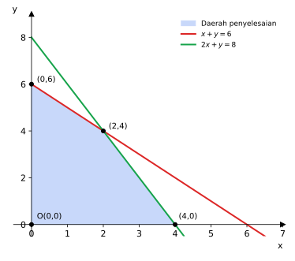

# BAB 2 — PERSAMAAN DAN PERTIDAKSAMAAN LINEAR

> **Elemen:** Aljabar · **Sub-elemen:** Persamaan dan Pertidaksamaan Linear
>
> **Cakupan TKA:** sistem persamaan linear multivariabel; sistem pertidaksamaan linear multivariabel; program linear.  
> **Batasan:** banyaknya variabel **paling banyak tiga**.

---

## A. Ringkasan Materi

### A.1 Persamaan Linear

Persamaan linear adalah persamaan yang variabelnya berpangkat **satu**.

- Satu variabel: $3x - 5 = 7$
- Dua variabel: $2x + 3y = 12$ (grafiknya berupa **garis lurus**)
- Tiga variabel: $x + y + z = 6$ (grafiknya berupa **bidang** di ruang)

### A.2 Sistem Persamaan Linear Dua Variabel (SPLDV)

Bentuk umum:
```math
\begin{cases} a_1 x + b_1 y = c_1 \\ a_2 x + b_2 y = c_2 \end{cases}
```

Penyelesaiannya adalah pasangan $(x, y)$ yang memenuhi **kedua** persamaan sekaligus. Secara grafik, itu adalah **titik potong** kedua garis.

**Metode penyelesaian**

1. **Substitusi** — nyatakan satu variabel dari salah satu persamaan, lalu masukkan ke persamaan lain.
2. **Eliminasi** — samakan koefisien salah satu variabel, lalu jumlahkan/kurangkan kedua persamaan.
3. **Campuran (eliminasi + substitusi)** — biasanya paling cepat.
4. **Grafik** — gambar kedua garis, lalu baca titik potongnya.

**Contoh.** Selesaikan $2x + 3y = 12$ dan $x - y = 1$.

*Eliminasi $x$:* kalikan persamaan kedua dengan 2 → $2x - 2y = 2$.  
Kurangkan: $(2x + 3y) - (2x - 2y) = 12 - 2 \Rightarrow 5y = 10 \Rightarrow y = 2$.  
*Substitusi:* $x = 1 + y = 3$. Jadi penyelesaiannya $(3, 2)$.

**Banyaknya penyelesaian SPLDV**

| Kondisi | Kedudukan garis | Penyelesaian |
|---|---|---|
| $\dfrac{a_1}{a_2} \neq \dfrac{b_1}{b_2}$ | berpotongan | tepat **satu** |
| $\dfrac{a_1}{a_2} = \dfrac{b_1}{b_2} \neq \dfrac{c_1}{c_2}$ | sejajar | **tidak ada** |
| $\dfrac{a_1}{a_2} = \dfrac{b_1}{b_2} = \dfrac{c_1}{c_2}$ | berimpit | **tak hingga** banyaknya |

**Bonus — metode determinan (aturan Cramer):**

$$D = a_1 b_2 - a_2 b_1, \quad D_x = c_1 b_2 - c_2 b_1, \quad D_y = a_1 c_2 - a_2 c_1, \qquad x = \frac{D_x}{D}, \quad y = \frac{D_y}{D}$$

### A.3 Sistem Persamaan Linear Tiga Variabel (SPLTV)

```math
\begin{cases} a_1 x + b_1 y + c_1 z = d_1 \\ a_2 x + b_2 y + c_2 z = d_2 \\ a_3 x + b_3 y + c_3 z = d_3 \end{cases}
```

**Strategi:** ubah SPLTV menjadi SPLDV.

1. Pilih satu variabel yang paling mudah dieliminasi (misalnya $z$).
2. Eliminasi $z$ dari pasangan persamaan (1)–(2) → persamaan (4).
3. Eliminasi $z$ dari pasangan persamaan (1)–(3) atau (2)–(3) → persamaan (5).
4. Selesaikan SPLDV (4)–(5), lalu substitusi balik untuk mencari $z$.

**Contoh.** Selesaikan
```math
\begin{cases} x + y + z = 6 & (1)\\ x - y + z = 2 & (2)\\ 2x + y - z = 1 & (3)\end{cases}
```
- (1) − (2): $2y = 4 \Rightarrow y = 2$.
- Substitusi $y = 2$ ke (1) dan (3): $x + z = 4$ dan $2x - z = -1$.
- Jumlahkan: $3x = 3 \Rightarrow x = 1$, sehingga $z = 3$.

Penyelesaiannya $(x, y, z) = (1, 2, 3)$.

### A.4 Membuat Model Matematika dari Soal Cerita

1. Tentukan apa yang dimisalkan sebagai variabel (tulis lengkap dengan satuannya: "misal $x$ = harga 1 kg apel").
2. Terjemahkan setiap kalimat informasi menjadi persamaan.
3. Selesaikan sistemnya.
4. Jawab **pertanyaan yang diminta** (sering yang ditanya bukan $x$ atau $y$, melainkan kombinasinya).

| Kalimat | Model |
|---|---|
| "tidak lebih dari", "paling banyak", "maksimal" | $\le$ |
| "tidak kurang dari", "paling sedikit", "minimal" | $\ge$ |
| "lebih dari" | $>$ |
| "kurang dari" | $<$ |
| "dua kali lipat bilangan pertama" | $2x$ |
| "5 lebih besar daripada $y$" | $y + 5$ |

### A.5 Pertidaksamaan Linear Dua Variabel (PtLDV)

Bentuk: $ax + by \le c$ (atau $<$, $\ge$, $>$). Penyelesaiannya berupa **daerah** (setengah bidang).

**Langkah menggambar daerah penyelesaian:**

1. Gambar garis batas $ax + by = c$ (cari titik potong dengan sumbu $x$ dan sumbu $y$).
   - Tanda $\le$ atau $\ge$ → garis **penuh** (titik pada garis ikut).
   - Tanda $<$ atau $>$ → garis **putus-putus**.
2. **Uji titik** yang tidak terletak pada garis, biasanya $O(0, 0)$.
   - Jika pertidaksamaan **benar** untuk titik uji → daerah yang memuat titik uji adalah daerah penyelesaian.
   - Jika **salah** → daerah di seberangnya.

**Menentukan persamaan garis dari grafik.** Garis yang memotong sumbu $x$ di $(a, 0)$ dan sumbu $y$ di $(0, b)$ adalah

$$bx + ay = ab$$

> Contoh: garis melalui $(4, 0)$ dan $(0, 2)$ → $2x + 4y = 8$ → $x + 2y = 4$.

### A.6 Sistem Pertidaksamaan Linear Dua Variabel (SPtLDV)

Daerah penyelesaian SPtLDV adalah **irisan** (bagian yang memenuhi semua) dari daerah penyelesaian setiap pertidaksamaan. Syarat $x \ge 0$ dan $y \ge 0$ berarti daerah berada di **kuadran I**.



*Gambar 2.1 — Daerah penyelesaian sistem $x + y \le 6$, $2x + y \le 8$, $x \ge 0$, $y \ge 0$ beserta titik-titik pojoknya.*

### A.7 Program Linear

Program linear adalah cara mencari nilai **optimum** (maksimum atau minimum) dari sebuah **fungsi objektif** $f(x, y) = px + qy$ dengan batasan (kendala) berupa SPtLDV.

**Langkah-langkah:**

1. Buat tabel informasi, lalu susun model matematika (kendala + fungsi objektif).
2. Gambar daerah penyelesaian (DP).
3. Tentukan **titik-titik pojok** DP (titik potong garis-garis batas).
4. Substitusikan setiap titik pojok ke fungsi objektif.
5. Nilai terbesar = maksimum; nilai terkecil = minimum.

**Contoh.** Tentukan nilai maksimum $f(x, y) = 5x + 4y$ pada daerah Gambar 2.1.

Titik potong $x + y = 6$ dan $2x + y = 8$: kurangkan → $x = 2$, lalu $y = 4$.

| Titik pojok | $f = 5x + 4y$ |
|:--:|:--:|
| $(0, 0)$ | $0$ |
| $(4, 0)$ | $20$ |
| $(2, 4)$ | $26$ ← maksimum |
| $(0, 6)$ | $24$ |

Nilai maksimumnya $26$, dicapai di titik $(2, 4)$.

**Contoh soal cerita.** Seorang penjahit memiliki 16 m kain katun dan 11 m kain sutra. Satu gaun jenis I memerlukan 2 m katun dan 1 m sutra; satu gaun jenis II memerlukan 1 m katun dan 2 m sutra. Laba gaun I Rp50.000 dan gaun II Rp40.000.

| | Gaun I ($x$) | Gaun II ($y$) | Persediaan |
|---|:--:|:--:|:--:|
| Katun | 2 | 1 | 16 |
| Sutra | 1 | 2 | 11 |
| Laba | 50.000 | 40.000 | |

Model: $2x + y \le 16$, $x + 2y \le 11$, $x \ge 0$, $y \ge 0$; fungsi objektif $f = 50\ 000x + 40\ 000y$.  
Titik pojok: $(0, 0)$, $(8, 0)$, $(0;\ 5{,}5)$, dan titik potong $(7, 2)$.

| Titik | Laba |
|:--:|:--:|
| $(8, 0)$ | Rp400.000 |
| $(7, 2)$ | Rp430.000 ← maksimum |
| $(0;\ 5{,}5)$ | Rp220.000 |

Laba maksimum Rp430.000 (7 gaun I dan 2 gaun II).

---

## B. Tips & Trik

1. **Pakai opsi jawaban.** Pada soal SPL pilihan ganda, substitusikan opsi ke persamaan — sering lebih cepat daripada menyelesaikan dari awal.
2. **Jumlahkan semua persamaan.** Jika SPLTV "simetris" dan yang ditanya $x + y + z$, jumlahkan ketiga persamaan. Contoh: $2a + j + m$, $a + 2j + m$, $a + j + 2m$ → jumlahnya $4(a + j + m)$.
3. **Eliminasi yang cerdas.** Pilih variabel yang koefisiennya sudah sama atau berlawanan tanda. Pada SPLTV, lihat apakah ada dua persamaan yang jika dijumlahkan langsung menghilangkan dua variabel.
4. **Rumus cepat garis dari grafik:** melalui $(a, 0)$ dan $(0, b)$ → $bx + ay = ab$.
5. **Uji titik $(0, 0)$.** Cara tercepat menentukan arah arsiran. Jika garis melewati $O$, uji titik lain seperti $(1, 0)$.
6. **Titik pojok selalu dari perpotongan dua garis batas** — termasuk sumbu $x$ ($y = 0$) dan sumbu $y$ ($x = 0$).
7. **Trik gradien (garis selidik).** Untuk fungsi objektif $px + qy$, geser garis $px + qy = k$. Untuk nilai **maksimum**, titik pojok terakhir yang disentuh (paling jauh dari $O$) adalah titik optimum; untuk nilai **minimum**, titik pertama yang disentuh.
8. **Perhatikan konteks:** banyak barang harus bilangan cacah; "paling sedikit" → $\ge$; "paling banyak" → $\le$.
9. **Cek kewajaran jawaban.** Harga tidak mungkin negatif; banyak orang tidak mungkin pecahan.
10. **SPL tidak punya penyelesaian ↔ garis sejajar**: perbandingan koefisien $x$ dan $y$ sama, tetapi konstantanya tidak.

---

## C. Latihan Soal

### Bagian I — Pilihan Ganda

**1.** Diketahui $x$ dan $y$ memenuhi $2x + 3y = 12$ dan $x - y = 1$. Nilai $x \cdot y$ adalah ….

- A. $5$
- B. $6$
- C. $4$
- D. $8$
- E. $3$

**2.** Harga 2 buku dan 3 pensil adalah Rp13.000, sedangkan harga 3 buku dan 1 pensil adalah Rp9.000. Harga 4 buku dan 5 pensil adalah ….

- A. Rp20.000
- B. Rp21.000
- C. Rp22.000
- D. Rp23.000
- E. Rp25.000

**3.** Sistem persamaan linear berikut yang **tidak** memiliki penyelesaian adalah ….

- A. $x + y = 3$ dan $2x + 2y = 6$
- B. $x - y = 1$ dan $x + y = 1$
- C. $3x + y = 2$ dan $x + 3y = 2$
- D. $2x - y = 3$ dan $4x - 2y = 6$
- E. $x + 2y = 4$ dan $2x + 4y = 5$

**4.** Nilai $k$ agar sistem persamaan $kx + 2y = 5$ dan $3x + 6y = 4$ **tidak** memiliki penyelesaian adalah ….

- A. $1$
- B. $2$
- C. $3$
- D. $6$
- E. $-1$

**5.** Diketahui sistem persamaan
```math
\begin{cases} x + y + z = 6 \\ x - y + z = 2 \\ 2x + y - z = 1 \end{cases}
```
Nilai $x + 2y + 3z$ adalah ….

- A. $10$
- B. $12$
- C. $14$
- D. $16$
- E. $18$

**6.** Ani membeli 2 kg apel, 1 kg jeruk, dan 1 kg mangga seharga Rp16.000. Budi membeli 1 kg apel, 2 kg jeruk, dan 1 kg mangga seharga Rp14.000. Cici membeli 1 kg apel, 1 kg jeruk, dan 2 kg mangga seharga Rp18.000. Harga 1 kg apel, 1 kg jeruk, dan 1 kg mangga seluruhnya adalah ….

- A. Rp8.000
- B. Rp9.000
- C. Rp10.000
- D. Rp11.000
- E. Rp12.000

**7.** Jumlah tiga bilangan adalah 30. Bilangan pertama sama dengan dua kali bilangan kedua, sedangkan bilangan ketiga 2 lebih besar daripada bilangan kedua. Hasil kali bilangan terbesar dan terkecil adalah ….

- A. $63$
- B. $98$
- C. $126$
- D. $84$
- E. $112$

**8.** Titik berikut yang termasuk dalam daerah penyelesaian sistem $2x + 3y \le 12$, $x \ge 0$, $y \ge 0$ adalah ….

- A. $(3, 3)$
- B. $(6, 1)$
- C. $(2, 2)$
- D. $(0, 5)$
- E. $(-1, 2)$

**9.** Suatu daerah penyelesaian di kuadran I dibatasi oleh garis yang melalui titik $(4, 0)$ dan $(0, 2)$. Daerah yang diarsir berada di bawah garis tersebut (memuat titik $O(0, 0)$). Pertidaksamaan yang sesuai adalah ….

- A. $x + 2y \le 4$
- B. $2x + y \le 4$
- C. $x + 2y \ge 4$
- D. $2x + y \ge 4$
- E. $x + 2y \le 8$

**10.** Perhatikan Gambar 2.1 (daerah penyelesaian sistem $x + y \le 6$, $2x + y \le 8$, $x \ge 0$, $y \ge 0$). Nilai maksimum $f(x, y) = 3x + 2y$ pada daerah tersebut adalah ….

- A. $10$
- B. $12$
- C. $13$
- D. $14$
- E. $18$

**11.** Nilai minimum $f(x, y) = 4x + 3y$ yang memenuhi $2x + y \ge 8$, $x + 2y \ge 10$, $x \ge 0$, $y \ge 0$ adalah ….

- A. $18$
- B. $20$
- C. $24$
- D. $30$
- E. $40$

**12.** Seorang pedagang roti membeli roti A seharga Rp2.000 per buah dan roti B seharga Rp4.000 per buah. Modalnya Rp400.000 dan etalasenya hanya dapat memuat 150 roti. Keuntungan roti A Rp1.000 per buah dan roti B Rp1.500 per buah. Keuntungan maksimum yang dapat diperoleh adalah ….

- A. Rp150.000
- B. Rp160.000
- C. Rp170.000
- D. Rp175.000
- E. Rp200.000

**13.** Sebuah pesawat memiliki tempat duduk tidak lebih dari 48 penumpang. Setiap penumpang kelas utama boleh membawa bagasi 60 kg, sedangkan penumpang kelas ekonomi 20 kg. Pesawat hanya dapat menampung bagasi 1.440 kg. Jika $x$ = banyak penumpang kelas utama dan $y$ = banyak penumpang kelas ekonomi, model matematikanya adalah ….  
*(semua opsi disertai $x \ge 0$, $y \ge 0$)*

- A. $x + y \le 48$; $x + 3y \le 72$
- B. $x + y \ge 48$; $3x + y \ge 72$
- C. $x + y \le 48$; $3x + y \le 72$
- D. $x + y \le 48$; $3x + y \ge 72$
- E. $x + y \le 72$; $3x + y \le 48$

**14.** Diketahui $\dfrac{1}{x} + \dfrac{1}{y} = \dfrac{5}{6}$ dan $\dfrac{1}{x} - \dfrac{1}{y} = \dfrac{1}{6}$. Nilai $x + y$ adalah ….

- A. $1$
- B. $6$
- C. $\frac{1}{5}$
- D. $\frac{5}{6}$
- E. $5$

**15.** Titik potong garis $3x - 2y = 7$ dan $x + 4y = 7$ adalah ….

- A. $(1, 3)$
- B. $(3, 1)$
- C. $(3, -1)$
- D. $(-1, 3)$
- E. $(1, -2)$

**16.** Lima tahun yang lalu, umur ayah 7 kali umur anaknya. Lima tahun yang akan datang, umur ayah 3 kali umur anaknya. Umur ayah sekarang adalah ….

- A. 35 tahun
- B. 38 tahun
- C. 40 tahun
- D. 42 tahun
- E. 45 tahun

**17.** Diketahui $x + 2y = 8$, $y + 2z = 11$, dan $z + 2x = 8$. Nilai $x + y + z$ adalah ….

- A. $9$
- B. $10$
- C. $12$
- D. $7$
- E. $8$

**18.** Luas daerah penyelesaian sistem pertidaksamaan $x + y \le 6$, $2x + y \le 8$, $x \ge 0$, $y \ge 0$ adalah … satuan luas.

- A. $12$
- B. $16$
- C. $18$
- D. $24$
- E. $14$

**19.** Pupuk jenis I mengandung 2 unit zat N dan 1 unit zat P per kg. Pupuk jenis II mengandung 1 unit zat N dan 2 unit zat P per kg. Sebidang kebun memerlukan paling sedikit 12 unit zat N dan 12 unit zat P. Harga pupuk I Rp5.000/kg dan pupuk II Rp4.000/kg. Biaya minimum pembelian pupuk adalah ….

- A. Rp36.000
- B. Rp40.000
- C. Rp48.000
- D. Rp52.000
- E. Rp60.000

**20.** Pasangan $(2, -1)$ merupakan penyelesaian sistem $ax + by = 5$ dan $bx + ay = -1$. Nilai $a + b$ adalah ….

- A. $2$
- B. $3$
- C. $5$
- D. $4$
- E. $6$

### Bagian II — Pilihan Ganda Kompleks (jawaban benar bisa lebih dari satu)

**21.** Titik-titik berikut yang memenuhi sistem $x + y \le 6$, $x \ge 1$, $y \ge 2$ adalah ….

- ☐ (1) $(1, 2)$
- ☐ (2) $(3, 3)$
- ☐ (3) $(4, 3)$
- ☐ (4) $(0, 4)$
- ☐ (5) $(2, 4)$

**22.** Diketahui sistem persamaan $2x - y = 3$ dan $4x - 2y = k$. Pernyataan yang benar adalah ….

- ☐ (1) Jika $k = 6$, sistem memiliki tak hingga banyak penyelesaian.
- ☐ (2) Jika $k = 5$, sistem tidak memiliki penyelesaian.
- ☐ (3) Untuk nilai $k$ berapa pun, sistem memiliki tepat satu penyelesaian.
- ☐ (4) Grafik kedua persamaan selalu sejajar atau berimpit.
- ☐ (5) Jika $k = 6$, maka $(2, 1)$ adalah salah satu penyelesaiannya.

**23.** Perhatikan Gambar 2.1 (sistem $x + y \le 6$, $2x + y \le 8$, $x \ge 0$, $y \ge 0$). Pernyataan yang benar adalah ….

- ☐ (1) Titik $(3, 2)$ termasuk daerah penyelesaian.
- ☐ (2) Nilai maksimum $f = x + y$ adalah $6$.
- ☐ (3) Nilai maksimum $f = 4x + y$ adalah $16$.
- ☐ (4) Nilai maksimum $f = 2x + 3y$ adalah $16$.
- ☐ (5) Titik $(1, 6)$ termasuk daerah penyelesaian.

**24.** Diketahui sistem $x + y + z = 10$, $x - y = 2$, dan $y - z = 1$. Pernyataan yang benar adalah ….

- ☐ (1) $x = 5$
- ☐ (2) $y + z = 5$
- ☐ (3) $xyz = 24$
- ☐ (4) $x - z = 2$
- ☐ (5) $x^2 + y^2 + z^2 = 38$

**25.** Diketahui pertidaksamaan $3x + 2y \ge 12$. Pernyataan yang benar adalah ….

- ☐ (1) Titik $(0, 0)$ termasuk daerah penyelesaian.
- ☐ (2) Titik $(4, 0)$ termasuk daerah penyelesaian.
- ☐ (3) Garis batasnya melalui titik $(0, 6)$.
- ☐ (4) Garis batasnya digambar putus-putus.
- ☐ (5) Titik $(2, 3)$ termasuk daerah penyelesaian.

### Bagian III — Benar atau Salah

**26.** Harga 2 tiket dewasa dan 3 tiket anak di sebuah taman rekreasi adalah Rp115.000. Harga 1 tiket dewasa dan 2 tiket anak adalah Rp65.000.

| | Pernyataan | B | S |
|:--:|---|:--:|:--:|
| a | Harga 1 tiket anak adalah Rp15.000. | ☐ | ☐ |
| b | Harga 1 tiket dewasa adalah Rp30.000. | ☐ | ☐ |
| c | Keluarga dengan 2 orang dewasa dan 2 anak membayar Rp100.000. | ☐ | ☐ |
| d | Dengan uang Rp200.000, rombongan berisi 4 orang dewasa dapat membeli paling banyak 4 tiket anak tambahan. | ☐ | ☐ |

**27.** Sebuah toko sepatu dapat menyimpan paling banyak 40 pasang sepatu. Harga beli sepatu A Rp200.000 per pasang dan sepatu B Rp100.000 per pasang, dengan modal Rp6.000.000. Keuntungan sepatu A Rp50.000 dan sepatu B Rp30.000 per pasang. Misalkan $x$ = banyak sepatu A dan $y$ = banyak sepatu B.

| | Pernyataan | B | S |
|:--:|---|:--:|:--:|
| a | Kendala modal dapat ditulis $2x + y \le 60$. | ☐ | ☐ |
| b | Titik $(20, 20)$ adalah salah satu titik pojok daerah penyelesaian. | ☐ | ☐ |
| c | Keuntungan maksimumnya Rp1.600.000. | ☐ | ☐ |
| d | Agar untung maksimum, toko harus membeli sepatu A saja. | ☐ | ☐ |

**28.** Diketahui sistem persamaan
```math
\begin{cases} x + y - z = 1 & (1)\\ 2x - y + z = 5 & (2)\\ x + 2y + z = 9 & (3)\end{cases}
```

| | Pernyataan | B | S |
|:--:|---|:--:|:--:|
| a | $x = 2$ | ☐ | ☐ |
| b | $y = z$ | ☐ | ☐ |
| c | $x + y + z = 7$ | ☐ | ☐ |
| d | Menjumlahkan persamaan (1) dan (2) langsung menghilangkan variabel $y$ dan $z$ sekaligus. | ☐ | ☐ |

**29.** Diketahui sistem $2x + 3y \le 12$, $2x + y \le 8$, $x \ge 0$, $y \ge 0$.

| | Pernyataan | B | S |
|:--:|---|:--:|:--:|
| a | Titik $(3, 2)$ adalah titik pojok daerah penyelesaian. | ☐ | ☐ |
| b | Nilai maksimum $f = 5x + 4y$ adalah $23$. | ☐ | ☐ |
| c | Nilai minimum $f = 5x + 4y$ pada daerah tersebut adalah $16$. | ☐ | ☐ |
| d | Titik $(2, 2)$ memenuhi sistem tersebut. | ☐ | ☐ |

### Bagian IV — Isian Singkat

**30.** Pasangan $x = 2$ dan $y = -1$ adalah penyelesaian dari sistem $ax + 3y = 5$ dan $2x + by = 10$. Nilai $a - b$ adalah ….

**31.** Sebuah celengan berisi 30 keping uang logam Rp500 dan Rp1.000 dengan jumlah total Rp21.000. Banyak uang logam Rp1.000 adalah … keping.

**32.** Nilai maksimum $f(x, y) = 20x + 30y$ dengan kendala $x + y \le 40$, $x + 3y \le 90$, $x \ge 0$, $y \ge 0$ adalah ….

**33.** Jumlah uang Ali, Budi, dan Cita adalah Rp150.000. Uang Ali Rp10.000 lebih banyak daripada uang Budi, sedangkan uang Cita dua kali uang Budi. Besar uang Cita adalah Rp….

---

## D. Kunci Jawaban dan Pembahasan

### Kunci Ringkas

| No | Kunci | No | Kunci | No | Kunci | No | Kunci |
|:--:|:--:|:--:|:--:|:--:|:--:|:--:|:--:|
| 1 | B | 10 | D | 19 | A | 28 | B, S, B, B |
| 2 | D | 11 | B | 20 | D | 29 | B, B, S, B |
| 3 | E | 12 | D | 21 | (1), (2), (5) | 30 | 10 |
| 4 | A | 13 | C | 22 | (1), (2), (4), (5) | 31 | 12 |
| 5 | C | 14 | E | 23 | (1), (2), (3) | 32 | 1.050 |
| 6 | E | 15 | B | 24 | (1), (2), (5) | 33 | 70.000 |
| 7 | B | 16 | C | 25 | (2), (3), (5) | | |
| 8 | C | 17 | A | 26 | B, S, B, B | | |
| 9 | A | 18 | E | 27 | B, B, B, S | | |

### Pembahasan

**1. Jawaban: B**  
Dari $x - y = 1$ → $x = y + 1$. Substitusi: $2(y + 1) + 3y = 12 \Rightarrow 5y = 10 \Rightarrow y = 2$, sehingga $x = 3$.  
$x \cdot y = 3 \cdot 2 = 6$.

**2. Jawaban: D**  
Misal $b$ = harga buku, $p$ = harga pensil.  
$2b + 3p = 13\ 000$ … (1) dan $3b + p = 9\ 000$ … (2).  
Dari (2): $p = 9\ 000 - 3b$. Substitusi ke (1): $2b + 27\ 000 - 9b = 13\ 000 \Rightarrow -7b = -14\ 000 \Rightarrow b = 2\ 000$, sehingga $p = 3\ 000$.  
$4b + 5p = 8\ 000 + 15\ 000 = 23\ 000$.

**3. Jawaban: E**  
SPL tidak punya penyelesaian jika $\dfrac{a_1}{a_2} = \dfrac{b_1}{b_2} \neq \dfrac{c_1}{c_2}$.  
Pada E: $\dfrac{1}{2} = \dfrac{2}{4} \neq \dfrac{4}{5}$ → garis sejajar → tidak ada penyelesaian.  
A dan D berimpit (tak hingga penyelesaian); B dan C berpotongan (tepat satu).

**4. Jawaban: A**  
Syarat sejajar: $\dfrac{k}{3} = \dfrac{2}{6} \Rightarrow k = 1$. Periksa konstanta: $\dfrac{5}{4} \neq \dfrac{2}{6}$ ✔, jadi benar-benar sejajar (bukan berimpit).

**5. Jawaban: C**  
Seperti contoh di materi: (1) − (2) → $2y = 4 \Rightarrow y = 2$. Lalu $x + z = 4$ dan $2x - z = -1$ → $3x = 3 \Rightarrow x = 1$, $z = 3$.  
$x + 2y + 3z = 1 + 4 + 9 = 14$.

**6. Jawaban: E**  
Misal $a$, $j$, $m$ = harga per kg apel, jeruk, mangga.  
$2a + j + m = 16\ 000$, $\ a + 2j + m = 14\ 000$, $\ a + j + 2m = 18\ 000$.  
**Trik:** jumlahkan ketiganya → $4a + 4j + 4m = 48\ 000 \Rightarrow a + j + m = 12\ 000$.  
(Tidak perlu mencari harga masing-masing!)

**7. Jawaban: B**  
Misal bilangan kedua $= b$. Bilangan pertama $= 2b$, bilangan ketiga $= b + 2$.  
$2b + b + (b + 2) = 30 \Rightarrow 4b = 28 \Rightarrow b = 7$.  
Ketiga bilangan: $14$, $7$, $9$. Terbesar × terkecil $= 14 \times 7 = 98$.

**8. Jawaban: C**  
Uji tiap titik pada $2x + 3y \le 12$ (serta $x, y \ge 0$):  
A: $6 + 9 = 15$ ✘ · B: $12 + 3 = 15$ ✘ · C: $4 + 6 = 10 \le 12$ ✔ · D: $0 + 15 = 15$ ✘ · E: $x = -1 < 0$ ✘.

**9. Jawaban: A**  
Garis melalui $(4, 0)$ dan $(0, 2)$: $2x + 4y = 8 \Rightarrow x + 2y = 4$.  
Daerah memuat $O(0, 0)$: $0 + 0 = 0 \le 4$ benar, sehingga tandanya $\le$. Jadi $x + 2y \le 4$.

**10. Jawaban: D**  
Titik pojok: $(0, 0)$, $(4, 0)$, $(2, 4)$, $(0, 6)$.  
$f(0,0) = 0$, $f(4,0) = 12$, $f(2,4) = 6 + 8 = 14$, $f(0,6) = 12$. Maksimum $= 14$.

**11. Jawaban: B**  
Daerah penyelesaian berada di **atas** kedua garis (tidak memuat $O$). Titik pojoknya:
- $2x + y = 8$ memotong sumbu $y$ di $(0, 8)$;
- $x + 2y = 10$ memotong sumbu $x$ di $(10, 0)$;
- titik potong kedua garis: dari $y = 8 - 2x$ → $x + 16 - 4x = 10 \Rightarrow x = 2$, $y = 4$ → $(2, 4)$.

$f(0, 8) = 24$, $f(2, 4) = 8 + 12 = 20$, $f(10, 0) = 40$. Minimum $= 20$.

**12. Jawaban: D**  
Misal $x$ = roti A dan $y$ = roti B.  
Kendala: $x + y \le 150$; $2\ 000x + 4\ 000y \le 400\ 000 \Rightarrow x + 2y \le 200$; $x, y \ge 0$.  
Titik potong: $(x + 2y) - (x + y) = 200 - 150 \Rightarrow y = 50$, $x = 100$.

| Titik | $f = 1\ 000x + 1\ 500y$ |
|:--:|:--:|
| $(150, 0)$ | 150.000 |
| $(100, 50)$ | 175.000 ← maks |
| $(0, 100)$ | 150.000 |

**13. Jawaban: C**  
Tempat duduk: $x + y \le 48$.  
Bagasi: $60x + 20y \le 1\ 440$; bagi 20 → $3x + y \le 72$.

**14. Jawaban: E**  
Misal $p = \frac{1}{x}$ dan $q = \frac{1}{y}$: $p + q = \frac{5}{6}$ dan $p - q = \frac{1}{6}$.  
Jumlahkan: $2p = 1 \Rightarrow p = \frac{1}{2} \Rightarrow x = 2$. Maka $q = \frac{5}{6} - \frac{1}{2} = \frac{1}{3} \Rightarrow y = 3$.  
$x + y = 5$.

**15. Jawaban: B**  
Dari $x + 4y = 7$ → $x = 7 - 4y$. Substitusi: $3(7 - 4y) - 2y = 7 \Rightarrow 21 - 14y = 7 \Rightarrow y = 1$, sehingga $x = 3$. Titik potongnya $(3, 1)$.

**16. Jawaban: C**  
Misal umur ayah sekarang $a$ dan umur anak sekarang $b$.  
$a - 5 = 7(b - 5) \Rightarrow a = 7b - 30$  
$a + 5 = 3(b + 5) \Rightarrow a = 3b + 10$  
Samakan: $7b - 30 = 3b + 10 \Rightarrow b = 10$, sehingga $a = 40$ tahun.

**17. Jawaban: A**  
Jumlahkan ketiga persamaan: $(x + 2y) + (y + 2z) + (z + 2x) = 8 + 11 + 8$  
$3x + 3y + 3z = 27 \Rightarrow x + y + z = 9$.  
(Penyelesaian lengkapnya $x = 2$, $y = 3$, $z = 4$.)

**18. Jawaban: E**  
Titik pojok: $O(0,0)$, $(4, 0)$, $(2, 4)$, $(0, 6)$. Bagi menjadi dua segitiga:
- Segitiga $O$–$(4,0)$–$(2,4)$: alas 4, tinggi 4 → luas $= \frac{1}{2}\cdot 4 \cdot 4 = 8$.
- Segitiga $O$–$(2,4)$–$(0,6)$: alas (pada sumbu $y$) 6, tinggi (jarak ke sumbu $y$) 2 → luas $= \frac{1}{2}\cdot 6 \cdot 2 = 6$.

Total luas $= 14$ satuan luas.

**19. Jawaban: A**  
Misal $x$ = kg pupuk I, $y$ = kg pupuk II.  
Kendala: $2x + y \ge 12$ (zat N), $x + 2y \ge 12$ (zat P), $x, y \ge 0$. Fungsi biaya: $f = 5\ 000x + 4\ 000y$.  
Titik pojok: $(0, 12)$, $(12, 0)$, dan titik potong $(4, 4)$.  
$f(0,12) = 48\ 000$, $f(4,4) = 20\ 000 + 16\ 000 = 36\ 000$, $f(12,0) = 60\ 000$. Minimum Rp36.000.

**20. Jawaban: D**  
Substitusi $(2, -1)$: $2a - b = 5$ … (1) dan $2b - a = -1$ … (2).  
Dari (1): $b = 2a - 5$. Ke (2): $4a - 10 - a = -1 \Rightarrow 3a = 9 \Rightarrow a = 3$, sehingga $b = 1$.  
$a + b = 4$.

**21. Jawaban: (1), (2), (5)**  
(1) $(1,2)$: $3 \le 6$ ✔ · (2) $(3,3)$: $6 \le 6$ ✔ · (3) $(4,3)$: $7 > 6$ ✘ · (4) $(0,4)$: $x = 0 < 1$ ✘ · (5) $(2,4)$: $6 \le 6$ ✔

**22. Jawaban: (1), (2), (4), (5)**  
Persamaan kedua $4x - 2y = k$ memiliki koefisien 2 kali persamaan pertama.
- $k = 6$ → persamaan kedua sama dengan 2 × persamaan pertama → **berimpit** → tak hingga penyelesaian. (1) ✔
- $k \neq 6$ (misal $k = 5$) → **sejajar** → tidak ada penyelesaian. (2) ✔
- (3) ✘, karena tidak pernah tepat satu penyelesaian.
- (4) ✔, gradien kedua garis selalu sama.
- (5) $2(2) - 1 = 3$ ✔ dan $4(2) - 2(1) = 6$ ✔.

**23. Jawaban: (1), (2), (3)**
- (1) $3 + 2 = 5 \le 6$ dan $6 + 2 = 8 \le 8$ ✔ (terletak pada garis batas, tetap termasuk).
- (2) $x + y$ di titik pojok: $0, 4, 6, 6$ → maksimum $6$ ✔.
- (3) $4x + y$: $0, 16, 12, 6$ → maksimum $16$ ✔.
- (4) $2x + 3y$: $0, 8, 16, 18$ → maksimum $18$, bukan $16$ ✘.
- (5) $1 + 6 = 7 > 6$ ✘.

**24. Jawaban: (1), (2), (5)**  
Dari $x = y + 2$ dan $z = y - 1$: $(y + 2) + y + (y - 1) = 10 \Rightarrow 3y = 9 \Rightarrow y = 3$. Maka $x = 5$, $z = 2$.  
(1) ✔ · (2) $3 + 2 = 5$ ✔ · (3) $xyz = 30$ ✘ · (4) $x - z = 3$ ✘ · (5) $25 + 9 + 4 = 38$ ✔

**25. Jawaban: (2), (3), (5)**
- (1) $0 \ge 12$ salah ✘ → daerah penyelesaian tidak memuat $O$.
- (2) $12 \ge 12$ ✔
- (3) $x = 0 \Rightarrow 2y = 12 \Rightarrow y = 6$ ✔
- (4) Tanda $\ge$ → garis **penuh** ✘
- (5) $6 + 6 = 12 \ge 12$ ✔

**26. Jawaban: a. B, b. S, c. B, d. B**  
Misal $d$ = tiket dewasa, $a$ = tiket anak: $2d + 3a = 115\ 000$ dan $d + 2a = 65\ 000$.  
Kalikan persamaan kedua dengan 2: $2d + 4a = 130\ 000$. Kurangkan: $a = 15\ 000$, sehingga $d = 35\ 000$.
- a. ✔
- b. ✘ ($35\ 000$)
- c. $2(35\ 000) + 2(15\ 000) = 100\ 000$ ✔
- d. $4 \times 35\ 000 = 140\ 000$; sisa $60\ 000 \div 15\ 000 = 4$ tiket anak ✔

**27. Jawaban: a. B, b. B, c. B, d. S**  
Kendala: $x + y \le 40$; $200\ 000x + 100\ 000y \le 6\ 000\ 000 \Rightarrow 2x + y \le 60$ (a ✔).  
Titik potong: $(2x + y) - (x + y) = 60 - 40 \Rightarrow x = 20$, $y = 20$ (b ✔).

| Titik | $f = 50\ 000x + 30\ 000y$ |
|:--:|:--:|
| $(30, 0)$ | 1.500.000 |
| $(20, 20)$ | 1.600.000 ← maks |
| $(0, 40)$ | 1.200.000 |

c ✔. d ✘, karena keuntungan maksimum dicapai saat membeli 20 sepatu A **dan** 20 sepatu B.

**28. Jawaban: a. B, b. S, c. B, d. B**  
(1) + (2): $3x = 6 \Rightarrow x = 2$ (d ✔ — $y$ dan $z$ hilang sekaligus).  
Substitusi $x = 2$: dari (1) $y - z = -1$; dari (3) $2y + z = 7$. Jumlahkan: $3y = 6 \Rightarrow y = 2$, $z = 3$.  
a ✔ · b ✘ ($y = 2 \neq z = 3$) · c $2 + 2 + 3 = 7$ ✔

**29. Jawaban: a. B, b. B, c. S, d. B**  
Titik potong $2x + 3y = 12$ dan $2x + y = 8$: kurangkan → $2y = 4 \Rightarrow y = 2$, $x = 3$ (a ✔).  
Titik pojok: $(0,0)$, $(4,0)$, $(3,2)$, $(0,4)$ → $f = 5x + 4y$: $0$, $20$, $23$, $16$.  
b ✔ (maks 23) · c ✘ (minimum $0$ di titik $O$) · d $4 + 6 = 10 \le 12$ dan $4 + 2 = 6 \le 8$ ✔

**30. Jawaban: 10**  
$2a + 3(-1) = 5 \Rightarrow a = 4$; $\ 2(2) + b(-1) = 10 \Rightarrow b = -6$.  
$a - b = 4 - (-6) = 10$.

**31. Jawaban: 12 keping**  
Misal $x$ = keping Rp500, $y$ = keping Rp1.000.  
$x + y = 30$ dan $500x + 1\ 000y = 21\ 000 \Rightarrow x + 2y = 42$.  
Kurangkan: $y = 12$.

**32. Jawaban: 1.050**  
Titik potong $x + y = 40$ dan $x + 3y = 90$: $2y = 50 \Rightarrow y = 25$, $x = 15$.  
Titik pojok: $(40, 0) \to 800$; $(15, 25) \to 300 + 750 = 1\ 050$; $(0, 30) \to 900$. Maksimum $1\ 050$.

**33. Jawaban: Rp70.000**  
Misal uang Budi $= b$ (ribu rupiah). Ali $= b + 10$, Cita $= 2b$.  
$(b + 10) + b + 2b = 150 \Rightarrow 4b = 140 \Rightarrow b = 35$. Uang Cita $= 70$ ribu $=$ Rp70.000.
