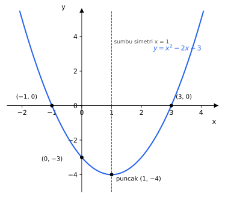
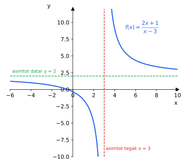

# BAB 3 — FUNGSI

> **Elemen:** Aljabar · **Sub-elemen:** Fungsi
>
> **Cakupan TKA:** domain, kodomain, daerah hasil (range); representasi fungsi linear, kuadrat, dan rasional dalam berbagai bentuk; invers fungsi dan representasinya; fungsi komposisi dan representasinya.  
> **Batasan:** identifikasi fungsi secara **analitis** (rumus) dan **grafis** (gambar).

---

## A. Ringkasan Materi

### A.1 Relasi dan Fungsi

**Relasi** dari himpunan $A$ ke $B$ adalah aturan yang memasangkan anggota $A$ dengan anggota $B$.

**Fungsi** (pemetaan) dari $A$ ke $B$ adalah relasi yang memasangkan **setiap** anggota $A$ dengan **tepat satu** anggota $B$.

- **Domain** ($D_f$, daerah asal) = himpunan $A$.
- **Kodomain** (daerah kawan) = himpunan $B$.
- **Range** ($R_f$, daerah hasil) = himpunan anggota $B$ yang **benar-benar** mendapat pasangan. Range selalu bagian dari kodomain.

> **Contoh.** $A = \lbrace 1, 2, 3 \rbrace$, $B = \lbrace a, b, c, d \rbrace$, dan $f = \lbrace (1, a), (2, a), (3, c) \rbrace$.  
> $f$ adalah fungsi karena setiap anggota $A$ punya tepat satu pasangan.  
> Domain $= \lbrace 1, 2, 3 \rbrace$, kodomain $= \lbrace a, b, c, d \rbrace$, range $= \lbrace a, c \rbrace$.

**Cara mengenali fungsi**

| Bentuk penyajian | Syarat disebut fungsi |
|---|---|
| Diagram panah | Setiap anggota domain memiliki **tepat satu** anak panah keluar. |
| Pasangan berurutan | Tidak ada dua pasangan dengan **anggota pertama sama** tetapi anggota kedua berbeda. |
| Grafik | **Uji garis vertikal**: setiap garis tegak memotong grafik paling banyak di satu titik. |

**Istilah penting**

- **Injektif (satu-satu):** tidak ada dua anggota domain yang punya peta sama. (Uji garis **horizontal** memotong paling banyak satu titik.)
- **Surjektif (onto):** range = kodomain.
- **Bijektif (korespondensi satu-satu):** injektif dan surjektif sekaligus. Hanya fungsi bijektif yang **punya invers**.

**Banyak fungsi:** jika $n(A) = a$ dan $n(B) = b$, banyak fungsi dari $A$ ke $B$ adalah $b^a$. Banyak korespondensi satu-satu antara dua himpunan yang masing-masing beranggota $n$ adalah $n!$.

### A.2 Menentukan Domain Alami

Jika domain tidak disebutkan, domainnya adalah semua bilangan real yang membuat rumus **terdefinisi**.

| Bentuk fungsi | Syarat domain |
|---|---|
| Polinom ($2x + 1$, $x^2 - 3x$) | semua bilangan real |
| Pecahan $\dfrac{P(x)}{Q(x)}$ | $Q(x) \neq 0$ |
| Akar genap $\sqrt{P(x)}$ | $P(x) \ge 0$ |
| Gabungan $\dfrac{\sqrt{P(x)}}{Q(x)}$ | $P(x) \ge 0$ **dan** $Q(x) \neq 0$ |
| $\dfrac{1}{\sqrt{P(x)}}$ | $P(x) > 0$ |

> **Contoh.** Domain $f(x) = \dfrac{\sqrt{x + 2}}{x - 1}$ adalah $x \ge -2$ dan $x \neq 1$, ditulis $\lbrace x \mid x \ge -2,\ x \neq 1,\ x \in \mathbb{R} \rbrace$.

### A.3 Fungsi Linear

$$f(x) = mx + c$$

- Grafiknya **garis lurus**; $m$ = gradien (kemiringan), $c$ = titik potong dengan sumbu $y$.
- $m > 0$ → grafik naik; $m < 0$ → grafik turun; $m = 0$ → fungsi konstan.
- Jika domainnya semua bilangan real dan $m \neq 0$, range-nya juga semua bilangan real.

**Menentukan fungsi linear dari dua titik** $(x_1, y_1)$ dan $(x_2, y_2)$:

$$m = \frac{y_2 - y_1}{x_2 - x_1}, \qquad f(x) = m(x - x_1) + y_1$$

> **Contoh.** $f(1) = 5$ dan $f(3) = 11$. Gradien $m = \frac{11 - 5}{3 - 1} = 3$, sehingga $f(x) = 3(x - 1) + 5 = 3x + 2$.

**Range pada domain terbatas:** untuk fungsi linear cukup hitung nilai fungsi di **ujung-ujung** domain.

### A.4 Fungsi Kuadrat

$$f(x) = ax^2 + bx + c, \qquad a \neq 0$$

Grafiknya berbentuk **parabola**.

| Unsur | Rumus / Ciri |
|---|---|
| Arah buka | $a > 0$ terbuka ke **atas** (punya nilai minimum); $a < 0$ terbuka ke **bawah** (punya nilai maksimum) |
| Sumbu simetri | $x_p = -\dfrac{b}{2a}$ |
| Titik puncak | $\left(-\dfrac{b}{2a},\ -\dfrac{D}{4a}\right)$ dengan $D = b^2 - 4ac$; atau cukup hitung $y_p = f(x_p)$ |
| Titik potong sumbu $y$ | $(0, c)$ |
| Titik potong sumbu $x$ | akar-akar $ax^2 + bx + c = 0$ |
| Diskriminan | $D > 0$: memotong sumbu $x$ di dua titik; $D = 0$: menyinggung; $D < 0$: tidak memotong |
| Range (domain $\mathbb{R}$) | $a > 0$: $y \ge y_p$; $a < 0$: $y \le y_p$ |

*Gambar 3.1 — Grafik $y = x^2 - 2x - 3$: terbuka ke atas, memotong sumbu $x$ di $(-1, 0)$ dan $(3, 0)$, memotong sumbu $y$ di $(0, -3)$, puncak $(1, -4)$. Range-nya $\lbrace y \mid y \ge -4 \rbrace$.*

**Tiga cara menentukan rumus fungsi kuadrat dari informasi grafik**

| Informasi yang diketahui | Gunakan bentuk |
|---|---|
| Titik puncak $(x_p, y_p)$ + satu titik lain | $y = a(x - x_p)^2 + y_p$ |
| Dua titik potong sumbu $x$: $(x_1, 0)$, $(x_2, 0)$ + satu titik lain | $y = a(x - x_1)(x - x_2)$ |
| Tiga titik sembarang | $y = ax^2 + bx + c$, lalu selesaikan SPLTV |

> **Contoh.** Parabola berpuncak $(1, -4)$ dan melalui $(0, -3)$.  
> $y = a(x - 1)^2 - 4$. Substitusi $(0, -3)$: $-3 = a - 4 \Rightarrow a = 1$.  
> Jadi $y = (x - 1)^2 - 4 = x^2 - 2x - 3$ (sesuai Gambar 3.1).

### A.5 Fungsi Rasional

Fungsi rasional berbentuk pecahan polinom. Bentuk yang paling sering muncul:

$$f(x) = \frac{ax + b}{cx + d}, \qquad c \neq 0$$

| Unsur | Rumus |
|---|---|
| Domain | $x \neq -\dfrac{d}{c}$ |
| Asimtot tegak | $x = -\dfrac{d}{c}$ (pembuat nol penyebut) |
| Asimtot datar | $y = \dfrac{a}{c}$ (perbandingan koefisien $x$) |
| Range | $y \neq \dfrac{a}{c}$ |
| Titik potong sumbu $x$ | $ax + b = 0 \Rightarrow x = -\dfrac{b}{a}$ |
| Titik potong sumbu $y$ | $\left(0, \dfrac{b}{d}\right)$ |

*Gambar 3.2 — Grafik $f(x) = \dfrac{2x + 1}{x - 3}$: asimtot tegak $x = 3$, asimtot datar $y = 2$. Grafik mendekati kedua garis itu tetapi tidak pernah memotong asimtot tegak.*

### A.6 Fungsi Komposisi

$$(f \circ g)(x) = f\big(g(x)\big) \qquad \text{("f bundaran g": kerjakan } g \text{ dulu, lalu hasilnya dimasukkan ke } f)$$

> **Contoh.** $f(x) = 2x - 3$ dan $g(x) = x^2 + 1$.  
> $(f \circ g)(x) = f(x^2 + 1) = 2(x^2 + 1) - 3 = 2x^2 - 1$  
> $(g \circ f)(x) = g(2x - 3) = (2x - 3)^2 + 1 = 4x^2 - 12x + 10$

**Sifat komposisi**

- Umumnya **tidak komutatif**: $f \circ g \neq g \circ f$.
- **Asosiatif**: $(f \circ g) \circ h = f \circ (g \circ h)$.
- Fungsi identitas $I(x) = x$: $f \circ I = I \circ f = f$.

**Menentukan fungsi yang belum diketahui**

1. *Diketahui $f \circ g$ dan $f$, dicari $g$:* tulis $f(g(x))$ memakai rumus $f$, lalu selesaikan untuk $g(x)$.
   > $f(x) = 2x + 1$, $(f \circ g)(x) = 6x - 5$ → $2g(x) + 1 = 6x - 5 \Rightarrow g(x) = 3x - 3$.
2. *Diketahui $f \circ g$ dan $g$, dicari $f$:* misalkan $u = g(x)$, nyatakan $x$ dalam $u$, lalu substitusikan.
   > $g(x) = x + 2$, $(f \circ g)(x) = x^2 + 4x + 5$ → $f(x + 2) = (x + 2)^2 + 1 \Rightarrow f(x) = x^2 + 1$.

### A.7 Fungsi Invers

Invers $f^{-1}$ "membalik" kerja $f$: jika $f(a) = b$, maka $f^{-1}(b) = a$.

**Langkah mencari invers:**
1. Tulis $y = f(x)$.
2. Nyatakan $x$ dalam $y$.
3. Ganti $x$ menjadi $f^{-1}(x)$ dan $y$ menjadi $x$.

> **Contoh.** $f(x) = \dfrac{3x - 2}{5}$ → $y = \dfrac{3x - 2}{5} \Rightarrow 5y = 3x - 2 \Rightarrow x = \dfrac{5y + 2}{3}$. Jadi $f^{-1}(x) = \dfrac{5x + 2}{3}$.

**Rumus cepat invers**

| $f(x)$ | $f^{-1}(x)$ |
|---|---|
| $ax + b$ | $\dfrac{x - b}{a}$ |
| $\dfrac{ax + b}{cx + d}$ | $\dfrac{-dx + b}{cx - a}$ (tukar posisi $a$ dan $d$, lalu ubah tandanya) |
| $a(x - p)^2 + q$, dengan $a > 0$ dan $x \ge p$ | $p + \sqrt{\dfrac{x - q}{a}}$ |

**Sifat-sifat invers**

- $(f \circ f^{-1})(x) = (f^{-1} \circ f)(x) = x$
- $(f \circ g)^{-1}(x) = (g^{-1} \circ f^{-1})(x)$ — urutannya **terbalik**
- Grafik $f$ dan $f^{-1}$ **simetris terhadap garis $y = x$**.
- Domain $f^{-1}$ = range $f$, dan range $f^{-1}$ = domain $f$.
- Fungsi kuadrat pada domain $\mathbb{R}$ **tidak** punya invers (tidak injektif). Domainnya harus dibatasi dulu, misalnya $x \ge x_p$.

---

## B. Tips & Trik

1. **$f^{-1}(a) = b \iff f(b) = a$.** Jika yang ditanya hanya nilai $f^{-1}(a)$, **tidak perlu** mencari rumus inversnya — cukup selesaikan $f(x) = a$.
2. **$(f \circ g)(a)$:** hitung $g(a)$ dulu (angka), lalu masukkan ke $f$. Jauh lebih cepat daripada mencari rumus $f \circ g$.
3. **Rumus invers pecahan:** $\dfrac{ax + b}{cx + d} \to \dfrac{-dx + b}{cx - a}$ — "$a$ dan $d$ bertukar tempat dan berganti tanda".
4. **Range fungsi rasional** $\dfrac{ax + b}{cx + d}$: $y \neq \dfrac{a}{c}$. **Domain**-nya: $x \neq -\dfrac{d}{c}$.
5. **Titik puncak:** $x_p = -\dfrac{b}{2a}$, lalu $y_p = f(x_p)$. Tidak perlu menghafal $-\dfrac{D}{4a}$.
6. **Cek opsi dengan angka.** Untuk soal "tentukan $f(x)$" atau "tentukan $g(x)$", substitusikan $x = 0$ atau $x = 1$ ke soal dan ke opsi. Opsi yang tidak cocok langsung gugur.
7. **Soal cerita dua tahap produksi** = fungsi komposisi. Jika yang diketahui hasil akhirnya → gunakan invers.
8. **Nilai maksimum/minimum** fungsi kuadrat = $y_p$. Pada soal cerita (tinggi bola, luas maksimum, keuntungan maksimum), cari $x_p$ lalu hitung $f(x_p)$.
9. **Hati-hati domain terbatas.** Range fungsi kuadrat pada interval $[p, q]$: bandingkan $f(p)$, $f(q)$, dan $y_p$ (jika $x_p$ berada di dalam interval).
10. **Pertidaksamaan kuadrat untuk domain akar:** faktorkan, cari pembuat nol, lalu gunakan garis bilangan. Untuk $(x - p)(x - q) \ge 0$ dengan $p < q$: $x \le p$ atau $x \ge q$.

---

## C. Latihan Soal

### Bagian I — Pilihan Ganda

**1.** Relasi berikut yang merupakan fungsi adalah ….

- A. $\lbrace (1, 2), (1, 3), (2, 4) \rbrace$
- B. $\lbrace (2, 1), (3, 1), (2, 5) \rbrace$
- C. $\lbrace (1, a), (2, a), (3, b) \rbrace$
- D. $\lbrace (a, 1), (a, 2), (b, 3) \rbrace$
- E. $\lbrace (1, 1), (2, 2), (1, 3) \rbrace$

**2.** Domain fungsi $f(x) = \dfrac{\sqrt{x - 3}}{x - 5}$ adalah ….

- A. $\lbrace x \mid x \ge 3,\ x \neq 5 \rbrace$
- B. $\lbrace x \mid x > 3,\ x \neq 5 \rbrace$
- C. $\lbrace x \mid x \ge 3 \rbrace$
- D. $\lbrace x \mid x \neq 5 \rbrace$
- E. $\lbrace x \mid x \le 3 \rbrace$

**3.** Domain fungsi $f(x) = \sqrt{x^2 - 4x - 12}$ adalah ….

- A. $\lbrace x \mid -2 \le x \le 6 \rbrace$
- B. $\lbrace x \mid x \le -6 \text{ atau } x \ge 2 \rbrace$
- C. $\lbrace x \mid -6 \le x \le 2 \rbrace$
- D. $\lbrace x \mid x \ge 6 \rbrace$
- E. $\lbrace x \mid x \le -2 \text{ atau } x \ge 6 \rbrace$

**4.** Daerah hasil fungsi $f(x) = 2x - 1$ dengan domain $\lbrace x \mid -1 \le x \le 3 \rbrace$ adalah ….

- A. $\lbrace y \mid -1 \le y \le 3 \rbrace$
- B. $\lbrace y \mid -3 \le y \le 5 \rbrace$
- C. $\lbrace y \mid -3 \le y \le 3 \rbrace$
- D. $\lbrace y \mid -2 \le y \le 6 \rbrace$
- E. $\lbrace y \mid 1 \le y \le 5 \rbrace$

**5.** Fungsi linear $f$ memenuhi $f(2) = 7$ dan $f(-1) = -2$. Nilai $f(5)$ adalah ….

- A. $13$
- B. $14$
- C. $15$
- D. $16$
- E. $17$

**6.** Koordinat titik puncak grafik $f(x) = x^2 - 6x + 5$ adalah ….

- A. $(3, -4)$
- B. $(-3, 32)$
- C. $(3, 4)$
- D. $(-3, -4)$
- E. $(6, 5)$

**7.** Daerah hasil fungsi $f(x) = -x^2 + 4x + 1$ dengan domain bilangan real adalah ….

- A. $\lbrace y \mid y \ge 5 \rbrace$
- B. $\lbrace y \mid y \le 1 \rbrace$
- C. $\lbrace y \mid y \le 5 \rbrace$
- D. $\lbrace y \mid y \ge -5 \rbrace$
- E. $\lbrace y \mid y \in \mathbb{R} \rbrace$

**8.** Grafik fungsi kuadrat mempunyai titik puncak $(2, 1)$ dan melalui titik $(0, 5)$. Persamaan grafik fungsi tersebut adalah ….

- A. $y = x^2 + 4x + 5$
- B. $y = -x^2 + 4x + 5$
- C. $y = x^2 - 4x + 3$
- D. $y = 2x^2 - 8x + 9$
- E. $y = x^2 - 4x + 5$

**9.** Grafik fungsi kuadrat memotong sumbu $x$ di titik $(-1, 0)$ dan $(3, 0)$ serta melalui titik $(0, 6)$. Nilai maksimum fungsi tersebut adalah ….

- A. $6$
- B. $8$
- C. $7$
- D. $9$
- E. $10$

**10.** Persamaan asimtot tegak dan asimtot datar grafik $f(x) = \dfrac{4x - 1}{2x + 6}$ berturut-turut adalah ….

- A. $x = 3$ dan $y = 2$
- B. $x = -3$ dan $y = -\frac{1}{6}$
- C. $x = -3$ dan $y = 4$
- D. $x = -3$ dan $y = 2$
- E. $x = \frac{1}{4}$ dan $y = 2$

**11.** Daerah hasil fungsi $f(x) = \dfrac{3x - 2}{x + 4}$, $x \neq -4$, adalah ….

- A. $\lbrace y \mid y \neq 3,\ y \in \mathbb{R} \rbrace$
- B. $\lbrace y \mid y \neq -4,\ y \in \mathbb{R} \rbrace$
- C. $\lbrace y \mid y \neq \frac{2}{3},\ y \in \mathbb{R} \rbrace$
- D. $\lbrace y \mid y \neq -\frac{1}{2},\ y \in \mathbb{R} \rbrace$
- E. $\lbrace y \mid y \neq 4,\ y \in \mathbb{R} \rbrace$

**12.** Diketahui $f(x) = 2x - 3$ dan $g(x) = x^2 + 1$. Rumus $(f \circ g)(x)$ adalah ….

- A. $2x^2 - 2$
- B. $4x^2 - 12x + 10$
- C. $2x^2 - 1$
- D. $2x^2 + 1$
- E. $4x^2 - 12x + 9$

**13.** Diketahui $f(x) = 3x - 1$ dan $g(x) = x^2 - 2x$. Nilai $(g \circ f)(2)$ adalah ….

- A. $5$
- B. $10$
- C. $20$
- D. $35$
- E. $15$

**14.** Diketahui $g(x) = x + 2$ dan $(f \circ g)(x) = x^2 + 4x + 5$. Rumus $f(x)$ adalah ….

- A. $x^2 + 4x + 3$
- B. $x^2 + 1$
- C. $x^2 - 1$
- D. $x^2 + 2$
- E. $x^2 + 4x + 1$

**15.** Diketahui $f(x) = 2x + 1$ dan $(f \circ g)(x) = 6x - 5$. Rumus $g(x)$ adalah ….

- A. $3x - 2$
- B. $3x + 3$
- C. $4x - 6$
- D. $3x - 3$
- E. $12x - 9$

**16.** Invers dari fungsi $f(x) = \dfrac{3x - 2}{5}$ adalah $f^{-1}(x) = \dots$

- A. $\dfrac{5x + 2}{3}$
- B. $\dfrac{5x - 2}{3}$
- C. $\dfrac{3x + 2}{5}$
- D. $\dfrac{2 - 5x}{3}$
- E. $\dfrac{5}{3x - 2}$

**17.** Invers dari fungsi $f(x) = \dfrac{2x + 3}{x - 1}$, $x \neq 1$, adalah $f^{-1}(x) = \dots$

- A. $\dfrac{x - 3}{x + 2},\ x \neq -2$
- B. $\dfrac{x + 1}{2x - 3},\ x \neq \frac{3}{2}$
- C. $\dfrac{x + 3}{x - 2},\ x \neq 2$
- D. $\dfrac{x - 1}{2x + 3},\ x \neq -\frac{3}{2}$
- E. $\dfrac{2x - 3}{x + 1},\ x \neq -1$

**18.** Diketahui $f(x) = 2x^3 - 11$. Nilai $f^{-1}(5)$ adalah ….

- A. $1$
- B. $2$
- C. $3$
- D. $239$
- E. $\frac{1}{2}$

**19.** Diketahui $f(x) = 2x + 4$ dan $g(x) = x - 1$. Nilai $(f \circ g)^{-1}(8)$ adalah ….

- A. $2$
- B. $4$
- C. $5$
- D. $18$
- E. $3$

**20.** Sebuah pabrik mengolah kayu menjadi kertas dalam dua tahap. Tahap pertama mengubah $x$ ton kayu menjadi bubur kertas sebanyak $f(x) = 0{,}8x - 2$ ton. Tahap kedua mengubah $x$ ton bubur kertas menjadi kertas sebanyak $g(x) = 0{,}5x + 1$ ton. Jika kertas yang dihasilkan 20 ton, banyak kayu yang diolah adalah ….

- A. 38 ton
- B. 40 ton
- C. 45 ton
- D. 50 ton
- E. 60 ton

### Bagian II — Pilihan Ganda Kompleks (jawaban benar bisa lebih dari satu)

**21.** Diketahui $f(x) = x^2 - 2x - 8$. Pernyataan yang benar adalah ….

- ☐ (1) Grafiknya terbuka ke atas.
- ☐ (2) Grafiknya memotong sumbu $x$ di $(-2, 0)$ dan $(4, 0)$.
- ☐ (3) Titik puncaknya $(1, -9)$.
- ☐ (4) Grafiknya memotong sumbu $y$ di $(0, 8)$.
- ☐ (5) Nilai minimumnya $-8$.

**22.** Diketahui $f(x) = \dfrac{x - 1}{x + 2}$. Pernyataan yang benar adalah ….

- ☐ (1) Domainnya $\lbrace x \mid x \neq -2 \rbrace$.
- ☐ (2) Asimtot datarnya $y = 1$.
- ☐ (3) $f(0) = \frac{1}{2}$.
- ☐ (4) $f^{-1}(x) = \dfrac{2x + 1}{1 - x}$.
- ☐ (5) Range-nya $\lbrace y \mid y \neq -2 \rbrace$.

**23.** Diketahui $f(x) = 3x + 2$ dan $g(x) = x - 1$. Pernyataan yang benar adalah ….

- ☐ (1) $(f \circ g)(x) = 3x - 1$
- ☐ (2) $(g \circ f)(x) = 3x + 1$
- ☐ (3) $f \circ g = g \circ f$
- ☐ (4) $f^{-1}(x) = \dfrac{x - 2}{3}$
- ☐ (5) $(f \circ g)(2) = 5$

**24.** Dengan domain semua bilangan real (kecuali yang membuat penyebut nol), fungsi yang range-nya **semua bilangan real** adalah ….

- ☐ (1) $f(x) = 2x + 5$
- ☐ (2) $f(x) = x^2$
- ☐ (3) $f(x) = -3x$
- ☐ (4) $f(x) = x^2 + 1$
- ☐ (5) $f(x) = \dfrac{1}{x}$

**25.** Pernyataan tentang fungsi invers dan komposisi yang benar adalah ….

- ☐ (1) $(f \circ f^{-1})(x) = x$
- ☐ (2) $(f \circ g)^{-1} = f^{-1} \circ g^{-1}$
- ☐ (3) Grafik $f$ dan $f^{-1}$ simetris terhadap garis $y = x$.
- ☐ (4) Setiap fungsi kuadrat dengan domain $\mathbb{R}$ memiliki invers.
- ☐ (5) Jika $f(3) = 7$, maka $f^{-1}(7) = 3$.

### Bagian III — Benar atau Salah

**26.** Diketahui $A = \lbrace 1, 2, 3 \rbrace$ dan $B = \lbrace a, b \rbrace$.

| | Pernyataan | B | S |
|:--:|---|:--:|:--:|
| a | Banyak fungsi dari $A$ ke $B$ adalah 8. | ☐ | ☐ |
| b | Banyak fungsi dari $B$ ke $A$ adalah 6. | ☐ | ☐ |
| c | Relasi $\lbrace (1, a), (2, a), (3, a) \rbrace$ merupakan fungsi dari $A$ ke $B$. | ☐ | ☐ |
| d | Dapat dibuat korespondensi satu-satu antara $A$ dan $B$. | ☐ | ☐ |

**27.** Diketahui fungsi kuadrat $f(x) = -x^2 + 2x + 3$.

| | Pernyataan | B | S |
|:--:|---|:--:|:--:|
| a | Sumbu simetrinya $x = 1$. | ☐ | ☐ |
| b | Nilai maksimumnya $4$. | ☐ | ☐ |
| c | Grafiknya memotong sumbu $x$ di $(1, 0)$ dan $(-3, 0)$. | ☐ | ☐ |
| d | Daerah hasilnya $\lbrace y \mid y \ge 4 \rbrace$. | ☐ | ☐ |

**28.** Tarif taksi *online* terdiri atas biaya buka pintu Rp8.000 ditambah Rp4.000 per kilometer. Tarif untuk perjalanan $x$ km dinyatakan dengan $T(x) = 4\ 000x + 8\ 000$.

| | Pernyataan | B | S |
|:--:|---|:--:|:--:|
| a | Tarif perjalanan 12 km adalah Rp56.000. | ☐ | ☐ |
| b | $T$ adalah fungsi linear dengan gradien 8.000. | ☐ | ☐ |
| c | Dengan uang Rp100.000, jarak terjauh yang dapat ditempuh adalah 23 km. | ☐ | ☐ |
| d | $T^{-1}(x) = \dfrac{x - 8\ 000}{4\ 000}$ menyatakan jarak tempuh jika tarifnya $x$ rupiah. | ☐ | ☐ |

**29.** Diketahui $f(x) = 2x - 1$ dan $g(x) = \dfrac{x + 1}{2}$.

| | Pernyataan | B | S |
|:--:|---|:--:|:--:|
| a | $(f \circ g)(x) = x$ | ☐ | ☐ |
| b | $g$ adalah invers dari $f$. | ☐ | ☐ |
| c | $(g \circ f)(3) = 3$ | ☐ | ☐ |
| d | $f(g(0)) = 1$ | ☐ | ☐ |

### Bagian IV — Isian Singkat

**30.** Diketahui $f(x) = x^2 - 3x + 2$ dan $f(a) = 12$ dengan $a > 0$. Nilai $a$ adalah ….

**31.** Diketahui $f(x) = 2x + 3$ dan $(g \circ f)(x) = 4x^2 + 12x + 10$. Nilai $g(3)$ adalah ….

**32.** Diketahui $f(x) = \dfrac{4x - 1}{2x + 3}$. Nilai $f^{-1}(1)$ adalah ….

**33.** Sebuah bola dilempar vertikal ke atas. Tinggi bola setelah $t$ detik adalah $h(t) = 20t - 5t^2$ meter. Tinggi maksimum yang dapat dicapai bola adalah … meter.

---

## D. Kunci Jawaban dan Pembahasan

### Kunci Ringkas

| No | Kunci | No | Kunci | No | Kunci | No | Kunci |
|:--:|:--:|:--:|:--:|:--:|:--:|:--:|:--:|
| 1 | C | 10 | D | 19 | E | 28 | B, S, B, B |
| 2 | A | 11 | A | 20 | D | 29 | B, B, B, S |
| 3 | E | 12 | C | 21 | (1), (2), (3) | 30 | 5 |
| 4 | B | 13 | E | 22 | (1), (2), (4) | 31 | 10 |
| 5 | D | 14 | B | 23 | (1), (2), (4), (5) | 32 | 2 |
| 6 | A | 15 | D | 24 | (1), (3) | 33 | 20 |
| 7 | C | 16 | A | 25 | (1), (3), (5) | | |
| 8 | E | 17 | C | 26 | B, S, B, S | | |
| 9 | B | 18 | B | 27 | B, B, S, S | | |

### Pembahasan

**1. Jawaban: C**  
Pada fungsi, setiap anggota domain (anggota pertama pasangan) hanya boleh muncul **satu kali**.  
A: angka 1 muncul dua kali ✘ · B: angka 2 dua kali ✘ · C: 1, 2, 3 masing-masing sekali ✔ (dua anggota boleh punya peta yang sama) · D: $a$ dua kali ✘ · E: angka 1 dua kali ✘.

**2. Jawaban: A**  
Syarat akar: $x - 3 \ge 0 \Rightarrow x \ge 3$. Syarat penyebut: $x - 5 \neq 0 \Rightarrow x \neq 5$.  
Domain $= \lbrace x \mid x \ge 3,\ x \neq 5 \rbrace$. (Opsi B salah karena $x = 3$ boleh: $f(3) = 0$.)

**3. Jawaban: E**  
Syarat: $x^2 - 4x - 12 \ge 0 \Rightarrow (x - 6)(x + 2) \ge 0$. Pembuat nol: $x = -2$ dan $x = 6$.  
Uji garis bilangan: untuk $x = 0$ nilainya $-12 < 0$ (negatif di tengah), sehingga yang memenuhi adalah bagian luar: $x \le -2$ atau $x \ge 6$.

**4. Jawaban: B**  
Fungsi linear naik ($m = 2 > 0$), jadi cukup hitung nilai di ujung domain:  
$f(-1) = -3$ dan $f(3) = 5$. Range $= \lbrace y \mid -3 \le y \le 5 \rbrace$.

**5. Jawaban: D**  
$m = \dfrac{7 - (-2)}{2 - (-1)} = \dfrac{9}{3} = 3$. $f(x) = 3(x - 2) + 7 = 3x + 1$.  
$f(5) = 16$.

**6. Jawaban: A**  
$x_p = -\dfrac{-6}{2(1)} = 3$ dan $y_p = f(3) = 9 - 18 + 5 = -4$. Puncak $(3, -4)$.

**7. Jawaban: C**  
$a = -1 < 0$ → terbuka ke bawah → punya nilai maksimum.  
$x_p = -\dfrac{4}{2(-1)} = 2$, $y_p = -4 + 8 + 1 = 5$. Range $= \lbrace y \mid y \le 5 \rbrace$.

**8. Jawaban: E**  
$y = a(x - 2)^2 + 1$. Melalui $(0, 5)$: $5 = 4a + 1 \Rightarrow a = 1$.  
$y = (x - 2)^2 + 1 = x^2 - 4x + 5$.

**9. Jawaban: B**  
$y = a(x + 1)(x - 3)$. Melalui $(0, 6)$: $6 = a(1)(-3) \Rightarrow a = -2$.  
$y = -2(x^2 - 2x - 3) = -2x^2 + 4x + 6$.  
Sumbu simetri berada di tengah-tengah akar: $x_p = \dfrac{-1 + 3}{2} = 1$. Nilai maksimum $y_p = -2 + 4 + 6 = 8$.

**10. Jawaban: D**  
Asimtot tegak: $2x + 6 = 0 \Rightarrow x = -3$. Asimtot datar: $y = \dfrac{4}{2} = 2$.

**11. Jawaban: A**  
Untuk $f(x) = \dfrac{ax + b}{cx + d}$, range-nya $y \neq \dfrac{a}{c} = \dfrac{3}{1} = 3$.  
*Bukti singkat:* $y = \dfrac{3x - 2}{x + 4} \Rightarrow x = \dfrac{-4y - 2}{y - 3}$, yang tidak terdefinisi hanya saat $y = 3$.

**12. Jawaban: C**  
$(f \circ g)(x) = f(g(x)) = 2(x^2 + 1) - 3 = 2x^2 - 1$. (Opsi B adalah $g \circ f$, jebakan!)

**13. Jawaban: E**  
$f(2) = 3(2) - 1 = 5$, lalu $g(5) = 25 - 10 = 15$.

**14. Jawaban: B**  
$f(x + 2) = x^2 + 4x + 5 = (x + 2)^2 + 1$. Ganti $x + 2$ dengan $x$: $f(x) = x^2 + 1$.  
*Cara substitusi:* misal $u = x + 2 \Rightarrow x = u - 2$: $f(u) = (u - 2)^2 + 4(u - 2) + 5 = u^2 + 1$.

**15. Jawaban: D**  
$(f \circ g)(x) = 2g(x) + 1 = 6x - 5 \Rightarrow 2g(x) = 6x - 6 \Rightarrow g(x) = 3x - 3$.

**16. Jawaban: A**  
$y = \dfrac{3x - 2}{5} \Rightarrow 5y + 2 = 3x \Rightarrow x = \dfrac{5y + 2}{3}$. Jadi $f^{-1}(x) = \dfrac{5x + 2}{3}$.

**17. Jawaban: C**  
Rumus cepat $\dfrac{ax + b}{cx + d} \to \dfrac{-dx + b}{cx - a}$ dengan $a = 2$, $b = 3$, $c = 1$, $d = -1$:  
$f^{-1}(x) = \dfrac{x + 3}{x - 2}$, $x \neq 2$.  
*Cek:* $f(2) = \dfrac{7}{1} = 7$ dan $f^{-1}(7) = \dfrac{10}{5} = 2$ ✔

**18. Jawaban: B**  
$f^{-1}(5) = b \iff f(b) = 5$: $2b^3 - 11 = 5 \Rightarrow b^3 = 8 \Rightarrow b = 2$.

**19. Jawaban: E**  
$(f \circ g)(x) = 2(x - 1) + 4 = 2x + 2$.  
$(f \circ g)^{-1}(8) = b \iff 2b + 2 = 8 \Rightarrow b = 3$.

**20. Jawaban: D**  
Kertas yang dihasilkan dari $x$ ton kayu: $(g \circ f)(x) = 0{,}5(0{,}8x - 2) + 1 = 0{,}4x$.  
$0{,}4x = 20 \Rightarrow x = 50$ ton.

**21. Jawaban: (1), (2), (3)**
- (1) $a = 1 > 0$ ✔
- (2) $x^2 - 2x - 8 = (x - 4)(x + 2) = 0 \Rightarrow x = 4$ atau $x = -2$ ✔
- (3) $x_p = 1$, $f(1) = 1 - 2 - 8 = -9$ ✔
- (4) $f(0) = -8$, bukan $8$ ✘
- (5) Nilai minimum $= y_p = -9$ ✘

**22. Jawaban: (1), (2), (4)**
- (1) $x + 2 \neq 0$ ✔
- (2) $y = \frac{1}{1} = 1$ ✔
- (3) $f(0) = \frac{-1}{2}$ ✘
- (4) Rumus cepat ($a = 1$, $b = -1$, $c = 1$, $d = 2$): $\dfrac{-2x - 1}{x - 1} = \dfrac{2x + 1}{1 - x}$ ✔
- (5) Range $y \neq 1$ ✘

**23. Jawaban: (1), (2), (4), (5)**  
(1) $3(x - 1) + 2 = 3x - 1$ ✔ · (2) $(3x + 2) - 1 = 3x + 1$ ✔ · (3) keduanya berbeda ✘ · (4) ✔ · (5) $3(2) - 1 = 5$ ✔

**24. Jawaban: (1), (3)**  
Fungsi linear dengan gradien tak nol memiliki range $\mathbb{R}$ → (1) dan (3).  
$x^2$ memiliki range $y \ge 0$; $x^2 + 1$ memiliki range $y \ge 1$; $\frac{1}{x}$ memiliki range $y \neq 0$.

**25. Jawaban: (1), (3), (5)**  
(2) salah, seharusnya $(f \circ g)^{-1} = g^{-1} \circ f^{-1}$.  
(4) salah, fungsi kuadrat tidak injektif pada $\mathbb{R}$ (misal $f(-1) = f(1)$ untuk $f(x) = x^2$).

**26. Jawaban: a. B, b. S, c. B, d. S**
- a. $n(B)^{n(A)} = 2^3 = 8$ ✔
- b. $n(A)^{n(B)} = 3^2 = 9$, bukan 6 ✘
- c. Setiap anggota $A$ punya tepat satu pasangan ✔
- d. Korespondensi satu-satu mensyaratkan banyak anggota sama; $3 \neq 2$ ✘

**27. Jawaban: a. B, b. B, c. S, d. S**
- a. $x_p = -\dfrac{2}{2(-1)} = 1$ ✔
- b. $f(1) = -1 + 2 + 3 = 4$ ✔
- c. $-x^2 + 2x + 3 = 0 \Rightarrow x^2 - 2x - 3 = 0 \Rightarrow (x - 3)(x + 1) = 0$ → titik $(3, 0)$ dan $(-1, 0)$ ✘
- d. Terbuka ke bawah, sehingga range $y \le 4$ ✘

**28. Jawaban: a. B, b. S, c. B, d. B**
- a. $4\ 000(12) + 8\ 000 = 56\ 000$ ✔
- b. Gradiennya $4\ 000$ (tarif per km), bukan $8\ 000$ ✘
- c. $4\ 000x + 8\ 000 \le 100\ 000 \Rightarrow x \le 23$ ✔
- d. Dari $y = 4\ 000x + 8\ 000$ → $x = \dfrac{y - 8\ 000}{4\ 000}$ ✔

**29. Jawaban: a. B, b. B, c. B, d. S**
- a. $f(g(x)) = 2 \cdot \dfrac{x + 1}{2} - 1 = x$ ✔
- b. Karena $f \circ g = I$ (dan juga $g \circ f = I$), $g = f^{-1}$ ✔
- c. $f(3) = 5$, $g(5) = 3$ ✔
- d. $f(g(0)) = 0$, bukan $1$ ✘

**30. Jawaban: 5**  
$a^2 - 3a + 2 = 12 \Rightarrow a^2 - 3a - 10 = 0 \Rightarrow (a - 5)(a + 2) = 0$. Karena $a > 0$, $a = 5$.

**31. Jawaban: 10**  
*Cara cepat:* cari $x$ yang membuat $f(x) = 3$: $2x + 3 = 3 \Rightarrow x = 0$.  
Maka $g(3) = g(f(0)) = (g \circ f)(0) = 10$.  
*(Cara panjang: $g(2x + 3) = (2x + 3)^2 + 1$, sehingga $g(x) = x^2 + 1$ dan $g(3) = 10$.)*

**32. Jawaban: 2**  
$f^{-1}(1) = b \iff f(b) = 1$: $4b - 1 = 2b + 3 \Rightarrow b = 2$.

**33. Jawaban: 20 meter**  
$h(t) = -5t^2 + 20t$ → $t_p = -\dfrac{20}{2(-5)} = 2$ detik.  
$h(2) = 40 - 20 = 20$ meter.
