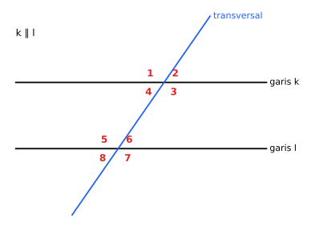
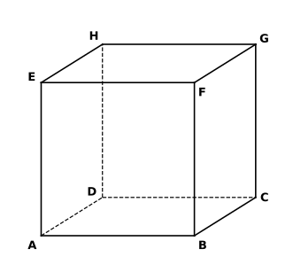

# BAB 5 — OBJEK GEOMETRI

> **Elemen:** Geometri dan Pengukuran · **Sub-elemen:** Objek Geometri
>
> **Cakupan TKA:** hubungan dua sudut, dua garis, dan dua bidang; hubungan objek geometri pada bangun datar dan bangun ruang; kesebangunan atau kekongruenan bangun datar; Teorema Pythagoras.  
> **Batasan:** bangun datar meliputi segitiga, segi empat, lingkaran, dan gabungannya; bangun ruang meliputi bangun ruang beraturan sisi datar dan sisi lengkung.

---

## A. Ringkasan Materi

### A.1 Sudut dan Hubungan Dua Sudut

**Jenis sudut:** lancip ($0^\circ < \alpha < 90^\circ$), siku-siku ($90^\circ$), tumpul ($90^\circ < \alpha < 180^\circ$), lurus ($180^\circ$), refleks ($180^\circ < \alpha < 360^\circ$).

| Hubungan | Ciri | Contoh |
|---|---|---|
| **Berpenyiku** (komplemen) | jumlahnya $90^\circ$ | penyiku $35^\circ$ adalah $55^\circ$ |
| **Berpelurus** (suplemen) | jumlahnya $180^\circ$ | pelurus $35^\circ$ adalah $145^\circ$ |
| **Bertolak belakang** | berhadapan pada dua garis yang berpotongan; **sama besar** | |

**Dua garis sejajar dipotong garis lain (transversal)**

*Gambar 5.1 — Garis $k \parallel l$ dipotong transversal; terbentuk sudut 1 sampai 8.*

| Pasangan sudut | Contoh pada Gambar 5.1 | Hubungan | Pola huruf |
|---|---|---|---|
| Sehadap | $\angle 1$ & $\angle 5$, $\angle 2$ & $\angle 6$, $\angle 3$ & $\angle 7$, $\angle 4$ & $\angle 8$ | **sama besar** | F |
| Dalam berseberangan | $\angle 3$ & $\angle 5$, $\angle 4$ & $\angle 6$ | **sama besar** | Z |
| Luar berseberangan | $\angle 1$ & $\angle 7$, $\angle 2$ & $\angle 8$ | **sama besar** | |
| Dalam sepihak | $\angle 4$ & $\angle 5$, $\angle 3$ & $\angle 6$ | jumlahnya $180^\circ$ | C / U |
| Luar sepihak | $\angle 1$ & $\angle 8$, $\angle 2$ & $\angle 7$ | jumlahnya $180^\circ$ | |
| Bertolak belakang | $\angle 1$ & $\angle 3$, $\angle 2$ & $\angle 4$, dst. | **sama besar** | X |

**Sudut pada segitiga dan segi-$n$**

- Jumlah sudut dalam segitiga $= 180^\circ$.
- **Sudut luar** segitiga $=$ jumlah dua sudut dalam yang **tidak bersisian** dengannya.
- Jumlah sudut dalam segi-$n$ $= (n - 2) \times 180^\circ$. Tiap sudut segi-$n$ **beraturan** $= \dfrac{(n - 2) \times 180^\circ}{n}$.
- Jumlah sudut luar segi-$n$ (satu di tiap titik sudut) selalu $360^\circ$.

**Sudut pada lingkaran**

- Sudut pusat $= 2 \times$ sudut keliling yang menghadap busur yang sama.
- Sudut keliling yang menghadap **diameter** $= 90^\circ$.
- Sudut-sudut keliling yang menghadap busur yang sama besarnya **sama**.
- Pada segi empat tali busur, jumlah sudut yang **berhadapan** $= 180^\circ$.

### A.2 Hubungan Dua Garis, Garis–Bidang, dan Dua Bidang

**Dua garis**

| Kedudukan | Ciri |
|---|---|
| Berpotongan | tepat satu titik persekutuan (khusus: **tegak lurus** jika membentuk $90^\circ$) |
| Sejajar | sebidang dan tidak punya titik persekutuan |
| Berimpit | semua titiknya sama |
| **Bersilangan** | **tidak sebidang**: tidak sejajar dan tidak berpotongan (hanya ada di ruang) |

**Garis dan bidang**

| Kedudukan | Ciri |
|---|---|
| Terletak pada bidang | semua titik garis ada pada bidang |
| Sejajar bidang | tidak punya titik persekutuan |
| Menembus (memotong) bidang | tepat satu titik persekutuan (titik tembus) |

Garis $g$ **tegak lurus** bidang $\alpha$ jika $g$ tegak lurus **dua garis berpotongan** yang terletak pada $\alpha$. Akibatnya, $g$ tegak lurus **semua** garis pada bidang itu.

**Dua bidang:** sejajar, berimpit, atau berpotongan (perpotongannya berupa **garis**, disebut garis potong/garis persekutuan).

**Aksioma dasar:** dua titik menentukan satu garis; tiga titik tak segaris menentukan satu bidang; dua garis sejajar atau dua garis berpotongan juga menentukan satu bidang.

### A.3 Hubungan Objek Geometri pada Bangun Ruang (Kubus)

*Gambar 5.2 — Kubus $ABCD.EFGH$: alas $ABCD$, tutup $EFGH$, dengan $E$ tepat di atas $A$, $F$ di atas $B$, $G$ di atas $C$, dan $H$ di atas $D$.*

**Unsur-unsur kubus**

| Unsur | Banyak | Contoh |
|---|:--:|---|
| Titik sudut | 8 | $A, B, \dots, H$ |
| Rusuk | 12 | $AB, BC, CG, \dots$ |
| Sisi (bidang) | 6 | $ABCD$, $EFGH$, $ABFE$, $BCGF$, $CDHG$, $ADHE$ |
| Diagonal sisi | 12 | $AC, BD, AF, BE, \dots$ |
| Diagonal ruang | 4 | $AG, BH, CE, DF$ |
| Bidang diagonal | 6 | $ACGE$, $BDHF$, $ABGH$, $CDEF$, $ADGF$, $BCHE$ |

**Kedudukan rusuk-rusuk terhadap rusuk $AB$**

| Kedudukan | Rusuk |
|---|---|
| Sejajar | $DC$, $EF$, $HG$ |
| Berpotongan | $AD$, $AE$, $BC$, $BF$ |
| Bersilangan | $CG$, $DH$, $EH$, $FG$ |

**Fakta penting pada kubus**

- Rusuk tegak ($AE$, $BF$, $CG$, $DH$) **tegak lurus** bidang alas $ABCD$.
- Diagonal sisi $AC$ sejajar $EG$; diagonal sisi $AH$ sejajar $BG$.
- $BD \perp AC$ dan $BD \perp AE$, sehingga $BD$ **tegak lurus bidang** $ACGE$.
- Bidang $ABCD \parallel EFGH$, $ABFE \parallel DCGH$, $ADHE \parallel BCGF$.
- Bidang diagonal $ACGE$ dan $BDHF$ berpotongan tegak lurus.

**Bonus — Rumus Euler** untuk bangun ruang sisi datar: $T + S - R = 2$ (titik sudut + sisi − rusuk). Kubus: $8 + 6 - 12 = 2$.

### A.4 Sifat Bangun Datar Segi Empat

| Bangun | Sisi | Sudut | Diagonal |
|---|---|---|---|
| Persegi | 4 sisi sama, sisi berhadapan sejajar | 4 siku-siku | sama panjang, tegak lurus, saling membagi dua |
| Persegi panjang | sisi berhadapan sama dan sejajar | 4 siku-siku | sama panjang, saling membagi dua |
| Jajargenjang | sisi berhadapan sama dan sejajar | sudut berhadapan sama; sudut berdekatan berjumlah $180^\circ$ | saling membagi dua |
| Belah ketupat | 4 sisi sama | sudut berhadapan sama | tegak lurus, saling membagi dua |
| Layang-layang | dua pasang sisi berdekatan sama | sepasang sudut berhadapan sama | tegak lurus; salah satunya dibagi dua oleh yang lain |
| Trapesium | tepat sepasang sisi sejajar | sudut di antara sisi sejajar (sepihak) berjumlah $180^\circ$ | — |

### A.5 Kesebangunan dan Kekongruenan

**Sebangun** ($\sim$): bentuknya sama, ukurannya boleh berbeda.  
Syarat: sudut-sudut yang bersesuaian **sama besar** dan sisi-sisi yang bersesuaian **sebanding**.

**Kongruen** ($\cong$): bentuk **dan** ukurannya sama persis.

**Syarat dua segitiga sebangun** (cukup salah satu):
1. Dua pasang sudut bersesuaian sama besar (sd–sd).
2. Ketiga pasang sisi bersesuaian sebanding (s–s–s).
3. Dua pasang sisi sebanding dan sudut apitnya sama besar (s–sd–s).

**Syarat dua segitiga kongruen** (cukup salah satu):
1. **s–s–s**: ketiga pasang sisi sama panjang.
2. **s–sd–s**: dua sisi dan sudut **apitnya** sama.
3. **sd–s–sd**: dua sudut dan sisi **apitnya** sama.
4. **sd–sd–s**: dua sudut dan sebuah sisi di hadapan salah satu sudut itu sama.

⚠️ **sd–sd–sd** hanya menjamin **sebangun**, **tidak** menjamin kongruen.

**Rumus kesebangunan yang sering keluar**

*(a) Garis sejajar alas.* Pada segitiga $ABC$, jika $DE \parallel BC$ ($D$ pada $AB$ dan $E$ pada $AC$), maka

$$\frac{AD}{AB} = \frac{AE}{AC} = \frac{DE}{BC}$$

*(b) Segitiga siku-siku dengan garis tinggi ke sisi miring.* Pada $\triangle ABC$ siku-siku di $A$ dengan $AD \perp BC$:

$$AD^2 = BD \cdot DC, \qquad AB^2 = BD \cdot BC, \qquad AC^2 = CD \cdot CB$$

*(c) Perbandingan luas.* Jika dua bangun sebangun dengan perbandingan sisi $k$, maka perbandingan luasnya $k^2$.

**Aplikasi:** bayangan benda (tinggi benda : panjang bayangan selalu sama pada saat yang sama), foto dan bingkai, peta dan skala, model/maket.

### A.6 Teorema Pythagoras

Pada segitiga siku-siku dengan sisi siku-siku $a$, $b$ dan sisi miring (hipotenusa) $c$:

$$c^2 = a^2 + b^2$$

**Tripel Pythagoras** (hafalkan!): $(3, 4, 5)$, $(5, 12, 13)$, $(8, 15, 17)$, $(7, 24, 25)$, $(20, 21, 29)$, $(9, 40, 41)$, beserta kelipatannya seperti $(6, 8, 10)$, $(9, 12, 15)$, $(10, 24, 26)$.

**Menentukan jenis segitiga** ($c$ = sisi terpanjang):

| Kondisi | Jenis segitiga |
|---|---|
| $c^2 < a^2 + b^2$ | lancip |
| $c^2 = a^2 + b^2$ | siku-siku |
| $c^2 > a^2 + b^2$ | tumpul |

**Segitiga siku-siku istimewa**

| Sudut | Perbandingan sisi |
|---|---|
| $45^\circ - 45^\circ - 90^\circ$ | $1 : 1 : \sqrt{2}$ |
| $30^\circ - 60^\circ - 90^\circ$ | $1 : \sqrt{3} : 2$ (sisi di depan $30^\circ$ : depan $60^\circ$ : sisi miring) |

**Aplikasi di bangun ruang:** diagonal sisi kubus $= a\sqrt{2}$; diagonal ruang kubus $= a\sqrt{3}$; diagonal ruang balok $= \sqrt{p^2 + l^2 + t^2}$.

---

## B. Tips & Trik

1. **Pola huruf untuk sudut:** F → sehadap (sama), Z → dalam berseberangan (sama), C/U → dalam sepihak (jumlah $180^\circ$).
2. **Jika dua sudut "kelihatan" sama-sama lancip atau sama-sama tumpul** pada gambar garis sejajar, biasanya sama besar; jika satu lancip dan satu tumpul, jumlahnya $180^\circ$.
3. **Sudut luar segitiga** $=$ jumlah dua sudut dalam yang jauh. Jauh lebih cepat daripada menghitung sudut ketiga dulu.
4. **Cek bersilangan:** dua garis bersilangan jika tidak ada satu bidang pun yang memuat keduanya. Praktisnya: tidak sejajar **dan** tidak pernah bertemu walau diperpanjang.
5. **Tuliskan pasangan titik sesuai urutan** saat menyatakan kesebangunan ($\triangle ADE \sim \triangle ABC$), agar tidak salah memasangkan sisi.
6. **Hafalkan tripel Pythagoras** — banyak soal langsung selesai tanpa menghitung akar.
7. **Rumus $AD^2 = BD \cdot DC$** (garis tinggi pada segitiga siku-siku) sering jadi "jalan pintas" soal HOTS.
8. **Bayangan:** $\dfrac{\text{tinggi}_1}{\text{bayangan}_1} = \dfrac{\text{tinggi}_2}{\text{bayangan}_2}$.
9. **Foto pada karton sebangun:** hitung dulu faktor skala dari sisi yang diketahui lengkap, lalu cari sisi lainnya.
10. **Soal perjalanan (utara–timur):** jumlahkan dulu semua perpindahan searah, baru pakai Pythagoras.

---

## C. Latihan Soal

### Bagian I — Pilihan Ganda

**1.** Pelurus dari penyiku sudut $35^\circ$ adalah ….

- A. $55^\circ$
- B. $125^\circ$
- C. $145^\circ$
- D. $35^\circ$
- E. $135^\circ$

**2.** Dua sudut saling berpelurus dengan besar $(3x + 20)^\circ$ dan $(2x + 10)^\circ$. Besar sudut yang lebih besar adalah ….

- A. $70^\circ$
- B. $90^\circ$
- C. $100^\circ$
- D. $120^\circ$
- E. $110^\circ$

**3.** Perhatikan Gambar 5.1. Jika $\angle 4 = (2x + 10)^\circ$ dan $\angle 5 = (4x - 10)^\circ$, nilai $x$ adalah ….

- A. $30$
- B. $20$
- C. $25$
- D. $35$
- E. $40$

**4.** Pada segitiga $ABC$, besar $\angle A = 50^\circ$ dan besar sudut luar di titik $C$ adalah $120^\circ$. Besar $\angle B$ adalah ….

- A. $50^\circ$
- B. $60^\circ$
- C. $80^\circ$
- D. $70^\circ$
- E. $130^\circ$

**5.** Besar setiap sudut dalam segi delapan beraturan adalah ….

- A. $108^\circ$
- B. $120^\circ$
- C. $135^\circ$
- D. $140^\circ$
- E. $144^\circ$

**6.** Titik $A$, $B$, dan $C$ terletak pada lingkaran berpusat $O$. Jika $\angle AOB = 110^\circ$, besar sudut keliling $\angle ACB$ yang menghadap busur $AB$ yang sama adalah ….

- A. $55^\circ$
- B. $70^\circ$
- C. $110^\circ$
- D. $125^\circ$
- E. $220^\circ$

**7.** Pada kubus $ABCD.EFGH$, rusuk yang **bersilangan** dengan rusuk $AB$ adalah ….

- A. $CD$
- B. $BF$
- C. $HG$
- D. $AD$
- E. $EH$

**8.** Pada kubus $ABCD.EFGH$, pasangan bidang yang saling **sejajar** adalah ….

- A. $ABCD$ dan $BCGF$
- B. $ADHE$ dan $BCGF$
- C. $ABFE$ dan $BCGF$
- D. $ACGE$ dan $BDHF$
- E. $ABGH$ dan $CDEF$

**9.** Pada kubus $ABCD.EFGH$, garis yang tegak lurus bidang $ABCD$ adalah ….

- A. $EG$
- B. $AC$
- C. $EF$
- D. $AE$
- E. $BG$

**10.** Banyak diagonal sisi dan banyak bidang diagonal sebuah kubus berturut-turut adalah ….

- A. 12 dan 4
- B. 6 dan 12
- C. 12 dan 6
- D. 8 dan 6
- E. 24 dan 6

**11.** Pada segitiga $ABC$, titik $D$ terletak pada $AB$ dan titik $E$ pada $AC$ sehingga $DE \parallel BC$. Jika $AD = 4$ cm, $DB = 6$ cm, dan $DE = 6$ cm, panjang $BC$ adalah ….

- A. 15 cm
- B. 9 cm
- C. 10 cm
- D. 12 cm
- E. 18 cm

**12.** Pada saat yang sama, sebuah tiang setinggi 2 m memiliki bayangan 1,5 m dan sebuah pohon memiliki bayangan 6 m. Tinggi pohon tersebut adalah ….

- A. 4,5 m
- B. 6 m
- C. 7,5 m
- D. 9 m
- E. 8 m

**13.** Sebuah foto berukuran $20 \text{ cm} \times 30 \text{ cm}$ (lebar × tinggi) ditempel pada karton. Sisa karton di kiri, kanan, dan atas foto masing-masing 2 cm. Jika foto dan karton sebangun, lebar karton di bagian bawah foto adalah ….

- A. 2 cm
- B. 3 cm
- C. 4 cm
- D. 5 cm
- E. 6 cm

**14.** Syarat berikut yang **tidak** menjamin dua segitiga kongruen adalah ….

- A. sisi–sisi–sisi
- B. sudut–sudut–sudut
- C. sisi–sudut–sisi
- D. sudut–sisi–sudut
- E. sudut–sudut–sisi

**15.** Segitiga $ABC$ siku-siku di $A$. Garis $AD$ tegak lurus $BC$ dengan $D$ pada $BC$. Jika $BD = 4$ cm dan $DC = 9$ cm, panjang $AD$ adalah ….

- A. 5 cm
- B. 6,5 cm
- C. 13 cm
- D. 6 cm
- E. 36 cm

**16.** Sebuah tangga sepanjang 6,5 m disandarkan pada dinding tegak. Jarak kaki tangga ke dinding 2,5 m. Tinggi ujung atas tangga dari lantai adalah ….

- A. 4 m
- B. 6 m
- C. 5 m
- D. 5,5 m
- E. 6,5 m

**17.** Segitiga dengan panjang sisi 7 cm, 8 cm, dan 12 cm termasuk segitiga ….

- A. lancip
- B. siku-siku
- C. sama kaki
- D. sama sisi
- E. tumpul

**18.** Sebuah segitiga siku-siku memiliki salah satu sudut $30^\circ$ dan sisi miring 12 cm. Panjang sisi di hadapan sudut $60^\circ$ adalah ….

- A. $6\sqrt{3}$ cm
- B. $6$ cm
- C. $6\sqrt{2}$ cm
- D. $12\sqrt{3}$ cm
- E. $4\sqrt{3}$ cm

**19.** Panjang diagonal ruang balok berukuran $12 \text{ cm} \times 4 \text{ cm} \times 3 \text{ cm}$ adalah ….

- A. 12 cm
- B. 15 cm
- C. 13 cm
- D. 17 cm
- E. 19 cm

**20.** Sebuah kapal berlayar 7 km ke utara, kemudian 12 km ke timur, lalu 9 km ke utara lagi. Jarak kapal dari posisi awal adalah ….

- A. 16 km
- B. 18 km
- C. 24 km
- D. 20 km
- E. 28 km

### Bagian II — Pilihan Ganda Kompleks (jawaban benar bisa lebih dari satu)

**21.** Pada kubus $ABCD.EFGH$, pasangan garis yang **bersilangan** adalah ….

- ☐ (1) $AB$ dan $CG$
- ☐ (2) $AE$ dan $CG$
- ☐ (3) $BD$ dan $EG$
- ☐ (4) $AC$ dan $BD$
- ☐ (5) $AH$ dan $BG$

**22.** Sifat yang dimiliki **belah ketupat** adalah ….

- ☐ (1) Keempat sisinya sama panjang.
- ☐ (2) Kedua diagonalnya saling tegak lurus.
- ☐ (3) Kedua diagonalnya sama panjang.
- ☐ (4) Sudut-sudut yang berhadapan sama besar.
- ☐ (5) Keempat sudutnya siku-siku.

**23.** Kelompok tiga bilangan berikut yang merupakan **tripel Pythagoras** adalah ….

- ☐ (1) 6, 8, 10
- ☐ (2) 5, 12, 13
- ☐ (3) 7, 24, 26
- ☐ (4) 8, 15, 17
- ☐ (5) 9, 12, 16

**24.** Dua segitiga **pasti sebangun** jika ….

- ☐ (1) dua pasang sudut yang bersesuaian sama besar.
- ☐ (2) ketiga pasang sisi yang bersesuaian sebanding.
- ☐ (3) keduanya segitiga sama sisi.
- ☐ (4) keduanya segitiga sama kaki.
- ☐ (5) keduanya segitiga siku-siku.

**25.** Pada kubus $ABCD.EFGH$, pernyataan yang benar adalah ….

- ☐ (1) $AE$ tegak lurus bidang $ABCD$.
- ☐ (2) $EG$ tegak lurus bidang $ABCD$.
- ☐ (3) $CG$ terletak pada bidang $BCGF$.
- ☐ (4) $BD$ terletak pada bidang $ACGE$.
- ☐ (5) $BD$ tegak lurus bidang $ACGE$.

### Bagian III — Benar atau Salah

**26.** Perhatikan Gambar 5.1. Diketahui $\angle 2 = 65^\circ$.

| | Pernyataan | B | S |
|:--:|---|:--:|:--:|
| a | $\angle 6 = 65^\circ$ | ☐ | ☐ |
| b | $\angle 4 = 65^\circ$ | ☐ | ☐ |
| c | $\angle 3$ dan $\angle 5$ adalah sudut luar berseberangan. | ☐ | ☐ |
| d | $\angle 8 = 115^\circ$ | ☐ | ☐ |

**27.** Segitiga $ABC$ dan $PQR$ memenuhi $AB = PQ$, $BC = QR$, dan $\angle B = \angle Q = 70^\circ$. Diketahui pula $\angle A = 50^\circ$.

| | Pernyataan | B | S |
|:--:|---|:--:|:--:|
| a | $\triangle ABC \cong \triangle PQR$ berdasarkan syarat sisi–sudut–sisi. | ☐ | ☐ |
| b | $\angle R = 60^\circ$ | ☐ | ☐ |
| c | $AC = PR$ | ☐ | ☐ |
| d | $\angle P = 70^\circ$ | ☐ | ☐ |

**28.** Segitiga $ABC$ siku-siku di $B$ dengan $AB = 8$ cm dan $BC = 15$ cm.

| | Pernyataan | B | S |
|:--:|---|:--:|:--:|
| a | $AC = 17$ cm | ☐ | ☐ |
| b | Luas segitiga $ABC$ adalah 60 cm². | ☐ | ☐ |
| c | Panjang garis tinggi dari $B$ ke $AC$ adalah $\dfrac{60}{17}$ cm. | ☐ | ☐ |
| d | Segitiga $ABC$ sebangun dengan segitiga bersisi 16 cm, 30 cm, dan 34 cm. | ☐ | ☐ |

**29.** Perhatikan kubus $ABCD.EFGH$.

| | Pernyataan | B | S |
|:--:|---|:--:|:--:|
| a | Garis $AC$ sejajar garis $EG$. | ☐ | ☐ |
| b | Garis $AF$ dan garis $CH$ berpotongan. | ☐ | ☐ |
| c | Bidang $ACGE$ tegak lurus bidang $ABCD$. | ☐ | ☐ |
| d | Garis $DF$ adalah diagonal ruang. | ☐ | ☐ |

### Bagian IV — Isian Singkat

**30.** Dua sudut saling berpenyiku. Besar sudut pertama sama dengan dua kali sudut kedua ditambah $15^\circ$. Besar sudut pertama adalah …°.

**31.** Jarak dua kota pada peta berskala $1 : 200.000$ adalah 7,5 cm. Jarak sebenarnya kedua kota adalah … km.

**32.** Sebuah persegi panjang memiliki panjang 24 cm dan diagonal 25 cm. Keliling persegi panjang tersebut adalah … cm.

**33.** Segitiga $ABC$ siku-siku di $A$ dengan $AD \perp BC$ ($D$ pada $BC$). Jika $AB = 15$ cm dan $BC = 25$ cm, panjang $BD$ adalah … cm.

---

## D. Kunci Jawaban dan Pembahasan

### Kunci Ringkas

| No | Kunci | No | Kunci | No | Kunci | No | Kunci |
|:--:|:--:|:--:|:--:|:--:|:--:|:--:|:--:|
| 1 | B | 10 | C | 19 | C | 28 | B, B, S, B |
| 2 | E | 11 | A | 20 | D | 29 | B, S, B, B |
| 3 | A | 12 | E | 21 | (1), (3) | 30 | 65 |
| 4 | D | 13 | C | 22 | (1), (2), (4) | 31 | 15 |
| 5 | C | 14 | B | 23 | (1), (2), (4) | 32 | 62 |
| 6 | A | 15 | D | 24 | (1), (2), (3) | 33 | 9 |
| 7 | E | 16 | B | 25 | (1), (3), (5) | | |
| 8 | B | 17 | E | 26 | B, B, S, S | | |
| 9 | D | 18 | A | 27 | B, B, B, S | | |

### Pembahasan

**1. Jawaban: B**  
Penyiku $35^\circ$ $= 90^\circ - 35^\circ = 55^\circ$. Pelurusnya $= 180^\circ - 55^\circ = 125^\circ$.

**2. Jawaban: E**  
$(3x + 20) + (2x + 10) = 180 \Rightarrow 5x = 150 \Rightarrow x = 30$.  
Kedua sudut: $3(30) + 20 = 110^\circ$ dan $2(30) + 10 = 70^\circ$. Yang lebih besar $110^\circ$.

**3. Jawaban: A**  
$\angle 4$ dan $\angle 5$ adalah sudut **dalam sepihak** (keduanya di antara garis $k$ dan $l$, di sisi kiri transversal), sehingga jumlahnya $180^\circ$.  
$(2x + 10) + (4x - 10) = 180 \Rightarrow 6x = 180 \Rightarrow x = 30$.

**4. Jawaban: D**  
Sudut luar di $C$ $= \angle A + \angle B \Rightarrow 120^\circ = 50^\circ + \angle B \Rightarrow \angle B = 70^\circ$.

**5. Jawaban: C**  
Jumlah sudut dalam segi-8 $= (8 - 2) \times 180^\circ = 1\ 080^\circ$. Tiap sudut $= 1\ 080^\circ \div 8 = 135^\circ$.

**6. Jawaban: A**  
Sudut keliling $= \frac{1}{2} \times$ sudut pusat $= \frac{1}{2} \times 110^\circ = 55^\circ$.

**7. Jawaban: E**  
$CD$ dan $HG$ sejajar $AB$; $BF$ dan $AD$ berpotongan dengan $AB$.  
$EH$ berada di bidang atas dan sejajar $AD$; $EH$ tidak sejajar dan tidak memotong $AB$ → **bersilangan**.

**8. Jawaban: B**  
Bidang kiri $ADHE$ dan bidang kanan $BCGF$ saling berhadapan → sejajar.  
Pasangan lain berpotongan: A (garis $BC$), C (garis $BF$), D (garis tengah kubus), E (juga berpotongan di dalam kubus).

**9. Jawaban: D**  
$AE$ adalah rusuk tegak; ia tegak lurus $AB$ dan $AD$ (dua garis berpotongan di bidang $ABCD$), sehingga tegak lurus bidang $ABCD$.

**10. Jawaban: C**  
Setiap sisi punya 2 diagonal: $6 \times 2 = 12$ diagonal sisi. Bidang diagonal ada 6 (lihat tabel di materi).

**11. Jawaban: A**  
$AB = AD + DB = 10$ cm. Karena $DE \parallel BC$: $\dfrac{AD}{AB} = \dfrac{DE}{BC} \Rightarrow \dfrac{4}{10} = \dfrac{6}{BC} \Rightarrow BC = 15$ cm.  
⚠️ Jebakan: memakai $\frac{AD}{DB} = \frac{DE}{BC}$ menghasilkan 9 cm (salah).

**12. Jawaban: E**  
$\dfrac{2}{1{,}5} = \dfrac{t}{6} \Rightarrow t = \dfrac{2 \times 6}{1{,}5} = 8$ m.

**13. Jawaban: C**  
Lebar karton $= 2 + 20 + 2 = 24$ cm. Karena sebangun: $\dfrac{24}{20} = \dfrac{T}{30} \Rightarrow T = 36$ cm (tinggi karton).  
Bagian bawah $= 36 - 30 - 2 = 4$ cm.

**14. Jawaban: B**  
Tiga sudut yang sama hanya menjamin bentuk sama (**sebangun**), ukurannya bisa berbeda. Contoh: dua segitiga sama sisi dengan sisi 2 cm dan 5 cm.

**15. Jawaban: D**  
Rumus garis tinggi pada segitiga siku-siku: $AD^2 = BD \cdot DC = 4 \times 9 = 36 \Rightarrow AD = 6$ cm.

**16. Jawaban: B**  
$t = \sqrt{6{,}5^2 - 2{,}5^2} = \sqrt{42{,}25 - 6{,}25} = \sqrt{36} = 6$ m.  
(Ini kelipatan tripel $5, 12, 13$ dengan faktor $0{,}5$: $2{,}5$; $6$; $6{,}5$.)

**17. Jawaban: E**  
Sisi terpanjang $c = 12$: $c^2 = 144$ dan $a^2 + b^2 = 49 + 64 = 113$.  
Karena $144 > 113$, segitiganya **tumpul**.

**18. Jawaban: A**  
Perbandingan sisi segitiga $30^\circ$–$60^\circ$–$90^\circ$ $= 1 : \sqrt{3} : 2$. Sisi miring $2 \to 12$, sehingga faktor pengalinya 6.  
Sisi di depan $60^\circ$ $= 6\sqrt{3}$ cm.

**19. Jawaban: C**  
$d = \sqrt{12^2 + 4^2 + 3^2} = \sqrt{144 + 16 + 9} = \sqrt{169} = 13$ cm.

**20. Jawaban: D**  
Total ke utara $= 7 + 9 = 16$ km; ke timur $= 12$ km.  
Jarak $= \sqrt{16^2 + 12^2} = \sqrt{400} = 20$ km (kelipatan tripel $3, 4, 5$).

**21. Jawaban: (1), (3)**
- (1) $AB$ di alas depan, $CG$ rusuk tegak belakang kanan: tidak sejajar dan tidak bertemu → bersilangan ✔
- (2) $AE \parallel CG$ (sama-sama rusuk tegak) ✘
- (3) $BD$ di bidang alas, $EG$ di bidang atas, arahnya berbeda ($EG \parallel AC$) → bersilangan ✔
- (4) $AC$ dan $BD$ berpotongan di pusat alas ✘
- (5) $AH$ (diagonal sisi kiri) sejajar $BG$ (diagonal sisi kanan) ✘

**22. Jawaban: (1), (2), (4)**  
Diagonal belah ketupat umumnya **tidak** sama panjang (3) dan sudutnya tidak harus siku-siku (5). Kedua sifat itu hanya dimiliki persegi.

**23. Jawaban: (1), (2), (4)**
- (1) $36 + 64 = 100 = 10^2$ ✔
- (2) $25 + 144 = 169 = 13^2$ ✔
- (3) $49 + 576 = 625 = 25^2 \neq 26^2$ ✘
- (4) $64 + 225 = 289 = 17^2$ ✔
- (5) $81 + 144 = 225 = 15^2 \neq 16^2$ ✘

**24. Jawaban: (1), (2), (3)**  
Segitiga sama sisi selalu bersudut $60^\circ, 60^\circ, 60^\circ$, jadi pasti sebangun (3).  
Dua segitiga sama kaki (4) atau dua segitiga siku-siku (5) belum tentu bersudut sama. Contoh: siku-siku $30^\circ$–$60^\circ$–$90^\circ$ dan $45^\circ$–$45^\circ$–$90^\circ$.

**25. Jawaban: (1), (3), (5)**
- (2) ✘: $EG$ terletak di bidang atas yang sejajar alas, sehingga $EG$ **sejajar** bidang $ABCD$.
- (4) ✘: $BD$ menembus bidang $ACGE$ di pusat alas, bukan terletak padanya.
- (5) ✔: $BD \perp AC$ (diagonal persegi) dan $BD \perp AE$ (karena $AE \perp$ alas). $AC$ dan $AE$ adalah dua garis berpotongan di bidang $ACGE$.

**26. Jawaban: a. B, b. B, c. S, d. S**  
Dengan $\angle 2 = 65^\circ$, semua sudut lancip pada gambar bernilai $65^\circ$ ($\angle 2, \angle 4, \angle 6, \angle 8$) dan semua sudut tumpul bernilai $115^\circ$ ($\angle 1, \angle 3, \angle 5, \angle 7$).
- a. $\angle 6$ sehadap dengan $\angle 2$ → $65^\circ$ ✔
- b. $\angle 4$ bertolak belakang dengan $\angle 2$ → $65^\circ$ ✔
- c. $\angle 3$ dan $\angle 5$ berada di antara kedua garis → sudut **dalam** berseberangan ✘
- d. $\angle 8$ sehadap dengan $\angle 4$ → $65^\circ$, bukan $115^\circ$ ✘

**27. Jawaban: a. B, b. B, c. B, d. S**
- a. Sudut $B$ diapit sisi $AB$ dan $BC$; sudut $Q$ diapit $PQ$ dan $QR$ → s–sd–s ✔
- b. $\angle C = 180^\circ - 50^\circ - 70^\circ = 60^\circ$, dan $\angle R$ bersesuaian dengan $\angle C$ ✔
- c. Sisi yang bersesuaian pada segitiga kongruen sama panjang ✔
- d. $\angle P$ bersesuaian dengan $\angle A = 50^\circ$ ✘

**28. Jawaban: a. B, b. B, c. S, d. B**
- a. $\sqrt{64 + 225} = \sqrt{289} = 17$ ✔
- b. $\frac{1}{2} \times 8 \times 15 = 60$ ✔
- c. Luas juga $= \frac{1}{2} \times AC \times t$, sehingga $60 = \frac{1}{2} \times 17 \times t \Rightarrow t = \frac{120}{17}$ cm, bukan $\frac{60}{17}$ ✘
- d. $\frac{16}{8} = \frac{30}{15} = \frac{34}{17} = 2$ → sebangun ✔

**29. Jawaban: a. B, b. S, c. B, d. B**
- a. $ACGE$ adalah persegi panjang, sehingga $AC \parallel EG$ ✔
- b. $AF$ terletak di bidang depan $ABFE$, sedangkan $CH$ di bidang belakang $DCGH$. Kedua bidang itu sejajar, jadi $AF$ dan $CH$ tidak mungkin berpotongan (keduanya bersilangan) ✘
- c. $ACGE$ memuat $AE$, dan $AE \perp ABCD$ ✔
- d. $D$ dan $F$ adalah dua titik sudut yang tidak terletak pada satu sisi ✔

**30. Jawaban: 65**  
$a + b = 90$ dan $a = 2b + 15$ → $3b + 15 = 90 \Rightarrow b = 25$. Jadi $a = 65^\circ$.

**31. Jawaban: 15 km**  
$7{,}5 \times 200\ 000 = 1\ 500\ 000$ cm $= 15\ 000$ m $= 15$ km.

**32. Jawaban: 62 cm**  
Lebar $= \sqrt{25^2 - 24^2} = \sqrt{49} = 7$ cm (tripel $7, 24, 25$).  
Keliling $= 2(24 + 7) = 62$ cm.

**33. Jawaban: 9 cm**  
$AB^2 = BD \cdot BC \Rightarrow 225 = BD \times 25 \Rightarrow BD = 9$ cm.
