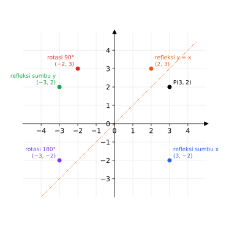

# BAB 6 — TRANSFORMASI GEOMETRI

> **Elemen:** Geometri dan Pengukuran · **Sub-elemen:** Transformasi Geometri
>
> **Cakupan TKA:** transformasi geometri (translasi, refleksi, rotasi, dan dilatasi, serta komposisinya) **dari titik**.

---

## A. Ringkasan Materi

Transformasi geometri adalah aturan yang memindahkan setiap titik $P(x, y)$ ke titik baru $P'(x', y')$ yang disebut **bayangan**. Notasinya:

$$P(x, y) \xrightarrow{\ T\ } P'(x', y')$$



*Gambar 6.1 — Bayangan titik $P(3, 2)$ oleh refleksi terhadap sumbu $x$, sumbu $y$, dan garis $y = x$, serta rotasi $90^\circ$ dan $180^\circ$ dengan pusat $O$.*

### A.1 Translasi (Pergeseran)

Translasi $T = \binom{a}{b}$ menggeser titik sejauh $a$ satuan mendatar (positif ke kanan) dan $b$ satuan tegak (positif ke atas).

$$P(x, y) \xrightarrow{\ T(a,\ b)\ } P'(x + a,\ y + b)$$

> **Contoh.** $A(4, 5)$ ditranslasi oleh $T(3, -2)$ → $A'(7, 3)$.  
> **Mencari translasi:** jika $P(2, -5) \to P'(-1, 3)$, maka $T = (-1 - 2,\ 3 - (-5)) = (-3, 8)$.

### A.2 Refleksi (Pencerminan)

| Cermin | Bayangan dari $(x, y)$ | Cara mengingat |
|---|---|---|
| Sumbu $x$ | $(x, -y)$ | $y$ berganti tanda |
| Sumbu $y$ | $(-x, y)$ | $x$ berganti tanda |
| Titik asal $O(0, 0)$ | $(-x, -y)$ | keduanya berganti tanda |
| Garis $y = x$ | $(y, x)$ | tukar posisi |
| Garis $y = -x$ | $(-y, -x)$ | tukar posisi, lalu keduanya berganti tanda |
| Garis $x = h$ | $(2h - x,\ y)$ | |
| Garis $y = k$ | $(x,\ 2k - y)$ | |

> **Contoh.** Refleksi $(7, -1)$ terhadap garis $x = 3$: $x' = 2(3) - 7 = -1$ → bayangannya $(-1, -1)$.

### A.3 Rotasi (Perputaran)

Kesepakatan: sudut **positif** = berlawanan arah jarum jam; sudut **negatif** = searah jarum jam.

**Rotasi dengan pusat $O(0, 0)$**

| Sudut | Bayangan dari $(x, y)$ |
|---|---|
| $90^\circ$ (atau $-270^\circ$) | $(-y, x)$ |
| $180^\circ$ (atau $-180^\circ$) | $(-x, -y)$ |
| $270^\circ$ (atau $-90^\circ$, searah jarum jam $90^\circ$) | $(y, -x)$ |
| $360^\circ$ | $(x, y)$ |
| $\theta$ (umum) | $(x\cos\theta - y\sin\theta,\ \ x\sin\theta + y\cos\theta)$ |

**Rotasi dengan pusat $P(a, b)$** — geser pusat ke $O$, putar, lalu geser kembali:

$$x' - a = (x - a)\cos\theta - (y - b)\sin\theta, \qquad y' - b = (x - a)\sin\theta + (y - b)\cos\theta$$

> **Contoh.** Rotasi $90^\circ$ titik $A(4, 3)$ dengan pusat $P(1, 2)$:  
> 1. Kurangi pusat: $(4 - 1,\ 3 - 2) = (3, 1)$.  
> 2. Rotasi $90^\circ$: $(3, 1) \to (-1, 3)$.  
> 3. Tambah pusat: $(-1 + 1,\ 3 + 2) = (0, 5)$.

### A.4 Dilatasi (Perkalian / Perbesaran)

Dilatasi dengan pusat $O$ dan faktor skala $k$, ditulis $[O, k]$:

$$P(x, y) \xrightarrow{\ [O,\ k]\ } P'(kx,\ ky)$$

Dilatasi dengan pusat $A(a, b)$ dan faktor $k$, ditulis $[A, k]$:

$$P'\big(a + k(x - a),\ \ b + k(y - b)\big)$$

| Nilai $k$ | Efek |
|---|---|
| $k > 1$ | diperbesar, searah dari pusat |
| $0 < k < 1$ | diperkecil, searah dari pusat |
| $k < 0$ | bayangan berada di **seberang** pusat |
| $k = -1$ | sama dengan rotasi $180^\circ$ (refleksi terhadap pusat) |

Jika sebuah bangun didilatasi dengan faktor $k$, **luas** bayangannya menjadi $k^2$ kali luas semula.

### A.5 Komposisi Transformasi

"$T_1$ **dilanjutkan** $T_2$" artinya kerjakan $T_1$ **dulu**, lalu hasilnya ditransformasi oleh $T_2$ (ditulis $T_2 \circ T_1$).

> **Contoh.** $A(2, 3)$ direfleksikan terhadap sumbu $x$, dilanjutkan translasi $(-1, 4)$:  
> $(2, 3) \to (2, -3) \to (2 - 1,\ -3 + 4) = (1, 1)$.

**Komposisi istimewa**

| Komposisi | Hasilnya setara dengan |
|---|---|
| Dua translasi $T_1$ lalu $T_2$ | satu translasi $T_1 + T_2$ |
| Refleksi terhadap $x = a$ lalu $x = b$ (dua garis sejajar) | translasi $\big(2(b - a),\ 0\big)$ |
| Refleksi terhadap $y = a$ lalu $y = b$ | translasi $\big(0,\ 2(b - a)\big)$ |
| Refleksi terhadap sumbu $x$ lalu sumbu $y$ (dua garis tegak lurus) | rotasi $180^\circ$ pusat $O$ |
| Refleksi terhadap dua garis berpotongan membentuk sudut $\alpha$ | rotasi sebesar $2\alpha$ |
| Dua rotasi $\alpha$ lalu $\beta$ dengan pusat sama | rotasi $\alpha + \beta$ |

⚠️ **Urutan penting.** Refleksi terhadap $x = 2$ lalu $x = 5$ berbeda hasilnya dengan refleksi terhadap $x = 5$ lalu $x = 2$.

### A.6 Bonus: Transformasi dengan Matriks

Transformasi selain translasi dapat ditulis sebagai perkalian matriks: bayangan $(x', y')$ diperoleh dari $M$ dikali $(x, y)$ sebagai vektor kolom.

```math
\begin{array}{ll}
\text{Refleksi sumbu } x: \begin{pmatrix} 1 & 0 \\ 0 & -1 \end{pmatrix} & \qquad \text{Refleksi sumbu } y: \begin{pmatrix} -1 & 0 \\ 0 & 1 \end{pmatrix} \\[3ex]
\text{Refleksi } y = x: \begin{pmatrix} 0 & 1 \\ 1 & 0 \end{pmatrix} & \qquad \text{Refleksi } y = -x: \begin{pmatrix} 0 & -1 \\ -1 & 0 \end{pmatrix} \\[3ex]
\text{Rotasi } \theta \text{ pusat } O: \begin{pmatrix} \cos\theta & -\sin\theta \\ \sin\theta & \cos\theta \end{pmatrix} & \qquad \text{Dilatasi } [O, k]: \begin{pmatrix} k & 0 \\ 0 & k \end{pmatrix}
\end{array}
```

Komposisi "$M_1$ dilanjutkan $M_2$" menggunakan matriks $M_2 \cdot M_1$ (yang terakhir ditulis paling kiri).

---

## B. Tips & Trik

1. **Rotasi $90^\circ$ pusat $O$:** "tukar, lalu negatifkan yang **depan**": $(x, y) \to (-y, x)$.  
   **Rotasi $-90^\circ$** (searah jarum jam): "tukar, lalu negatifkan yang **belakang**": $(x, y) \to (y, -x)$.
2. **Refleksi $y = x$:** cukup tukar. **Refleksi $y = -x$:** tukar dan negatifkan keduanya.
3. **Refleksi terhadap garis $x = h$:** $h$ adalah titik tengah antara $x$ dan $x'$, sehingga $x' = 2h - x$.
4. **Pusat bukan $O$?** Pakai pola "kurangi pusat → transformasi → tambah pusat" (berlaku untuk rotasi dan dilatasi).
5. **Mencari titik asal dari bayangan:** kerjakan transformasi **kebalikannya** dengan urutan terbalik. Kebalikan rotasi $90^\circ$ adalah rotasi $-90^\circ$; kebalikan dilatasi $k$ adalah dilatasi $\frac{1}{k}$; kebalikan refleksi adalah refleksi itu sendiri.
6. **Cek dengan sketsa kuadran.** Titik di kuadran I yang dirotasi $90^\circ$ pasti pindah ke kuadran II. Ini cara cepat membuang opsi yang salah.
7. **Isometri** (bentuk dan ukuran tetap): translasi, refleksi, rotasi. Dilatasi mengubah ukuran, kecuali $|k| = 1$.
8. **Jarak titik ke pusat rotasi tidak berubah** setelah dirotasi. Gunakan ini untuk mengecek jawaban.
9. **Dua refleksi terhadap garis sejajar** = translasi sejauh **2 kali** jarak kedua garis, searah dari cermin pertama ke cermin kedua.
10. **Luas setelah dilatasi** = $k^2 \times$ luas awal (tanda $k$ tidak berpengaruh).

---

## C. Latihan Soal

### Bagian I — Pilihan Ganda

**1.** Bayangan titik $A(4, 5)$ oleh translasi $T = \binom{3}{-2}$ adalah ….

- A. $(1, 7)$
- B. $(7, 7)$
- C. $(7, 3)$
- D. $(12, -10)$
- E. $(1, 3)$

**2.** Titik $P(2, -5)$ ditranslasi oleh $T$ sehingga bayangannya $P'(-1, 3)$. Translasi $T$ adalah ….

- A. $\binom{-3}{8}$
- B. $\binom{3}{-8}$
- C. $\binom{1}{-2}$
- D. $\binom{-3}{-2}$
- E. $\binom{3}{8}$

**3.** Bayangan titik $(-4, 7)$ oleh refleksi terhadap sumbu $y$ adalah ….

- A. $(-4, -7)$
- B. $(4, -7)$
- C. $(7, -4)$
- D. $(-7, 4)$
- E. $(4, 7)$

**4.** Bayangan titik $(3, -6)$ oleh refleksi terhadap garis $y = x$ adalah ….

- A. $(-3, 6)$
- B. $(-6, 3)$
- C. $(6, -3)$
- D. $(6, 3)$
- E. $(-6, -3)$

**5.** Bayangan titik $(5, 2)$ oleh refleksi terhadap garis $y = -x$ adalah ….

- A. $(2, 5)$
- B. $(-5, -2)$
- C. $(5, -2)$
- D. $(-2, -5)$
- E. $(-2, 5)$

**6.** Bayangan titik $(7, -1)$ oleh refleksi terhadap garis $x = 3$ adalah ….

- A. $(-1, -1)$
- B. $(13, -1)$
- C. $(7, 5)$
- D. $(-7, -1)$
- E. $(1, -1)$

**7.** Bayangan titik $(4, 3)$ oleh refleksi terhadap garis $y = -2$ adalah ….

- A. $(4, -3)$
- B. $(4, -1)$
- C. $(4, -7)$
- D. $(-8, 3)$
- E. $(0, 3)$

**8.** Bayangan titik $(3, 4)$ oleh rotasi $90^\circ$ berlawanan arah jarum jam dengan pusat $O$ adalah ….

- A. $(4, -3)$
- B. $(-3, -4)$
- C. $(4, 3)$
- D. $(-3, 4)$
- E. $(-4, 3)$

**9.** Bayangan titik $(-2, 5)$ oleh rotasi $180^\circ$ dengan pusat $O$ adalah ….

- A. $(-2, -5)$
- B. $(2, -5)$
- C. $(5, -2)$
- D. $(-5, 2)$
- E. $(2, 5)$

**10.** Bayangan titik $(2, -6)$ oleh rotasi $90^\circ$ **searah** jarum jam dengan pusat $O$ adalah ….

- A. $(6, 2)$
- B. $(6, -2)$
- C. $(-2, -6)$
- D. $(-6, -2)$
- E. $(2, 6)$

**11.** Bayangan titik $A(4, 3)$ oleh rotasi $90^\circ$ berlawanan arah jarum jam dengan pusat $P(1, 2)$ adalah ….

- A. $(0, 5)$
- B. $(2, -1)$
- C. $(-2, 5)$
- D. $(-3, 4)$
- E. $(0, -1)$

**12.** Bayangan titik $(-2, 4)$ oleh dilatasi $[O, 3]$ adalah ….

- A. $(1, 7)$
- B. $(6, -12)$
- C. $(-6, 12)$
- D. $\left(-\frac{2}{3}, \frac{4}{3}\right)$
- E. $(-5, 7)$

**13.** Bayangan titik $(4, -3)$ oleh dilatasi dengan pusat $A(1, 1)$ dan faktor skala 2 adalah ….

- A. $(8, -6)$
- B. $(9, -5)$
- C. $(6, -8)$
- D. $(5, -5)$
- E. $(7, -7)$

**14.** Bayangan titik $(8, -6)$ oleh dilatasi dengan pusat $O$ dan faktor skala $-\frac{1}{2}$ adalah ….

- A. $(4, -3)$
- B. $(-4, 3)$
- C. $(-16, 12)$
- D. $(16, -12)$
- E. $(-4, -3)$

**15.** Titik $A(2, 3)$ direfleksikan terhadap sumbu $x$, dilanjutkan translasi $\binom{-1}{4}$. Bayangan akhirnya adalah ….

- A. $(1, 7)$
- B. $(3, -7)$
- C. $(-3, 1)$
- D. $(1, 1)$
- E. $(1, -1)$

**16.** Titik $B(-1, 4)$ dirotasi $90^\circ$ berlawanan arah jarum jam dengan pusat $O$, dilanjutkan refleksi terhadap garis $y = x$. Bayangan akhirnya adalah ….

- A. $(-1, -4)$
- B. $(4, 1)$
- C. $(1, 4)$
- D. $(-4, -1)$
- E. $(4, -1)$

**17.** Titik $(1, 3)$ direfleksikan terhadap garis $x = 2$, dilanjutkan refleksi terhadap garis $x = 5$. Bayangan akhirnya adalah ….

- A. $(-5, 3)$
- B. $(9, 3)$
- C. $(7, 3)$
- D. $(4, 3)$
- E. $(1, 9)$

**18.** Refleksi terhadap sumbu $x$ dilanjutkan refleksi terhadap sumbu $y$ setara dengan satu transformasi, yaitu ….

- A. rotasi $90^\circ$ dengan pusat $O$
- B. refleksi terhadap garis $y = x$
- C. translasi
- D. dilatasi dengan faktor 2
- E. rotasi $180^\circ$ dengan pusat $O$

**19.** Titik $P$ dirotasi $90^\circ$ berlawanan arah jarum jam dengan pusat $O$ sehingga bayangannya $P'(-3, 7)$. Koordinat titik $P$ adalah ….

- A. $(3, -7)$
- B. $(7, 3)$
- C. $(-7, -3)$
- D. $(3, 7)$
- E. $(-7, 3)$

**20.** Segitiga $ABC$ dengan $A(1, 1)$, $B(4, 1)$, dan $C(1, 5)$ didilatasi dengan pusat $O$ dan faktor skala 3. Luas bayangan segitiga tersebut adalah … satuan luas.

- A. $18$
- B. $27$
- C. $36$
- D. $54$
- E. $162$

### Bagian II — Pilihan Ganda Kompleks (jawaban benar bisa lebih dari satu)

**21.** Diketahui titik $A(3, -2)$. Pernyataan yang benar adalah ….

- ☐ (1) Bayangan $A$ oleh refleksi terhadap sumbu $x$ adalah $(3, 2)$.
- ☐ (2) Bayangan $A$ oleh refleksi terhadap sumbu $y$ adalah $(-3, 2)$.
- ☐ (3) Bayangan $A$ oleh refleksi terhadap titik $O$ adalah $(-3, 2)$.
- ☐ (4) Bayangan $A$ oleh refleksi terhadap garis $y = x$ adalah $(2, 3)$.
- ☐ (5) Bayangan $A$ oleh rotasi $180^\circ$ dengan pusat $O$ adalah $(-3, 2)$.

**22.** Transformasi yang memetakan titik $(2, 5)$ ke titik $(-2, 5)$ adalah ….

- ☐ (1) refleksi terhadap sumbu $y$
- ☐ (2) refleksi terhadap garis $x = 0$
- ☐ (3) translasi $\binom{-4}{0}$
- ☐ (4) rotasi $180^\circ$ dengan pusat $O$
- ☐ (5) refleksi terhadap garis $y = x$

**23.** Transformasi yang **tidak mengubah ukuran** bangun (isometri) adalah ….

- ☐ (1) translasi
- ☐ (2) refleksi
- ☐ (3) rotasi
- ☐ (4) dilatasi dengan faktor 2
- ☐ (5) dilatasi dengan faktor $-1$

**24.** Titik $P(4, 2)$ dirotasi $90^\circ$ berlawanan arah jarum jam dengan pusat $O$ sehingga diperoleh $P'$. Pernyataan yang benar adalah ….

- ☐ (1) $P' = (-2, 4)$
- ☐ (2) Jarak $OP$ sama dengan jarak $OP'$.
- ☐ (3) $P'$ terletak di kuadran III.
- ☐ (4) Garis $OP$ tegak lurus garis $OP'$.
- ☐ (5) $P' = (2, -4)$

**25.** Transformasi (atau komposisi transformasi) yang memetakan setiap titik $(x, y)$ ke $(-x, -y)$ adalah ….

- ☐ (1) rotasi $180^\circ$ dengan pusat $O$
- ☐ (2) refleksi terhadap sumbu $x$ dilanjutkan refleksi terhadap sumbu $y$
- ☐ (3) refleksi terhadap garis $y = x$ dilanjutkan refleksi terhadap garis $y = -x$
- ☐ (4) dilatasi dengan pusat $O$ dan faktor skala $-1$
- ☐ (5) rotasi $90^\circ$ dengan pusat $O$ dilanjutkan refleksi terhadap sumbu $x$

### Bagian III — Benar atau Salah

**26.** Titik $A(-2, 3)$ ditranslasi oleh $T = \binom{4}{-1}$ sehingga diperoleh $A'$.

| | Pernyataan | B | S |
|:--:|---|:--:|:--:|
| a | $A' = (2, 2)$ | ☐ | ☐ |
| b | $A'$ terletak di kuadran I. | ☐ | ☐ |
| c | Jika $A'$ ditranslasi lagi oleh $\binom{4}{-1}$, hasilnya kembali ke titik $A$. | ☐ | ☐ |
| d | Jarak $AA'$ adalah $\sqrt{17}$. | ☐ | ☐ |

**27.** Titik $B(6, -4)$ didilatasi dengan pusat $O$ dan faktor skala $k$.

| | Pernyataan | B | S |
|:--:|---|:--:|:--:|
| a | Jika $k = \frac{1}{2}$, bayangannya $(3, -2)$. | ☐ | ☐ |
| b | Jika $k = -2$, bayangannya $(-12, 8)$. | ☐ | ☐ |
| c | Jika bayangannya $(-3, 2)$, maka $k = \frac{1}{2}$. | ☐ | ☐ |
| d | Dilatasi dengan $k = -1$ sama dengan refleksi terhadap sumbu $y$. | ☐ | ☐ |

**28.** Titik $C(1, 2)$ dirotasi sebesar $\theta$ berlawanan arah jarum jam dengan pusat $O$.

| | Pernyataan | B | S |
|:--:|---|:--:|:--:|
| a | Jika $\theta = 90^\circ$, bayangannya $(2, -1)$. | ☐ | ☐ |
| b | Jika $\theta = 270^\circ$, bayangannya $(2, -1)$. | ☐ | ☐ |
| c | Jika $\theta = 360^\circ$, bayangannya $(1, 2)$. | ☐ | ☐ |
| d | Jika $\theta = 45^\circ$, bayangannya $\left(-\frac{1}{2}\sqrt{2},\ \frac{3}{2}\sqrt{2}\right)$. | ☐ | ☐ |

**29.** Titik $D(3, 1)$ direfleksikan terhadap garis $x = 1$, dilanjutkan refleksi terhadap garis $x = 4$.

| | Pernyataan | B | S |
|:--:|---|:--:|:--:|
| a | Bayangan pertama adalah $(-1, 1)$. | ☐ | ☐ |
| b | Bayangan akhir adalah $(9, 1)$. | ☐ | ☐ |
| c | Komposisi kedua refleksi tersebut setara dengan translasi $\binom{6}{0}$. | ☐ | ☐ |
| d | Jika urutannya ditukar (refleksi terhadap $x = 4$ dulu, lalu $x = 1$), bayangan akhirnya sama. | ☐ | ☐ |

### Bagian IV — Isian Singkat

**30.** Titik $(a, b)$ direfleksikan terhadap sumbu $y$, dilanjutkan translasi $\binom{3}{-2}$, sehingga bayangannya $(1, 5)$. Nilai $a + b$ adalah ….

**31.** Titik $(-3, 4)$ dirotasi $90^\circ$ searah jarum jam dengan pusat $O$, dilanjutkan dilatasi $[O, 2]$. Koordinat bayangan akhirnya adalah ….

**32.** Dilatasi dengan pusat $A(2, 3)$ dan faktor skala $k$ memetakan titik $B(4, 7)$ ke $B'(8, 15)$. Nilai $k$ adalah ….

**33.** Titik $P(5, -3)$ direfleksikan terhadap garis $y = 1$, dilanjutkan rotasi $180^\circ$ dengan pusat $O$. Koordinat bayangan akhirnya adalah ….

---

## D. Kunci Jawaban dan Pembahasan

### Kunci Ringkas

| No | Kunci | No | Kunci | No | Kunci | No | Kunci |
|:--:|:--:|:--:|:--:|:--:|:--:|:--:|:--:|
| 1 | C | 10 | D | 19 | B | 28 | S, B, B, B |
| 2 | A | 11 | A | 20 | D | 29 | B, B, B, S |
| 3 | E | 12 | C | 21 | (1), (3), (5) | 30 | 9 |
| 4 | B | 13 | E | 22 | (1), (2), (3) | 31 | $(8, 6)$ |
| 5 | D | 14 | B | 23 | (1), (2), (3), (5) | 32 | 3 |
| 6 | A | 15 | D | 24 | (1), (2), (4) | 33 | $(-5, -5)$ |
| 7 | C | 16 | A | 25 | (1), (2), (3), (4) | | |
| 8 | E | 17 | C | 26 | B, B, S, B | | |
| 9 | B | 18 | E | 27 | B, B, S, S | | |

### Pembahasan

**1. Jawaban: C**  
$(4 + 3,\ 5 + (-2)) = (7, 3)$.

**2. Jawaban: A**  
$T = (x' - x,\ y' - y) = (-1 - 2,\ 3 - (-5)) = (-3, 8)$.

**3. Jawaban: E**  
Refleksi sumbu $y$: $(x, y) \to (-x, y)$. Jadi $(-4, 7) \to (4, 7)$.

**4. Jawaban: B**  
Refleksi $y = x$: tukar posisi → $(3, -6) \to (-6, 3)$.

**5. Jawaban: D**  
Refleksi $y = -x$: $(x, y) \to (-y, -x)$. Jadi $(5, 2) \to (-2, -5)$.

**6. Jawaban: A**  
$x' = 2h - x = 2(3) - 7 = -1$, sedangkan $y$ tetap. Bayangannya $(-1, -1)$.  
*Cek:* titik tengah $x = 7$ dan $x' = -1$ adalah $3$ ✔

**7. Jawaban: C**  
$y' = 2k - y = 2(-2) - 3 = -7$, sedangkan $x$ tetap. Bayangannya $(4, -7)$.

**8. Jawaban: E**  
Rotasi $90^\circ$: $(x, y) \to (-y, x)$. Jadi $(3, 4) \to (-4, 3)$.  
*Cek kuadran:* $(3, 4)$ di kuadran I → bayangannya harus di kuadran II ✔

**9. Jawaban: B**  
Rotasi $180^\circ$: $(x, y) \to (-x, -y)$. Jadi $(-2, 5) \to (2, -5)$.

**10. Jawaban: D**  
Searah jarum jam $90^\circ$ $= -90^\circ$: $(x, y) \to (y, -x)$. Jadi $(2, -6) \to (-6, -2)$.

**11. Jawaban: A**  
Kurangi pusat: $(4 - 1,\ 3 - 2) = (3, 1)$.  
Rotasi $90^\circ$: $(3, 1) \to (-1, 3)$.  
Tambah pusat: $(-1 + 1,\ 3 + 2) = (0, 5)$.  
(Opsi D adalah hasil jika pusatnya dianggap $O$ — jebakan.)

**12. Jawaban: C**  
$[O, 3]$: $(3 \cdot (-2),\ 3 \cdot 4) = (-6, 12)$.

**13. Jawaban: E**  
$x' = 1 + 2(4 - 1) = 7$ dan $y' = 1 + 2(-3 - 1) = -7$. Bayangannya $(7, -7)$.

**14. Jawaban: B**  
$\left(-\frac{1}{2} \cdot 8,\ -\frac{1}{2} \cdot (-6)\right) = (-4, 3)$.

**15. Jawaban: D**  
Refleksi sumbu $x$: $(2, 3) \to (2, -3)$. Translasi: $(2 - 1,\ -3 + 4) = (1, 1)$.

**16. Jawaban: A**  
Rotasi $90^\circ$: $(-1, 4) \to (-4, -1)$. Refleksi $y = x$: $(-4, -1) \to (-1, -4)$.

**17. Jawaban: C**  
Refleksi $x = 2$: $x' = 4 - 1 = 3$ → $(3, 3)$.  
Refleksi $x = 5$: $x'' = 10 - 3 = 7$ → $(7, 3)$.  
*Cara cepat:* setara dengan translasi $\big(2(5 - 2),\ 0\big) = (6, 0)$ → $(1 + 6,\ 3) = (7, 3)$ ✔

**18. Jawaban: E**  
$(x, y) \to (x, -y) \to (-x, -y)$, sama dengan rotasi $180^\circ$ pusat $O$. (Sumbu $x$ dan sumbu $y$ saling tegak lurus → rotasi $2 \times 90^\circ = 180^\circ$.)

**19. Jawaban: B**  
Kebalikan rotasi $90^\circ$ adalah rotasi $-90^\circ$: $(x, y) \to (y, -x)$.  
$P = (7, -(-3)) = (7, 3)$.  
*Cek:* rotasi $90^\circ$ dari $(7, 3)$ adalah $(-3, 7)$ ✔

**20. Jawaban: D**  
Luas segitiga asal: alas $AB = 3$, tinggi $AC = 4$ (siku-siku di $A$), sehingga luas $= \frac{1}{2} \times 3 \times 4 = 6$.  
Luas bayangan $= k^2 \times 6 = 9 \times 6 = 54$ satuan luas.

**21. Jawaban: (1), (3), (5)**
- (1) $(3, -(-2)) = (3, 2)$ ✔
- (2) Refleksi sumbu $y$: $(-3, -2)$, bukan $(-3, 2)$ ✘
- (3) Refleksi titik $O$: $(-3, 2)$ ✔
- (4) Refleksi $y = x$: $(-2, 3)$, bukan $(2, 3)$ ✘
- (5) Rotasi $180^\circ$ sama dengan refleksi titik $O$: $(-3, 2)$ ✔

**22. Jawaban: (1), (2), (3)**
- (1) $(2, 5) \to (-2, 5)$ ✔
- (2) Garis $x = 0$ adalah sumbu $y$ ✔
- (3) $(2 - 4,\ 5 + 0) = (-2, 5)$ ✔
- (4) $(-2, -5)$ ✘
- (5) $(5, 2)$ ✘

**23. Jawaban: (1), (2), (3), (5)**  
Translasi, refleksi, dan rotasi selalu isometri. Dilatasi dengan $|k| = 1$ juga tidak mengubah ukuran; $k = -1$ sama dengan rotasi $180^\circ$. Dilatasi $k = 2$ memperbesar ✘.

**24. Jawaban: (1), (2), (4)**  
$P' = (-2, 4)$ ✔ (terletak di kuadran II, bukan III).  
Rotasi tidak mengubah jarak ke pusat ✔. Rotasi $90^\circ$ membuat $OP \perp OP'$ ✔.

**25. Jawaban: (1), (2), (3), (4)**
- (1) definisi rotasi $180^\circ$ ✔
- (2) $(x, y) \to (x, -y) \to (-x, -y)$ ✔
- (3) $(x, y) \to (y, x) \to (-x, -y)$ ✔
- (4) $(-1 \cdot x,\ -1 \cdot y)$ ✔
- (5) $(x, y) \to (-y, x) \to (-y, -x)$ ✘

**26. Jawaban: a. B, b. B, c. S, d. B**
- a. $(-2 + 4,\ 3 - 1) = (2, 2)$ ✔
- b. $x > 0$ dan $y > 0$ ✔
- c. Translasi yang sama akan menggeser lagi ke $(6, 1)$. Untuk kembali ke $A$ diperlukan translasi $\binom{-4}{1}$ ✘
- d. $AA' = \sqrt{4^2 + (-1)^2} = \sqrt{17}$ ✔

**27. Jawaban: a. B, b. B, c. S, d. S**
- a. $(3, -2)$ ✔
- b. $(-12, 8)$ ✔
- c. $6k = -3 \Rightarrow k = -\frac{1}{2}$, bukan $\frac{1}{2}$ ✘
- d. $k = -1$: $(x, y) \to (-x, -y)$, yaitu rotasi $180^\circ$ / refleksi terhadap titik $O$, bukan refleksi sumbu $y$ ✘

**28. Jawaban: a. S, b. B, c. B, d. B**
- a. Rotasi $90^\circ$: $(-2, 1)$, bukan $(2, -1)$ ✘
- b. Rotasi $270^\circ$: $(y, -x) = (2, -1)$ ✔
- c. Satu putaran penuh kembali ke posisi semula ✔
- d. $x' = 1 \cdot \frac{\sqrt{2}}{2} - 2 \cdot \frac{\sqrt{2}}{2} = -\frac{\sqrt{2}}{2}$ dan $y' = 1 \cdot \frac{\sqrt{2}}{2} + 2 \cdot \frac{\sqrt{2}}{2} = \frac{3\sqrt{2}}{2}$ ✔

**29. Jawaban: a. B, b. B, c. B, d. S**
- a. $x' = 2(1) - 3 = -1$ → $(-1, 1)$ ✔
- b. $x'' = 2(4) - (-1) = 9$ → $(9, 1)$ ✔
- c. $2(4 - 1) = 6$ → translasi $(6, 0)$; cek $3 + 6 = 9$ ✔
- d. Ditukar: $(3, 1) \to (5, 1) \to (-3, 1)$, berbeda ✘ (setara translasi $(-6, 0)$)

**30. Jawaban: 9**  
$(a, b) \to (-a, b) \to (-a + 3,\ b - 2) = (1, 5)$.  
$-a + 3 = 1 \Rightarrow a = 2$ dan $b - 2 = 5 \Rightarrow b = 7$. Jadi $a + b = 9$.

**31. Jawaban: $(8, 6)$**  
Rotasi $-90^\circ$: $(x, y) \to (y, -x)$ → $(-3, 4) \to (4, 3)$. Dilatasi $[O, 2]$: $(8, 6)$.

**32. Jawaban: 3**  
$x' = 2 + k(4 - 2) = 8 \Rightarrow 2k = 6 \Rightarrow k = 3$.  
Cek $y$: $3 + 3(7 - 3) = 15$ ✔

**33. Jawaban: $(-5, -5)$**  
Refleksi $y = 1$: $y' = 2(1) - (-3) = 5$ → $(5, 5)$. Rotasi $180^\circ$: $(-5, -5)$.
