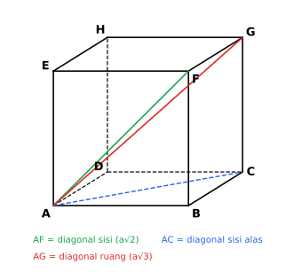

# BAB 7 — PENGUKURAN

> **Elemen:** Geometri dan Pengukuran · **Sub-elemen:** Pengukuran
>
> **Cakupan TKA:** keliling dan luas bangun datar; volume dan luas permukaan bangun ruang; jarak dua objek geometri.  
> **Batasan:** bangun datar meliputi segitiga, segi empat, lingkaran, dan gabungannya; bangun ruang beraturan sisi datar dan sisi lengkung; jarak meliputi jarak dua titik, dua garis, dua bidang, titik dan garis, serta titik dan bidang.

---

## A. Ringkasan Materi

### A.1 Keliling dan Luas Bangun Datar

| Bangun | Keliling | Luas |
|---|---|---|
| Persegi (sisi $s$) | $4s$ | $s^2$ |
| Persegi panjang ($p$, $l$) | $2(p + l)$ | $p \times l$ |
| Segitiga (alas $a$, tinggi $t$) | jumlah ketiga sisi | $\frac{1}{2} a t$ |
| Jajargenjang | jumlah keempat sisi | $a \times t$ |
| Trapesium (sisi sejajar $a$, $b$) | jumlah keempat sisi | $\frac{1}{2}(a + b)\ t$ |
| Belah ketupat (diagonal $d_1$, $d_2$) | $4s$ | $\frac{1}{2} d_1 d_2$ |
| Layang-layang | $2(a + b)$ | $\frac{1}{2} d_1 d_2$ |
| Lingkaran (jari-jari $r$) | $2\pi r = \pi d$ | $\pi r^2$ |

**Rumus Heron** (segitiga dengan sisi $a, b, c$ tanpa tinggi): $L = \sqrt{s(s - a)(s - b)(s - c)}$ dengan $s = \frac{1}{2}(a + b + c)$.

**Bagian lingkaran** (sudut pusat $\theta$):

$$\text{Panjang busur} = \frac{\theta}{360^\circ} \times 2\pi r, \qquad \text{Luas juring} = \frac{\theta}{360^\circ} \times \pi r^2$$

$$\text{Luas tembereng} = \text{luas juring} - \text{luas segitiga (dua jari-jari dan tali busur)}$$

**Bangun gabungan:** pecah menjadi bangun-bangun dasar, lalu **jumlahkan** (jika menempel) atau **kurangkan** (jika berlubang). Untuk keliling, telusuri **tepi luar** saja.

> **Contoh.** Luas daerah persegi bersisi 14 cm yang di dalamnya dilubangi lingkaran berdiameter 14 cm:  
> $14^2 - \frac{22}{7} \times 7^2 = 196 - 154 = 42$ cm².

### A.2 Volume dan Luas Permukaan Bangun Ruang Sisi Datar

| Bangun | Volume | Luas permukaan |
|---|---|---|
| Kubus (rusuk $s$) | $s^3$ | $6s^2$ |
| Balok ($p$, $l$, $t$) | $p\ l\ t$ | $2(pl + pt + lt)$ |
| Prisma | $L_{\text{alas}} \times t$ | $2 L_{\text{alas}} + K_{\text{alas}} \times t$ |
| Limas | $\frac{1}{3} L_{\text{alas}} \times t$ | $L_{\text{alas}} + \text{jumlah luas sisi tegak}$ |

Pada limas segi empat beraturan dengan sisi alas $a$ dan tinggi $t$, tinggi segitiga sisi tegak (apotema) adalah $t_s = \sqrt{t^2 + \left(\tfrac{a}{2}\right)^2}$.

### A.3 Volume dan Luas Permukaan Bangun Ruang Sisi Lengkung

| Bangun | Volume | Luas permukaan |
|---|---|---|
| Tabung ($r$, $t$) | $\pi r^2 t$ | $2\pi r(r + t)$; selimut $= 2\pi r t$ |
| Kerucut ($r$, $t$, garis pelukis $s$) | $\frac{1}{3}\pi r^2 t$ | $\pi r(r + s)$; selimut $= \pi r s$ |
| Bola ($r$) | $\frac{4}{3}\pi r^3$ | $4\pi r^2$ |
| Belahan bola padat | $\frac{2}{3}\pi r^3$ | $3\pi r^2$ (lengkung $2\pi r^2$ + alas $\pi r^2$) |

Pada kerucut: $s^2 = r^2 + t^2$.

**Variasi luas permukaan tabung:** tanpa tutup $= \pi r^2 + 2\pi r t$; tanpa alas dan tutup (pipa) $= 2\pi r t$.

**Konversi satuan volume**

$$1 \text{ liter} = 1 \text{ dm}^3 = 1\ 000 \text{ cm}^3, \qquad 1 \text{ mL} = 1 \text{ cm}^3, \qquad 1 \text{ m}^3 = 1\ 000 \text{ liter}$$

**Debit** $= \dfrac{\text{volume}}{\text{waktu}}$, sehingga waktu $= \dfrac{\text{volume}}{\text{debit}}$.

### A.4 Jarak pada Bidang Koordinat

**Jarak dua titik** $A(x_1, y_1)$ dan $B(x_2, y_2)$:

$$AB = \sqrt{(x_2 - x_1)^2 + (y_2 - y_1)^2}$$

**Jarak titik** $P(x_0, y_0)$ **ke garis** $ax + by + c = 0$:

$$d = \frac{|a x_0 + b y_0 + c|}{\sqrt{a^2 + b^2}}$$

**Jarak dua garis sejajar** $ax + by + c_1 = 0$ dan $ax + by + c_2 = 0$:

$$d = \frac{|c_1 - c_2|}{\sqrt{a^2 + b^2}}$$

### A.5 Jarak pada Bangun Ruang

Prinsip utama: **jarak selalu diukur sepanjang ruas garis terpendek, yaitu yang tegak lurus.**

| Jarak | Cara menentukan |
|---|---|
| Titik ke titik | panjang ruas garis penghubungnya (gunakan Pythagoras, bisa dua kali) |
| Titik ke garis | tarik garis dari titik yang **tegak lurus** garis; hitung panjangnya (sering memakai luas segitiga dua cara) |
| Titik ke bidang | tarik garis dari titik yang **tegak lurus** bidang (proyeksi titik pada bidang) |
| Dua garis sejajar | ambil satu titik pada garis pertama, hitung jaraknya ke garis kedua |
| Dua garis bersilangan | panjang ruas garis yang **tegak lurus kedua garis** |
| Garis ke bidang yang sejajar | ambil satu titik pada garis, hitung jaraknya ke bidang |
| Dua bidang sejajar | ambil satu titik pada bidang pertama, hitung jaraknya ke bidang kedua |

**Trik luas segitiga dua cara** (untuk jarak titik ke garis): pada segitiga dengan alas $a_1$ dan tinggi $t_1$, jika tinggi ke alas lain $a_2$ dicari:

$$\frac{1}{2} a_1 t_1 = \frac{1}{2} a_2 t_2 \quad\Rightarrow\quad t_2 = \frac{a_1 t_1}{a_2}$$

*Gambar 7.1 — Pada kubus $ABCD.EFGH$ dengan rusuk $a$: diagonal sisi $AF = AC = a\sqrt{2}$ dan diagonal ruang $AG = a\sqrt{3}$.*

**Tabel jarak cepat pada kubus $ABCD.EFGH$ dengan rusuk $a$**

| Jarak | Hasil |
|---|---|
| Diagonal sisi (mis. $A$ ke $C$) | $a\sqrt{2}$ |
| Diagonal ruang (mis. $A$ ke $G$) | $a\sqrt{3}$ |
| Titik ke bidang sisi yang berhadapan (mis. $E$ ke $ABCD$) | $a$ |
| Titik sudut ke titik tengah rusuk jauh (mis. $A$ ke tengah $FG$) | $\frac{3}{2}a$ |
| Titik sudut ke diagonal sisi yang tidak melaluinya pada sisi yang sama (mis. $C$ ke $BD$) | $\frac{1}{2}a\sqrt{2}$ |
| Titik sudut ke bidang diagonal (mis. $A$ ke $BDHF$) | $\frac{1}{2}a\sqrt{2}$ |
| Titik sudut ke diagonal ruang (mis. $A$ ke $HB$) | $\frac{1}{3}a\sqrt{6}$ |
| Titik sudut ke bidang segitiga (mis. $A$ ke bidang $BDE$) | $\frac{1}{3}a\sqrt{3}$ |
| Bidang $AFH$ ke bidang $BDG$ (sejajar) | $\frac{1}{3}a\sqrt{3}$ |
| Rusuk ke rusuk yang bersilangan (mis. $AB$ ke $CG$) | $a$ |
| Rusuk ke rusuk sejajar yang tidak sesisi (mis. $AB$ ke $HG$) | $a\sqrt{2}$ |
| Rusuk tegak ke diagonal alas yang bersilangan (mis. $AE$ ke $BD$) | $\frac{1}{2}a\sqrt{2}$ |

> **Contoh.** Kubus rusuk 6 cm. Jarak titik $A$ ke bidang $BDE$:  
> Bidang $BDE$ memotong diagonal ruang $AG$ tegak lurus di titik yang membagi $AG$ dengan perbandingan $1 : 2$.  
> Jarak $= \frac{1}{3} \times AG = \frac{1}{3} \times 6\sqrt{3} = 2\sqrt{3}$ cm.

> **Contoh.** Kubus rusuk 6 cm. Jarak titik $A$ ke titik tengah $FG$ (misal $P$):  
> $AF$ adalah diagonal sisi $= 6\sqrt{2}$, dan $FP = 3$. Karena $FG \perp$ bidang $ABFE$, segitiga $AFP$ siku-siku di $F$:  
> $AP = \sqrt{(6\sqrt{2})^2 + 3^2} = \sqrt{72 + 9} = 9$ cm.

---

## B. Tips & Trik

1. **Pilih nilai $\pi$ yang tepat.** Jika jari-jari/diameter kelipatan 7, pakai $\frac{22}{7}$; jika tidak, pakai $3{,}14$ — atau biarkan dalam $\pi$ jika opsi jawaban memuat $\pi$.
2. **Kerucut hampir selalu memakai tripel Pythagoras** untuk $r$, $t$, dan $s$: $(6, 8, 10)$, $(5, 12, 13)$, $(7, 24, 25)$.
3. **Perbandingan volume kerucut : tabung : bola** dengan jari-jari sama dan tinggi kerucut = tinggi tabung = $2r$ adalah $1 : 3 : 2$.
4. **Balok dengan ukuran $p, l, t$:** diagonal ruang $\sqrt{p^2 + l^2 + t^2}$; khusus kubus $a\sqrt{3}$.
5. **Hati-hati satuan.** Ubah semua ke satuan yang sama sebelum menghitung. Volume cm³ → liter: bagi 1.000.
6. **Luas permukaan "tanpa tutup"** → kurangi satu luas alas.
7. **Jarak di ruang = cari segitiga siku-siku.** Gambar ulang segitiga yang memuat jarak itu di luar kubus agar terlihat jelas.
8. **Jarak titik ke garis:** gunakan luas segitiga dua cara ($\text{alas}_1 \times \text{tinggi}_1 = \text{alas}_2 \times \text{tinggi}_2$).
9. **Jarak dua objek sejajar** (garis–garis, garis–bidang, bidang–bidang): ubah menjadi jarak **titik** ke objek yang lain.
10. **Hafalkan tabel jarak cepat kubus** — banyak soal TKA dapat dijawab kurang dari 30 detik.

---

## C. Latihan Soal

*Gunakan $\pi = \frac{22}{7}$ kecuali dinyatakan lain.*

### Bagian I — Pilihan Ganda

**1.** Sebuah persegi panjang memiliki keliling 34 cm dan panjang 12 cm. Luas persegi panjang tersebut adalah … cm².

- A. $50$
- B. $55$
- C. $65$
- D. $60$
- E. $72$

**2.** Luas trapesium dengan panjang sisi sejajar 10 cm dan 16 cm serta tinggi 8 cm adalah … cm².

- A. $104$
- B. $96$
- C. $112$
- D. $128$
- E. $208$

**3.** Panjang diagonal-diagonal sebuah belah ketupat adalah 12 cm dan 16 cm. Keliling belah ketupat tersebut adalah … cm.

- A. $28$
- B. $48$
- C. $40$
- D. $56$
- E. $96$

**4.** Luas lingkaran berdiameter 28 cm adalah … cm².

- A. $88$
- B. $154$
- C. $308$
- D. $2.464$
- E. $616$

**5.** Panjang busur lingkaran berjari-jari 21 cm dengan sudut pusat $120^\circ$ adalah … cm.

- A. $22$
- B. $44$
- C. $66$
- D. $132$
- E. $462$

**6.** Luas juring lingkaran berjari-jari 14 cm dengan sudut pusat $45^\circ$ adalah … cm².

- A. $44$
- B. $88$
- C. $154$
- D. $77$
- E. $308$

**7.** Sebuah bangun terdiri atas persegi bersisi 14 cm dan setengah lingkaran yang menempel di luar salah satu sisinya (diameter setengah lingkaran = sisi persegi). Luas bangun tersebut adalah … cm².

- A. $273$
- B. $245$
- C. $350$
- D. $196$
- E. $308$

**8.** Sebuah kubus memiliki luas permukaan 150 cm². Volume kubus tersebut adalah … cm³.

- A. $25$
- B. $75$
- C. $125$
- D. $150$
- E. $216$

**9.** Luas permukaan balok berukuran $8 \text{ cm} \times 6 \text{ cm} \times 5 \text{ cm}$ adalah … cm².

- A. $118$
- B. $240$
- C. $256$
- D. $480$
- E. $236$

**10.** Alas sebuah prisma berbentuk segitiga siku-siku dengan sisi siku-siku 6 cm dan 8 cm. Tinggi prisma 12 cm. Luas permukaan prisma adalah … cm².

- A. $288$
- B. $336$
- C. $312$
- D. $360$
- E. $576$

**11.** Sebuah limas beraturan memiliki alas persegi bersisi 10 cm dan tinggi limas 12 cm. Luas permukaan limas adalah … cm².

- A. $360$
- B. $340$
- C. $400$
- D. $460$
- E. $520$

**12.** Volume tabung berjari-jari 7 cm dan tinggi 10 cm adalah ….

- A. 15,4 liter
- B. 0,154 liter
- C. 154 liter
- D. 1,54 liter
- E. 1.540 liter

**13.** Luas permukaan kerucut dengan jari-jari alas 6 cm dan tinggi 8 cm adalah … cm².

- A. $60\pi$
- B. $36\pi$
- C. $96\pi$
- D. $100\pi$
- E. $132\pi$

**14.** Volume sebuah bola adalah $36\pi$ cm³. Luas permukaan bola tersebut adalah … cm².

- A. $9\pi$
- B. $12\pi$
- C. $27\pi$
- D. $108\pi$
- E. $36\pi$

**15.** Sebuah kerucut, tabung, dan bola memiliki jari-jari yang sama, yaitu $r$. Tinggi kerucut dan tinggi tabung sama dengan $2r$. Perbandingan volume kerucut : tabung : bola adalah ….

- A. $1 : 2 : 3$
- B. $1 : 3 : 2$
- C. $2 : 3 : 1$
- D. $1 : 3 : 4$
- E. $3 : 1 : 2$

**16.** Sebuah bak mandi berbentuk balok berukuran panjang 100 cm, lebar 60 cm, dan tinggi 50 cm. Bak itu diisi air dari keadaan kosong dengan debit 10 liter/menit. Waktu yang diperlukan hingga bak penuh adalah ….

- A. 3 menit
- B. 50 menit
- C. 30 menit
- D. 60 menit
- E. 300 menit

**17.** Jarak antara titik $A(1, 2)$ dan $B(7, 10)$ adalah … satuan.

- A. $10$
- B. $8$
- C. $12$
- D. $14$
- E. $\sqrt{28}$

**18.** Jarak titik $P(2, 3)$ ke garis $3x + 4y - 8 = 0$ adalah … satuan.

- A. $1$
- B. $3$
- C. $4$
- D. $2$
- E. $5$

**19.** Diketahui kubus $ABCD.EFGH$ dengan panjang rusuk 6 cm. Jarak titik $A$ ke titik $G$ adalah ….

- A. $6\sqrt{2}$ cm
- B. $6\sqrt{3}$ cm
- C. $6$ cm
- D. $12$ cm
- E. $3\sqrt{6}$ cm

**20.** Diketahui kubus $ABCD.EFGH$ dengan panjang rusuk 8 cm. Jarak titik $C$ ke garis $BD$ adalah ….

- A. $4$ cm
- B. $4\sqrt{3}$ cm
- C. $8$ cm
- D. $8\sqrt{2}$ cm
- E. $4\sqrt{2}$ cm

### Bagian II — Pilihan Ganda Kompleks (jawaban benar bisa lebih dari satu)

**21.** Diketahui kubus $ABCD.EFGH$ dengan panjang rusuk 4 cm. Pernyataan yang benar adalah ….

- ☐ (1) Jarak titik $A$ ke titik $C$ adalah $4\sqrt{2}$ cm.
- ☐ (2) Jarak titik $A$ ke titik $G$ adalah $4\sqrt{3}$ cm.
- ☐ (3) Jarak titik $E$ ke bidang $ABCD$ adalah 4 cm.
- ☐ (4) Jarak garis $AE$ ke garis $CG$ adalah 4 cm.
- ☐ (5) Jarak bidang $ABCD$ ke bidang $EFGH$ adalah 4 cm.

**22.** Bangun ruang yang volumenya dihitung dengan rumus $\frac{1}{3} \times \text{luas alas} \times \text{tinggi}$ adalah ….

- ☐ (1) limas segi empat
- ☐ (2) kerucut
- ☐ (3) prisma
- ☐ (4) tabung
- ☐ (5) limas segitiga

**23.** Sebuah tabung memiliki jari-jari 7 cm dan tinggi 10 cm. Pernyataan yang benar adalah ….

- ☐ (1) Volumenya 1.540 cm³.
- ☐ (2) Luas selimutnya 440 cm².
- ☐ (3) Luas permukaan tabung tertutup 748 cm².
- ☐ (4) Luas permukaan tabung tanpa tutup 648 cm².
- ☐ (5) Keliling alasnya 44 cm.

**24.** Diketahui kubus $ABCD.EFGH$ dengan panjang rusuk $a$. Pernyataan yang benar adalah ….

- ☐ (1) Jarak titik $A$ ke bidang $BDHF$ adalah $\frac{1}{2}a\sqrt{2}$.
- ☐ (2) Jarak garis $AB$ ke garis $HG$ adalah $a\sqrt{2}$.
- ☐ (3) Jarak titik $E$ ke garis $AC$ adalah $a\sqrt{2}$.
- ☐ (4) Jarak garis $AE$ ke garis $BD$ adalah $\frac{1}{2}a\sqrt{2}$.
- ☐ (5) Jarak bidang $ADHE$ ke bidang $BCGF$ adalah $a\sqrt{2}$.

**25.** Konversi satuan berikut yang benar adalah ….

- ☐ (1) 1 liter = 1 dm³
- ☐ (2) 1 m³ = 100 liter
- ☐ (3) 1 cm³ = 1 mL
- ☐ (4) 2,5 m³ = 2.500 dm³
- ☐ (5) 500 cm³ = 5 liter

### Bagian III — Benar atau Salah

**26.** Diketahui kubus $ABCD.EFGH$ dengan panjang rusuk 6 cm.

| | Pernyataan | B | S |
|:--:|---|:--:|:--:|
| a | Jarak titik $A$ ke titik tengah rusuk $FG$ adalah 9 cm. | ☐ | ☐ |
| b | Jarak titik $B$ ke bidang $ACGE$ adalah $3\sqrt{2}$ cm. | ☐ | ☐ |
| c | Jarak titik $A$ ke bidang $BDE$ adalah $2\sqrt{3}$ cm. | ☐ | ☐ |
| d | Jarak garis $AB$ ke bidang $EFGH$ adalah $6\sqrt{2}$ cm. | ☐ | ☐ |

**27.** Sebuah benda padat berbentuk gabungan kerucut dan belahan bola. Alas kerucut berimpit dengan bidang datar belahan bola. Jari-jari keduanya 6 cm dan tinggi kerucut 8 cm.

| | Pernyataan | B | S |
|:--:|---|:--:|:--:|
| a | Volume kerucut adalah $96\pi$ cm³. | ☐ | ☐ |
| b | Volume belahan bola adalah $144\pi$ cm³. | ☐ | ☐ |
| c | Volume benda adalah $250\pi$ cm³. | ☐ | ☐ |
| d | Luas permukaan benda adalah $132\pi$ cm². | ☐ | ☐ |

**28.** Sebuah lapangan berbentuk persegi panjang berukuran $40 \text{ m} \times 30 \text{ m}$. Di tengahnya terdapat kolam berbentuk lingkaran berdiameter 14 m. Bagian lapangan selain kolam ditanami rumput dengan biaya Rp20.000 per m².

| | Pernyataan | B | S |
|:--:|---|:--:|:--:|
| a | Luas lapangan 1.200 m². | ☐ | ☐ |
| b | Luas kolam 616 m². | ☐ | ☐ |
| c | Luas bagian yang ditanami rumput 1.046 m². | ☐ | ☐ |
| d | Biaya penanaman rumput Rp20.920.000. | ☐ | ☐ |

**29.** Diketahui titik $P(1, 1)$, titik $Q(4, 5)$, dan garis $g: 3x - 4y + 11 = 0$.

| | Pernyataan | B | S |
|:--:|---|:--:|:--:|
| a | Jarak $PQ$ adalah 7 satuan. | ☐ | ☐ |
| b | Jarak titik $P$ ke garis $g$ adalah 2 satuan. | ☐ | ☐ |
| c | Titik $Q$ terletak pada garis $g$. | ☐ | ☐ |
| d | Jarak garis $g$ ke garis $3x - 4y + 1 = 0$ adalah 2 satuan. | ☐ | ☐ |

### Bagian IV — Isian Singkat

**30.** Sebuah persegi bersisi 14 cm. Di dalamnya terdapat lingkaran yang menyinggung keempat sisi persegi. Luas daerah persegi di luar lingkaran adalah … cm².

**31.** Sebuah tangki air berbentuk tabung berdiameter 1,4 m dan tinggi 2 m. Kapasitas tangki tersebut adalah … liter.

**32.** Diketahui kubus $ABCD.EFGH$ dengan panjang rusuk 12 cm. Jarak titik $A$ ke garis $HB$ adalah … cm.

**33.** Sebuah topi ulang tahun berbentuk kerucut tanpa alas memiliki diameter 14 cm dan tinggi 24 cm. Luas karton yang diperlukan untuk membuat topi tersebut adalah … cm².

---

## D. Kunci Jawaban dan Pembahasan

### Kunci Ringkas

| No | Kunci | No | Kunci | No | Kunci | No | Kunci |
|:--:|:--:|:--:|:--:|:--:|:--:|:--:|:--:|
| 1 | D | 10 | B | 19 | B | 28 | B, S, B, B |
| 2 | A | 11 | A | 20 | E | 29 | S, B, S, B |
| 3 | C | 12 | D | 21 | (1), (2), (3), (5) | 30 | 42 |
| 4 | E | 13 | C | 22 | (1), (2), (5) | 31 | 3.080 |
| 5 | B | 14 | E | 23 | (1), (2), (3), (5) | 32 | $4\sqrt{6}$ |
| 6 | D | 15 | B | 24 | (1), (2), (4) | 33 | 550 |
| 7 | A | 16 | C | 25 | (1), (3), (4) | | |
| 8 | C | 17 | A | 26 | B, B, B, S | | |
| 9 | E | 18 | D | 27 | B, B, S, B | | |

### Pembahasan

**1. Jawaban: D**  
$2(12 + l) = 34 \Rightarrow 12 + l = 17 \Rightarrow l = 5$ cm. Luas $= 12 \times 5 = 60$ cm².

**2. Jawaban: A**  
$L = \frac{1}{2}(10 + 16) \times 8 = 13 \times 8 = 104$ cm².

**3. Jawaban: C**  
Diagonal belah ketupat saling tegak lurus dan membagi dua. Setengah diagonalnya 6 cm dan 8 cm, sehingga sisinya $= \sqrt{6^2 + 8^2} = 10$ cm.  
Keliling $= 4 \times 10 = 40$ cm.

**4. Jawaban: E**  
$r = 14$ cm. $L = \frac{22}{7} \times 14 \times 14 = 616$ cm².

**5. Jawaban: B**  
$\dfrac{120^\circ}{360^\circ} \times 2 \times \dfrac{22}{7} \times 21 = \dfrac{1}{3} \times 132 = 44$ cm.

**6. Jawaban: D**  
$\dfrac{45^\circ}{360^\circ} \times \dfrac{22}{7} \times 14^2 = \dfrac{1}{8} \times 616 = 77$ cm².

**7. Jawaban: A**  
Luas persegi $= 196$ cm². Setengah lingkaran berjari-jari 7 cm: $\frac{1}{2} \times \frac{22}{7} \times 49 = 77$ cm².  
Total $= 196 + 77 = 273$ cm².

**8. Jawaban: C**  
$6s^2 = 150 \Rightarrow s^2 = 25 \Rightarrow s = 5$ cm. $V = 5^3 = 125$ cm³.

**9. Jawaban: E**  
$2(8 \cdot 6 + 8 \cdot 5 + 6 \cdot 5) = 2(48 + 40 + 30) = 2 \times 118 = 236$ cm².

**10. Jawaban: B**  
Sisi miring alas $= \sqrt{36 + 64} = 10$ cm. Luas alas $= \frac{1}{2} \times 6 \times 8 = 24$ cm². Keliling alas $= 6 + 8 + 10 = 24$ cm.  
$LP = 2(24) + 24 \times 12 = 48 + 288 = 336$ cm².

**11. Jawaban: A**  
Tinggi sisi tegak $t_s = \sqrt{12^2 + 5^2} = 13$ cm (tripel 5, 12, 13).  
$LP = 10^2 + 4 \times \frac{1}{2} \times 10 \times 13 = 100 + 260 = 360$ cm².

**12. Jawaban: D**  
$V = \frac{22}{7} \times 7^2 \times 10 = 1\ 540$ cm³ $= 1{,}54$ liter.

**13. Jawaban: C**  
$s = \sqrt{6^2 + 8^2} = 10$ cm. $LP = \pi r (r + s) = \pi \times 6 \times (6 + 10) = 96\pi$ cm².

**14. Jawaban: E**  
$\frac{4}{3}\pi r^3 = 36\pi \Rightarrow r^3 = 27 \Rightarrow r = 3$ cm. $LP = 4\pi (3)^2 = 36\pi$ cm².

**15. Jawaban: B**
- $V_{\text{kerucut}} = \frac{1}{3}\pi r^2 (2r) = \frac{2}{3}\pi r^3$
- $V_{\text{tabung}} = \pi r^2 (2r) = 2\pi r^3$
- $V_{\text{bola}} = \frac{4}{3}\pi r^3$

Perbandingan $\frac{2}{3} : 2 : \frac{4}{3}$; kalikan 3 → $2 : 6 : 4 = 1 : 3 : 2$.

**16. Jawaban: C**  
$V = 100 \times 60 \times 50 = 300\ 000$ cm³ $= 300$ liter. Waktu $= \dfrac{300}{10} = 30$ menit.

**17. Jawaban: A**  
$AB = \sqrt{(7 - 1)^2 + (10 - 2)^2} = \sqrt{36 + 64} = 10$.

**18. Jawaban: D**  
$d = \dfrac{|3(2) + 4(3) - 8|}{\sqrt{3^2 + 4^2}} = \dfrac{|10|}{5} = 2$.

**19. Jawaban: B**  
$AG$ adalah diagonal ruang $= a\sqrt{3} = 6\sqrt{3}$ cm.

**20. Jawaban: E**  
Segitiga $BCD$ siku-siku sama kaki di $C$. Garis tegak lurus dari $C$ ke $BD$ jatuh di titik tengah $BD$ (titik potong diagonal alas), sehingga jaraknya setengah diagonal sisi:  
$\frac{1}{2} \times 8\sqrt{2} = 4\sqrt{2}$ cm.

**21. Jawaban: (1), (2), (3), (5)**  
(1) diagonal sisi $4\sqrt{2}$ ✔ · (2) diagonal ruang $4\sqrt{3}$ ✔ · (3) $EA \perp ABCD$, sehingga jaraknya $EA = 4$ ✔ · (4) $AE \parallel CG$; jaraknya $AC = 4\sqrt{2}$, bukan 4 ✘ · (5) ✔

**22. Jawaban: (1), (2), (5)**  
Semua limas dan kerucut memakai $\frac{1}{3} L_{\text{alas}} t$. Prisma dan tabung memakai $L_{\text{alas}} \times t$.

**23. Jawaban: (1), (2), (3), (5)**
- (1) $\frac{22}{7} \times 49 \times 10 = 1\ 540$ ✔
- (2) $2 \times \frac{22}{7} \times 7 \times 10 = 440$ ✔
- (3) Luas alas $= 154$; $440 + 2(154) = 748$ ✔
- (4) Tanpa tutup $= 440 + 154 = 594$, bukan 648 ✘
- (5) $2 \times \frac{22}{7} \times 7 = 44$ ✔

**24. Jawaban: (1), (2), (4)**
- (1) Bidang $BDHF$ memuat $BD$. Garis dari $A$ yang tegak lurus bidang itu jatuh di titik tengah $BD$ (pusat alas), sehingga jaraknya $\frac{1}{2}AC = \frac{1}{2}a\sqrt{2}$ ✔
- (2) $AB \parallel HG$; jaraknya $= BG$ (diagonal sisi) $= a\sqrt{2}$ ✔
- (3) $EA \perp$ bidang alas, sehingga $EA \perp AC$. Jarak $E$ ke $AC$ adalah $EA = a$, bukan $a\sqrt{2}$ ✘
- (4) $AE$ dan $BD$ bersilangan. Ruas yang tegak lurus keduanya adalah ruas dari $A$ ke titik tengah $BD$, panjangnya $\frac{1}{2}a\sqrt{2}$ ✔
- (5) Kedua bidang sejajar dengan jarak $AB = a$ ✘

**25. Jawaban: (1), (3), (4)**  
(2) $1 \text{ m}^3 = 1\ 000$ liter ✘. (4) $2{,}5 \text{ m}^3 = 2{,}5 \times 1\ 000 = 2\ 500 \text{ dm}^3$ ✔. (5) $500 \text{ cm}^3 = 0{,}5$ liter ✘.

**26. Jawaban: a. B, b. B, c. B, d. S**
- a. Misal $P$ titik tengah $FG$. $AF = 6\sqrt{2}$, $FP = 3$, dan $\triangle AFP$ siku-siku di $F$ → $AP = \sqrt{72 + 9} = 9$ ✔
- b. Jarak $B$ ke bidang $ACGE$ $= \frac{1}{2}BD = \frac{1}{2} \times 6\sqrt{2} = 3\sqrt{2}$ ✔
- c. $\frac{1}{3} \times AG = \frac{1}{3} \times 6\sqrt{3} = 2\sqrt{3}$ ✔
- d. $AB$ sejajar bidang $EFGH$; jaraknya $= AE = 6$, bukan $6\sqrt{2}$ ✘

**27. Jawaban: a. B, b. B, c. S, d. B**
- a. $\frac{1}{3}\pi (36)(8) = 96\pi$ ✔
- b. $\frac{2}{3}\pi (216) = 144\pi$ ✔
- c. $96\pi + 144\pi = 240\pi$, bukan $250\pi$ ✘
- d. Permukaan benda = selimut kerucut + permukaan lengkung belahan bola (alasnya tertutup, tidak dihitung).  
  Garis pelukis $s = \sqrt{36 + 64} = 10$. Selimut $= \pi(6)(10) = 60\pi$; lengkung belahan bola $= 2\pi(36) = 72\pi$. Total $132\pi$ ✔

**28. Jawaban: a. B, b. S, c. B, d. B**
- a. $40 \times 30 = 1\ 200$ ✔
- b. $r = 7$: $\frac{22}{7} \times 49 = 154$ m², bukan 616 ✘ (616 adalah luas jika $r = 14$)
- c. $1\ 200 - 154 = 1\ 046$ ✔
- d. $1\ 046 \times 20\ 000 = 20\ 920\ 000$ ✔

**29. Jawaban: a. S, b. B, c. S, d. B**
- a. $PQ = \sqrt{3^2 + 4^2} = 5$, bukan 7 ✘
- b. $\dfrac{|3 - 4 + 11|}{5} = \dfrac{10}{5} = 2$ ✔
- c. $3(4) - 4(5) + 11 = 3 \neq 0$ ✘
- d. $\dfrac{|11 - 1|}{\sqrt{9 + 16}} = \dfrac{10}{5} = 2$ ✔

**30. Jawaban: 42 cm²**  
Diameter lingkaran = sisi persegi = 14 cm, sehingga $r = 7$.  
$196 - \frac{22}{7} \times 49 = 196 - 154 = 42$ cm².

**31. Jawaban: 3.080 liter**  
$r = 0{,}7$ m. $V = \frac{22}{7} \times 0{,}49 \times 2 = 3{,}08$ m³ $= 3\ 080$ liter.

**32. Jawaban: $4\sqrt{6}$ cm**  
Segitiga $ABH$ siku-siku di $A$ (karena $AB \perp$ bidang $ADHE$), dengan $AB = 12$, $AH = 12\sqrt{2}$, dan $HB = 12\sqrt{3}$.  
Luas dua cara: $\frac{1}{2} \times AB \times AH = \frac{1}{2} \times HB \times d$  
$12 \times 12\sqrt{2} = 12\sqrt{3} \times d \Rightarrow d = \dfrac{12\sqrt{2}}{\sqrt{3}} = \dfrac{12\sqrt{6}}{3} = 4\sqrt{6}$ cm.  
(Sesuai rumus cepat $\frac{1}{3}a\sqrt{6}$.)

**33. Jawaban: 550 cm²**  
$r = 7$, $t = 24$, $s = \sqrt{49 + 576} = 25$ (tripel 7, 24, 25).  
Luas selimut $= \pi r s = \frac{22}{7} \times 7 \times 25 = 550$ cm².
