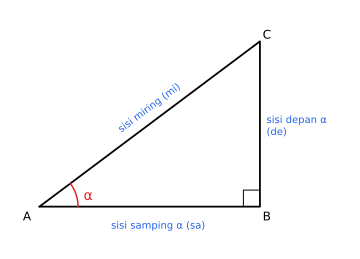

# BAB 8 — TRIGONOMETRI

> **Elemen:** Trigonometri · **Sub-elemen:** Perbandingan Trigonometri
>
> **Cakupan TKA:** perbandingan trigonometri (sinus, kosinus, tangen, kotangen, sekan, kosekan).

---

## A. Ringkasan Materi

### A.1 Perbandingan Trigonometri pada Segitiga Siku-Siku

*Gambar 8.1 — Terhadap sudut $\alpha$: sisi **depan** (de) adalah sisi di hadapan $\alpha$, sisi **samping** (sa) adalah sisi siku-siku yang menempel pada $\alpha$, dan sisi **miring** (mi) adalah hipotenusa.*

| Perbandingan | Rumus | Kebalikan |
|---|---|---|
| sinus | $\sin \alpha = \dfrac{\text{de}}{\text{mi}}$ | kosekan: $\csc \alpha = \dfrac{1}{\sin \alpha} = \dfrac{\text{mi}}{\text{de}}$ |
| kosinus | $\cos \alpha = \dfrac{\text{sa}}{\text{mi}}$ | sekan: $\sec \alpha = \dfrac{1}{\cos \alpha} = \dfrac{\text{mi}}{\text{sa}}$ |
| tangen | $\tan \alpha = \dfrac{\text{de}}{\text{sa}}$ | kotangen: $\cot \alpha = \dfrac{1}{\tan \alpha} = \dfrac{\text{sa}}{\text{de}}$ |

**Jembatan keledai:** **"SinDeMi – CosSaMi – TanDeSa"**.

> **Contoh.** Segitiga $ABC$ siku-siku di $B$ dengan $AB = 4$, $BC = 3$, sehingga $AC = 5$. Terhadap sudut $A$: de $= BC = 3$, sa $= AB = 4$, mi $= 5$.  
> $\sin A = \frac{3}{5}$, $\cos A = \frac{4}{5}$, $\tan A = \frac{3}{4}$, $\csc A = \frac{5}{3}$, $\sec A = \frac{5}{4}$, $\cot A = \frac{4}{3}$.

**Jika hanya satu perbandingan yang diketahui**, gambar segitiga siku-siku, isi dua sisi, lalu cari sisi ketiga dengan Pythagoras.

> **Contoh.** $\tan A = \frac{5}{12}$ ($A$ lancip) → de $= 5$, sa $= 12$, mi $= 13$. Jadi $\cos A = \frac{12}{13}$ dan $\sin A = \frac{5}{13}$.

### A.2 Nilai Perbandingan Trigonometri Sudut Istimewa

| $\alpha$ | $0^\circ$ | $30^\circ$ | $45^\circ$ | $60^\circ$ | $90^\circ$ |
|---|:--:|:--:|:--:|:--:|:--:|
| $\sin \alpha$ | $0$ | $\frac{1}{2}$ | $\frac{1}{2}\sqrt{2}$ | $\frac{1}{2}\sqrt{3}$ | $1$ |
| $\cos \alpha$ | $1$ | $\frac{1}{2}\sqrt{3}$ | $\frac{1}{2}\sqrt{2}$ | $\frac{1}{2}$ | $0$ |
| $\tan \alpha$ | $0$ | $\frac{1}{3}\sqrt{3}$ | $1$ | $\sqrt{3}$ | tak terdefinisi |

**Trik hafalan:** $\sin 0^\circ, 30^\circ, 45^\circ, 60^\circ, 90^\circ = \frac{1}{2}\sqrt{0},\ \frac{1}{2}\sqrt{1},\ \frac{1}{2}\sqrt{2},\ \frac{1}{2}\sqrt{3},\ \frac{1}{2}\sqrt{4}$. Nilai $\cos$ adalah urutan **terbalik** dari $\sin$. Nilai $\tan = \dfrac{\sin}{\cos}$.

### A.3 Sudut di Berbagai Kuadran

Untuk sudut $\theta$ yang titik ujungnya $(x, y)$ dengan $r = \sqrt{x^2 + y^2}$:

$$\sin \theta = \frac{y}{r}, \qquad \cos \theta = \frac{x}{r}, \qquad \tan \theta = \frac{y}{x}$$

**Tanda di setiap kuadran** — ingat: **"Semua Sindikat Tangannya Kosong"**

| Kuadran | Rentang sudut | Yang bernilai positif |
|:--:|:--:|---|
| I | $0^\circ$–$90^\circ$ | **Semua** |
| II | $90^\circ$–$180^\circ$ | **Sin** (dan csc) |
| III | $180^\circ$–$270^\circ$ | **Tan** (dan cot) |
| IV | $270^\circ$–$360^\circ$ | **Cos** (dan sec) |

**Rumus sudut berelasi**

| Bentuk | Fungsi | Contoh |
|---|---|---|
| $(180^\circ - \alpha)$, $(180^\circ + \alpha)$, $(360^\circ - \alpha)$ | fungsi **tetap** (sin tetap sin) | $\sin 150^\circ = \sin(180^\circ - 30^\circ) = +\sin 30^\circ = \frac{1}{2}$ |
| $(90^\circ \pm \alpha)$, $(270^\circ \pm \alpha)$ | fungsi **berubah** (sin ↔ cos, tan ↔ cot, sec ↔ csc) | $\cos 140^\circ = \cos(90^\circ + 50^\circ) = -\sin 50^\circ$ |

Tanda (+/−) mengikuti **kuadran sudut semula**.

> **Contoh.**  
> $\cos 240^\circ = \cos(180^\circ + 60^\circ) = -\cos 60^\circ = -\frac{1}{2}$ (kuadran III, cos negatif).  
> $\tan 315^\circ = \tan(360^\circ - 45^\circ) = -\tan 45^\circ = -1$ (kuadran IV, tan negatif).

**Sudut negatif:** $\sin(-\alpha) = -\sin \alpha$, $\cos(-\alpha) = \cos \alpha$, $\tan(-\alpha) = -\tan \alpha$.

**Sudut lebih dari $360^\circ$:** kurangi dengan kelipatan $360^\circ$. Contoh: $\sin 390^\circ = \sin 30^\circ$.

**Radian:** $\pi \text{ rad} = 180^\circ$. Contoh: $\frac{5\pi}{6} = \frac{5 \times 180^\circ}{6} = 150^\circ$.

### A.4 Identitas Trigonometri Dasar

$$\sin^2 \alpha + \cos^2 \alpha = 1 \qquad 1 + \tan^2 \alpha = \sec^2 \alpha \qquad 1 + \cot^2 \alpha = \csc^2 \alpha$$

$$\tan \alpha = \frac{\sin \alpha}{\cos \alpha}, \qquad \cot \alpha = \frac{\cos \alpha}{\sin \alpha}$$

**Strategi membuktikan/menyederhanakan:** ubah semua ke $\sin$ dan $\cos$, samakan penyebut, lalu gunakan $\sin^2 + \cos^2 = 1$.

> **Contoh.** $\sin x \cdot \cot x = \sin x \cdot \dfrac{\cos x}{\sin x} = \cos x$.

### A.5 Penerapan: Sudut Elevasi dan Depresi

- **Sudut elevasi**: sudut antara garis mendatar dan garis pandang **ke atas**.
- **Sudut depresi**: sudut antara garis mendatar dan garis pandang **ke bawah**.
- Sudut elevasi dari A ke B **sama besar** dengan sudut depresi dari B ke A (sudut dalam berseberangan).

> **Contoh.** Dari jarak 10 m, seorang anak dengan tinggi mata 1,5 m melihat puncak tiang dengan sudut elevasi $45^\circ$.  
> Tinggi tiang di atas mata anak $= 10 \tan 45^\circ = 10$ m. Tinggi tiang $= 10 + 1{,}5 = 11{,}5$ m.

### A.6 Pengayaan (Tambahan)

Untuk segitiga sembarang $ABC$ dengan sisi $a$, $b$, $c$ di hadapan sudut $A$, $B$, $C$:

$$\frac{a}{\sin A} = \frac{b}{\sin B} = \frac{c}{\sin C}, \qquad a^2 = b^2 + c^2 - 2bc \cos A, \qquad L = \frac{1}{2}bc \sin A$$

---

## B. Tips & Trik

1. **Gambar segitiga dulu!** Jika diketahui satu perbandingan (misal $\sin A = \frac{3}{5}$), langsung gambar segitiga siku-siku dan lengkapi dengan tripel Pythagoras.
2. **Tentukan tanda terakhir.** Hitung nilai "positif"-nya dari segitiga, baru beri tanda sesuai kuadran.
3. **Sudut relasi:** $180^\circ$ dan $360^\circ$ → fungsi tetap; $90^\circ$ dan $270^\circ$ → fungsi berubah.
4. **Hafalkan tabel sudut istimewa** dengan trik $\frac{1}{2}\sqrt{0}, \frac{1}{2}\sqrt{1}, \dots, \frac{1}{2}\sqrt{4}$.
5. **Identitas:** jika bingung, ubah semuanya ke $\sin$ dan $\cos$.
6. **$\sin A + \cos A = k$:** kuadratkan → $1 + 2\sin A \cos A = k^2$.
7. **Elevasi/depresi:** gambar sketsa, tandai garis mendatar, dan cari segitiga siku-sikunya. Jangan lupa menambahkan **tinggi mata** pengamat jika disebutkan.
8. **Dua sudut elevasi dari dua titik** (soal menara): misalkan jarak ke kaki menara $x$, tulis tinggi menara dengan dua cara, lalu samakan.
9. **Cek kewajaran:** $-1 \le \sin \alpha, \cos \alpha \le 1$. Jika hasilmu $\sin \alpha = \frac{5}{3}$, pasti ada yang salah.
10. **$\tan$ sudut istimewa:** $\tan 30^\circ = \frac{1}{\sqrt{3}} = \frac{1}{3}\sqrt{3}$ — sering muncul dalam bentuk yang berbeda di opsi jawaban.

---

## C. Latihan Soal

### Bagian I — Pilihan Ganda

**1.** Segitiga $ABC$ siku-siku di $B$ dengan $AB = 8$ cm, $BC = 6$ cm, dan $AC = 10$ cm. Nilai $\sin A$ adalah ….

- A. $\frac{4}{5}$
- B. $\frac{3}{4}$
- C. $\frac{3}{5}$
- D. $\frac{4}{3}$
- E. $\frac{5}{3}$

**2.** Pada segitiga soal nomor 1, nilai $\sec A$ adalah ….

- A. $\frac{5}{4}$
- B. $\frac{5}{3}$
- C. $\frac{4}{5}$
- D. $\frac{3}{4}$
- E. $\frac{4}{3}$

**3.** Nilai $\sin 30^\circ + \cos 60^\circ + \tan 45^\circ$ adalah ….

- A. $1$
- B. $\frac{3}{2}$
- C. $\frac{5}{2}$
- D. $3$
- E. $2$

**4.** Nilai $\dfrac{\sin 60^\circ \cdot \cos 30^\circ}{\tan 45^\circ}$ adalah ….

- A. $\frac{1}{4}$
- B. $\frac{3}{4}$
- C. $\frac{1}{2}$
- D. $\frac{1}{2}\sqrt{3}$
- E. $1$

**5.** Diketahui $\tan A = \frac{5}{12}$ dengan $A$ sudut lancip. Nilai $\cos A$ adalah ….

- A. $\frac{5}{13}$
- B. $\frac{13}{12}$
- C. $\frac{5}{12}$
- D. $\frac{12}{13}$
- E. $\frac{13}{5}$

**6.** Diketahui $\sin A = \frac{3}{5}$ dan $A$ terletak di kuadran II. Nilai $\tan A$ adalah ….

- A. $-\frac{3}{4}$
- B. $\frac{3}{4}$
- C. $\frac{4}{3}$
- D. $-\frac{4}{3}$
- E. $-\frac{3}{5}$

**7.** Nilai $\sin 150^\circ$ adalah ….

- A. $-\frac{1}{2}$
- B. $-\frac{1}{2}\sqrt{3}$
- C. $\frac{1}{2}$
- D. $\frac{1}{2}\sqrt{3}$
- E. $1$

**8.** Nilai $\cos 240^\circ$ adalah ….

- A. $\frac{1}{2}$
- B. $\frac{1}{2}\sqrt{3}$
- C. $-\frac{1}{2}\sqrt{3}$
- D. $-1$
- E. $-\frac{1}{2}$

**9.** Nilai $\tan 315^\circ$ adalah ….

- A. $1$
- B. $-1$
- C. $\sqrt{3}$
- D. $-\sqrt{3}$
- E. $-\frac{1}{3}\sqrt{3}$

**10.** Nilai $\cos 120^\circ + \sin 210^\circ - \tan 225^\circ$ adalah ….

- A. $-1$
- B. $0$
- C. $1$
- D. $-2$
- E. $2$

**11.** Jika $\sin 50^\circ = p$, maka nilai $\cos 140^\circ$ adalah ….

- A. $-p$
- B. $p$
- C. $\sqrt{1 - p^2}$
- D. $-\sqrt{1 - p^2}$
- E. $\frac{1}{p}$

**12.** Bentuk sederhana dari $(1 - \sin^2 A) \cdot \sec A \cdot \tan A$ adalah ….

- A. $\cos A$
- B. $\tan A$
- C. $\sin A$
- D. $1$
- E. $\sec A$

**13.** Bentuk $\sin^4 x - \cos^4 x$ senilai dengan ….

- A. $1$
- B. $1 - 2\sin^2 x$
- C. $\sin^2 x + \cos^2 x$
- D. $0$
- E. $2\sin^2 x - 1$

**14.** Titik $P(-5, 12)$ terletak pada kaki sudut $\theta$ yang diukur dari sumbu $x$ positif. Nilai $\sin \theta + \cos \theta$ adalah ….

- A. $\frac{17}{13}$
- B. $\frac{7}{13}$
- C. $-\frac{7}{13}$
- D. $-\frac{17}{13}$
- E. $\frac{12}{5}$

**15.** Seorang anak dengan tinggi mata 1,5 m dari tanah melihat puncak sebuah tiang dengan sudut elevasi $45^\circ$. Jarak anak ke tiang 10 m. Tinggi tiang tersebut adalah ….

- A. 10 m
- B. 8,5 m
- C. $10\sqrt{2}$ m
- D. 11,5 m
- E. $11{,}5\sqrt{2}$ m

**16.** Dari puncak menara setinggi 60 m, seseorang melihat sebuah perahu dengan sudut depresi $30^\circ$. Jarak perahu ke kaki menara adalah ….

- A. $60\sqrt{3}$ m
- B. $20\sqrt{3}$ m
- C. 30 m
- D. $30\sqrt{3}$ m
- E. 120 m

**17.** Sebuah layang-layang diikat dengan tali sepanjang 50 m yang membentuk sudut $60^\circ$ terhadap tanah (tali dianggap lurus). Tinggi layang-layang dari tanah adalah ….

- A. 25 m
- B. $25\sqrt{2}$ m
- C. $25\sqrt{3}$ m
- D. $50\sqrt{3}$ m
- E. 100 m

**18.** Sudut $\frac{5\pi}{6}$ radian sama dengan ….

- A. $120^\circ$
- B. $135^\circ$
- C. $210^\circ$
- D. $300^\circ$
- E. $150^\circ$

**19.** Diketahui $\cot A = 2$ dengan $A$ sudut lancip. Nilai $\csc^2 A$ adalah ….

- A. $3$
- B. $5$
- C. $4$
- D. $\sqrt{5}$
- E. $\frac{1}{5}$

**20.** Dua pengamat $A$ dan $B$ berdiri segaris dengan kaki sebuah menara, pada sisi yang sama. Sudut elevasi puncak menara dari $A$ adalah $30^\circ$ dan dari $B$ adalah $60^\circ$. Jarak $A$ ke $B$ adalah 40 m ($B$ lebih dekat ke menara). Tinggi menara adalah ….

- A. 20 m
- B. 40 m
- C. $20\sqrt{2}$ m
- D. $20\sqrt{3}$ m
- E. $40\sqrt{3}$ m

### Bagian II — Pilihan Ganda Kompleks (jawaban benar bisa lebih dari satu)

**21.** Nilai-nilai berikut yang sama dengan $\frac{1}{2}$ adalah ….

- ☐ (1) $\sin 30^\circ$
- ☐ (2) $\cos 60^\circ$
- ☐ (3) $\sin 150^\circ$
- ☐ (4) $\cos 120^\circ$
- ☐ (5) $\tan 30^\circ$

**22.** Jika $\theta$ adalah sudut di kuadran III, pernyataan yang benar adalah ….

- ☐ (1) $\sin \theta < 0$
- ☐ (2) $\cos \theta < 0$
- ☐ (3) $\tan \theta > 0$
- ☐ (4) $\sec \theta > 0$
- ☐ (5) $\csc \theta < 0$

**23.** Identitas trigonometri berikut yang benar untuk setiap sudut $x$ (yang membuatnya terdefinisi) adalah ….

- ☐ (1) $\sin^2 x + \cos^2 x = 1$
- ☐ (2) $1 + \tan^2 x = \sec^2 x$
- ☐ (3) $1 + \cot^2 x = \sec^2 x$
- ☐ (4) $\tan x \cdot \cot x = 1$
- ☐ (5) $\sin x \cdot \csc x = \cos x$

**24.** Diketahui $\cos A = \frac{5}{13}$ dengan $A$ sudut lancip. Pernyataan yang benar adalah ….

- ☐ (1) $\sin A = \frac{12}{13}$
- ☐ (2) $\tan A = \frac{12}{5}$
- ☐ (3) $\cot A = \frac{12}{5}$
- ☐ (4) $\csc A = \frac{13}{12}$
- ☐ (5) $\sec A = \frac{5}{13}$

**25.** Pernyataan tentang sudut berelasi berikut yang benar adalah ….

- ☐ (1) $\sin(90^\circ - x) = \cos x$
- ☐ (2) $\cos(180^\circ - x) = \cos x$
- ☐ (3) $\tan(180^\circ + x) = \tan x$
- ☐ (4) $\sin(-x) = \sin x$
- ☐ (5) $\cos(360^\circ - x) = \cos x$

### Bagian III — Benar atau Salah

**26.** Segitiga $PQR$ siku-siku di $Q$ dengan $PQ = 7$ cm dan $QR = 24$ cm.

| | Pernyataan | B | S |
|:--:|---|:--:|:--:|
| a | $PR = 25$ cm | ☐ | ☐ |
| b | $\sin P = \frac{24}{25}$ | ☐ | ☐ |
| c | $\tan R = \frac{7}{24}$ | ☐ | ☐ |
| d | $\cos P = \cos R$ | ☐ | ☐ |

**27.** Tentukan benar atau salah.

| | Pernyataan | B | S |
|:--:|---|:--:|:--:|
| a | $\sin 120^\circ = \sin 60^\circ$ | ☐ | ☐ |
| b | $\cos 135^\circ = \cos 45^\circ$ | ☐ | ☐ |
| c | $\tan 210^\circ = \frac{1}{3}\sqrt{3}$ | ☐ | ☐ |
| d | $\sec 300^\circ = -2$ | ☐ | ☐ |

**28.** Seorang pengamat berada di puncak mercusuar setinggi 50 m (tinggi pengamat diabaikan). Mula-mula ia melihat sebuah kapal dengan sudut depresi $45^\circ$. Beberapa saat kemudian kapal bergerak menjauhi mercusuar (lurus) dan sudut depresinya menjadi $30^\circ$.

| | Pernyataan | B | S |
|:--:|---|:--:|:--:|
| a | Saat sudut depresi $45^\circ$, jarak kapal ke kaki mercusuar 50 m. | ☐ | ☐ |
| b | Saat sudut depresi $30^\circ$, jarak kapal ke kaki mercusuar $\frac{50}{3}\sqrt{3}$ m. | ☐ | ☐ |
| c | Kapal telah bergerak sejauh $50(\sqrt{3} - 1)$ m. | ☐ | ☐ |
| d | Semakin jauh kapal dari mercusuar, semakin kecil sudut depresinya. | ☐ | ☐ |

**29.** Diketahui $\tan x = \frac{3}{4}$ dan $x$ terletak di kuadran III.

| | Pernyataan | B | S |
|:--:|---|:--:|:--:|
| a | $\sin x = \frac{3}{5}$ | ☐ | ☐ |
| b | $\cos x = \frac{4}{5}$ | ☐ | ☐ |
| c | $\sin x + \cos x = -\frac{7}{5}$ | ☐ | ☐ |
| d | $\sec x \cdot \cos x = 1$ | ☐ | ☐ |

### Bagian IV — Isian Singkat

**30.** Nilai $2\sin^2 45^\circ + 4\cos^2 60^\circ - \tan^2 60^\circ$ adalah ….

**31.** Diketahui $\sin x = 0{,}6$ dengan $x$ sudut lancip. Nilai $5\cos x + 4\tan x$ adalah ….

**32.** Sebuah tangga sepanjang 8 m bersandar pada dinding dan membentuk sudut $60^\circ$ dengan lantai. Tinggi ujung atas tangga dari lantai adalah … m.

**33.** Diketahui $\sin A + \cos A = \frac{7}{5}$. Nilai $\sin A \cdot \cos A$ adalah ….

---

## D. Kunci Jawaban dan Pembahasan

### Kunci Ringkas

| No | Kunci | No | Kunci | No | Kunci | No | Kunci |
|:--:|:--:|:--:|:--:|:--:|:--:|:--:|:--:|
| 1 | C | 10 | D | 19 | B | 28 | B, S, B, B |
| 2 | A | 11 | A | 20 | D | 29 | S, S, B, B |
| 3 | E | 12 | C | 21 | (1), (2), (3) | 30 | $-1$ |
| 4 | B | 13 | E | 22 | (1), (2), (3), (5) | 31 | 7 |
| 5 | D | 14 | B | 23 | (1), (2), (4) | 32 | $4\sqrt{3}$ |
| 6 | A | 15 | D | 24 | (1), (2), (4) | 33 | $\frac{12}{25}$ |
| 7 | C | 16 | A | 25 | (1), (3), (5) | | |
| 8 | E | 17 | C | 26 | B, B, B, S | | |
| 9 | B | 18 | E | 27 | B, S, B, S | | |

### Pembahasan

**1. Jawaban: C**  
Terhadap sudut $A$: sisi depan $= BC = 6$, sisi miring $= AC = 10$.  
$\sin A = \frac{6}{10} = \frac{3}{5}$.

**2. Jawaban: A**  
$\sec A = \dfrac{\text{mi}}{\text{sa}} = \dfrac{AC}{AB} = \dfrac{10}{8} = \dfrac{5}{4}$.

**3. Jawaban: E**  
$\frac{1}{2} + \frac{1}{2} + 1 = 2$.

**4. Jawaban: B**  
$\dfrac{\frac{1}{2}\sqrt{3} \cdot \frac{1}{2}\sqrt{3}}{1} = \dfrac{3}{4}$.

**5. Jawaban: D**  
de $= 5$, sa $= 12$, mi $= \sqrt{25 + 144} = 13$. $\cos A = \frac{12}{13}$.

**6. Jawaban: A**  
Dari $\sin A = \frac{3}{5}$: de $= 3$, mi $= 5$, sa $= 4$.  
Di kuadran II, $\cos$ negatif dan $\tan$ negatif. Jadi $\tan A = -\frac{3}{4}$.

**7. Jawaban: C**  
$\sin 150^\circ = \sin(180^\circ - 30^\circ) = \sin 30^\circ = \frac{1}{2}$ (kuadran II, sin positif).

**8. Jawaban: E**  
$\cos 240^\circ = \cos(180^\circ + 60^\circ) = -\cos 60^\circ = -\frac{1}{2}$.

**9. Jawaban: B**  
$\tan 315^\circ = \tan(360^\circ - 45^\circ) = -\tan 45^\circ = -1$.

**10. Jawaban: D**  
$\cos 120^\circ = -\frac{1}{2}$, $\sin 210^\circ = -\frac{1}{2}$, $\tan 225^\circ = \tan 45^\circ = 1$.  
$-\frac{1}{2} - \frac{1}{2} - 1 = -2$.

**11. Jawaban: A**  
$\cos 140^\circ = \cos(90^\circ + 50^\circ) = -\sin 50^\circ = -p$.  
(Fungsi berubah karena memakai $90^\circ$; tandanya negatif karena $140^\circ$ di kuadran II, tempat cos negatif.)

**12. Jawaban: C**  
$(1 - \sin^2 A) = \cos^2 A$. Maka $\cos^2 A \cdot \dfrac{1}{\cos A} \cdot \dfrac{\sin A}{\cos A} = \sin A$.

**13. Jawaban: E**  
$\sin^4 x - \cos^4 x = (\sin^2 x - \cos^2 x)(\sin^2 x + \cos^2 x) = \sin^2 x - \cos^2 x$.  
Karena $\cos^2 x = 1 - \sin^2 x$: $\sin^2 x - (1 - \sin^2 x) = 2\sin^2 x - 1$.

**14. Jawaban: B**  
$r = \sqrt{25 + 144} = 13$. $\sin \theta = \frac{12}{13}$ dan $\cos \theta = \frac{-5}{13}$.  
Jumlahnya $\frac{7}{13}$.

**15. Jawaban: D**  
Tinggi tiang di atas mata anak $= 10 \tan 45^\circ = 10$ m. Ditambah tinggi mata: $11{,}5$ m.

**16. Jawaban: A**  
Sudut depresi $30^\circ$ = sudut elevasi dari perahu ke puncak menara $30^\circ$.  
$\tan 30^\circ = \dfrac{60}{x} \Rightarrow x = \dfrac{60}{\frac{1}{3}\sqrt{3}} = \dfrac{180}{\sqrt{3}} = 60\sqrt{3}$ m.

**17. Jawaban: C**  
Tinggi $= 50 \sin 60^\circ = 50 \times \frac{1}{2}\sqrt{3} = 25\sqrt{3}$ m.

**18. Jawaban: E**  
$\frac{5\pi}{6} = \frac{5 \times 180^\circ}{6} = 150^\circ$.

**19. Jawaban: B**  
$\csc^2 A = 1 + \cot^2 A = 1 + 4 = 5$.

**20. Jawaban: D**  
Misal jarak $B$ ke kaki menara $x$ dan tinggi menara $h$.  
Dari $B$: $h = x \tan 60^\circ = x\sqrt{3}$.  
Dari $A$: $h = (x + 40) \tan 30^\circ = \dfrac{x + 40}{\sqrt{3}}$.  
Samakan: $x\sqrt{3} = \dfrac{x + 40}{\sqrt{3}} \Rightarrow 3x = x + 40 \Rightarrow x = 20$.  
Jadi $h = 20\sqrt{3}$ m.

**21. Jawaban: (1), (2), (3)**  
$\cos 120^\circ = -\frac{1}{2}$ ✘ dan $\tan 30^\circ = \frac{1}{3}\sqrt{3}$ ✘.

**22. Jawaban: (1), (2), (3), (5)**  
Di kuadran III hanya $\tan$ dan $\cot$ yang positif. $\sec = \frac{1}{\cos}$ negatif ✘, sedangkan $\csc = \frac{1}{\sin}$ negatif ✔.

**23. Jawaban: (1), (2), (4)**  
(3) seharusnya $1 + \cot^2 x = \csc^2 x$ ✘. (5) $\sin x \cdot \csc x = 1$, bukan $\cos x$ ✘.

**24. Jawaban: (1), (2), (4)**  
sa $= 5$, mi $= 13$, de $= 12$.  
$\sin A = \frac{12}{13}$ ✔, $\tan A = \frac{12}{5}$ ✔, $\cot A = \frac{5}{12}$ (bukan $\frac{12}{5}$) ✘, $\csc A = \frac{13}{12}$ ✔, $\sec A = \frac{13}{5}$ (bukan $\frac{5}{13}$) ✘.

**25. Jawaban: (1), (3), (5)**  
(2) $\cos(180^\circ - x) = -\cos x$ ✘. (4) $\sin(-x) = -\sin x$ ✘.

**26. Jawaban: a. B, b. B, c. B, d. S**
- a. $\sqrt{49 + 576} = \sqrt{625} = 25$ ✔
- b. Sisi di depan $P$ adalah $QR = 24$ → $\sin P = \frac{24}{25}$ ✔
- c. Sisi di depan $R$ adalah $PQ = 7$ dan sisi sampingnya $QR = 24$ → $\tan R = \frac{7}{24}$ ✔
- d. $\cos P = \frac{7}{25}$ dan $\cos R = \frac{24}{25}$ ✘

**27. Jawaban: a. B, b. S, c. B, d. S**
- a. $\sin 120^\circ = \sin(180^\circ - 60^\circ) = \sin 60^\circ$ ✔
- b. $\cos 135^\circ = -\cos 45^\circ$ ✘
- c. $\tan 210^\circ = \tan(180^\circ + 30^\circ) = \tan 30^\circ = \frac{1}{3}\sqrt{3}$ ✔
- d. $\cos 300^\circ = \cos 60^\circ = \frac{1}{2}$ (kuadran IV, positif), sehingga $\sec 300^\circ = 2$, bukan $-2$ ✘

**28. Jawaban: a. B, b. S, c. B, d. B**
- a. $\tan 45^\circ = \frac{50}{x_1} \Rightarrow x_1 = 50$ m ✔
- b. $\tan 30^\circ = \frac{50}{x_2} \Rightarrow x_2 = \dfrac{50}{\frac{1}{3}\sqrt{3}} = 50\sqrt{3}$ m, bukan $\frac{50}{3}\sqrt{3}$ ✘
- c. $x_2 - x_1 = 50\sqrt{3} - 50 = 50(\sqrt{3} - 1)$ m ✔
- d. Makin jauh, garis pandang makin landai → sudut depresi makin kecil ✔

**29. Jawaban: a. S, b. S, c. B, d. B**  
Dari $\tan x = \frac{3}{4}$: de $= 3$, sa $= 4$, mi $= 5$. Di kuadran III, $\sin$ dan $\cos$ negatif.  
$\sin x = -\frac{3}{5}$ (a ✘), $\cos x = -\frac{4}{5}$ (b ✘), $\sin x + \cos x = -\frac{7}{5}$ (c ✔), $\sec x \cdot \cos x = 1$ selalu (d ✔).

**30. Jawaban: $-1$**  
$2\left(\frac{1}{2}\sqrt{2}\right)^2 + 4\left(\frac{1}{2}\right)^2 - (\sqrt{3})^2 = 2 \cdot \frac{1}{2} + 4 \cdot \frac{1}{4} - 3 = 1 + 1 - 3 = -1$.

**31. Jawaban: 7**  
$\sin x = 0{,}6 = \frac{3}{5}$ → de $= 3$, mi $= 5$, sa $= 4$.  
$\cos x = \frac{4}{5}$, $\tan x = \frac{3}{4}$. Maka $5 \cdot \frac{4}{5} + 4 \cdot \frac{3}{4} = 4 + 3 = 7$.

**32. Jawaban: $4\sqrt{3}$ m**  
Tinggi $= 8 \sin 60^\circ = 8 \times \frac{1}{2}\sqrt{3} = 4\sqrt{3}$ m.

**33. Jawaban: $\frac{12}{25}$**  
Kuadratkan: $(\sin A + \cos A)^2 = \sin^2 A + \cos^2 A + 2\sin A\cos A = 1 + 2\sin A \cos A$.  
$1 + 2\sin A \cos A = \frac{49}{25} \Rightarrow 2\sin A\cos A = \frac{24}{25} \Rightarrow \sin A \cos A = \frac{12}{25}$.
