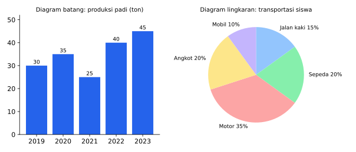
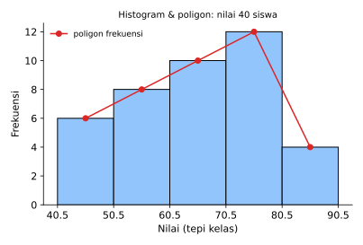

# BAB 9 — DATA (STATISTIKA)

> **Elemen:** Data dan Peluang · **Sub-elemen:** Data
>
> **Cakupan TKA:** penyajian data dalam bentuk diagram batang, diagram garis, diagram lingkaran, grafik, tabel, dan bentuk visual; ukuran pemusatan dan penyebaran data tunggal dan data kelompok.

---

## A. Ringkasan Materi

### A.1 Penyajian Data

| Bentuk | Kegunaan | Hal yang perlu dibaca |
|---|---|---|
| **Tabel** | menyajikan angka secara rinci | judul kolom/baris, satuan |
| **Diagram batang** | membandingkan besar antar-kategori | tinggi batang, skala sumbu |
| **Diagram garis** | melihat perubahan/tren dari waktu ke waktu | naik–turun, kemiringan (kenaikan terbesar = garis paling curam) |
| **Diagram lingkaran** | melihat bagian dari keseluruhan | persentase atau sudut juring |
| **Histogram & poligon** | data kelompok (distribusi frekuensi) | tepi kelas, frekuensi |
| **Ogive** (frekuensi kumulatif) | membaca "berapa banyak yang kurang dari / lebih dari" | nilai kumulatif pada tepi kelas |
| **Diagram batang-daun** | data tunggal yang cukup banyak, tetap terlihat nilai aslinya | batang = puluhan, daun = satuan |
| **Diagram kotak garis** (*box plot*) | melihat sebaran: minimum, $Q_1$, median, $Q_3$, maksimum | panjang kotak = jangkauan antarkuartil |

*Gambar 9.1 — Kiri: diagram batang produksi padi (ton) tahun 2019–2023. Kanan: diagram lingkaran moda transportasi 600 siswa.*

**Diagram lingkaran**

$$\text{Sudut juring} = \frac{\text{frekuensi}}{\text{total}} \times 360^\circ = \text{persentase} \times 360^\circ, \qquad \text{frekuensi} = \frac{\text{sudut}}{360^\circ} \times \text{total}$$

**Persentase perubahan**

$$\text{Persentase kenaikan/penurunan} = \frac{\text{nilai baru} - \text{nilai lama}}{\text{nilai lama}} \times 100\%$$

### A.2 Ukuran Pemusatan Data Tunggal

| Ukuran | Pengertian | Cara |
|---|---|---|
| **Mean** (rata-rata) $\bar{x}$ | jumlah data dibagi banyak data | $\bar{x} = \dfrac{\sum x_i}{n}$; untuk tabel frekuensi $\bar{x} = \dfrac{\sum f_i x_i}{\sum f_i}$ |
| **Median** (Me) | nilai tengah setelah data **diurutkan** | $n$ ganjil: data ke-$\frac{n+1}{2}$; $n$ genap: rata-rata data ke-$\frac{n}{2}$ dan ke-$\left(\frac{n}{2} + 1\right)$ |
| **Modus** (Mo) | nilai yang paling sering muncul | bisa lebih dari satu, atau tidak ada |

> **Contoh.** Data: $5, 8, 6, 7, 8, 9, 4$. Urutkan: $4, 5, 6, 7, 8, 8, 9$.  
> Mean $= \frac{47}{7} \approx 6{,}71$; median $=$ data ke-4 $= 7$; modus $= 8$.

**Rata-rata gabungan**

$$\bar{x}_{\text{gab}} = \frac{n_1 \bar{x}_1 + n_2 \bar{x}_2}{n_1 + n_2}$$

**Menambah atau mengeluarkan data:** kerjakan dengan **jumlah** data, bukan rata-ratanya. Jumlah $= n \times \bar{x}$.

### A.3 Ukuran Letak: Kuartil Data Tunggal

Kuartil membagi data terurut menjadi empat bagian sama banyak. Letak kuartil ke-$i$ ($i = 1, 2, 3$) adalah data ke-$\dfrac{i(n + 1)}{4}$.

- $Q_1$ = kuartil bawah, $Q_2$ = median, $Q_3$ = kuartil atas.
- Cara praktis: cari median dulu; $Q_1$ adalah median dari setengah data bagian bawah, dan $Q_3$ adalah median dari setengah data bagian atas.

> **Contoh.** Data terurut: $2, 4, 5, 7, 8, 10, 12$ ($n = 7$).  
> $Q_2 = $ data ke-4 $= 7$; $Q_1 = $ data ke-2 $= 4$; $Q_3 = $ data ke-6 $= 10$.

### A.4 Ukuran Penyebaran Data Tunggal

| Ukuran | Rumus |
|---|---|
| Jangkauan (*range*) | $J = x_{\max} - x_{\min}$ |
| Jangkauan antarkuartil (hamparan) | $H = Q_3 - Q_1$ |
| Simpangan kuartil | $Q_d = \frac{1}{2}(Q_3 - Q_1)$ |
| Simpangan rata-rata | $SR = \dfrac{\sum \lvert x_i - \bar{x} \rvert}{n}$ |
| Ragam (varians) | $s^2 = \dfrac{\sum (x_i - \bar{x})^2}{n}$ |
| Simpangan baku (standar deviasi) | $s = \sqrt{s^2}$ |

Untuk tabel frekuensi, setiap suku dikalikan frekuensinya: $s^2 = \dfrac{\sum f_i (x_i - \bar{x})^2}{\sum f_i}$.

> **Contoh.** Data: $2, 3, 6, 9, 10$. Rata-rata $= \frac{30}{5} = 6$.  
> Simpangan: $-4, -3, 0, 3, 4$.  
> $SR = \frac{4 + 3 + 0 + 3 + 4}{5} = 2{,}8$; $\ s^2 = \frac{16 + 9 + 0 + 9 + 16}{5} = 10$; $\ s = \sqrt{10}$.

**Pengaruh operasi pada semua data**

| Operasi pada setiap data | Ukuran pemusatan (mean, median, modus) & kuartil | Ukuran penyebaran (jangkauan, $H$, $SR$, $s$) | Ragam $s^2$ |
|---|---|---|---|
| ditambah/dikurangi $c$ | ikut bertambah/berkurang $c$ | **tetap** | tetap |
| dikali $k$ | ikut dikali $k$ | dikali $\lvert k \rvert$ | dikali $k^2$ |

### A.5 Data Kelompok

**Istilah pada tabel distribusi frekuensi** (contoh kelas $51$–$60$):

- Batas bawah $= 51$, batas atas $= 60$.
- Tepi bawah $= 51 - 0{,}5 = 50{,}5$; tepi atas $= 60 + 0{,}5 = 60{,}5$.
- Panjang kelas $p = 60{,}5 - 50{,}5 = 10$.
- Titik tengah $x_i = \frac{51 + 60}{2} = 55{,}5$.

**Rumus-rumus data kelompok**

$$\text{Mean: } \bar{x} = \frac{\sum f_i x_i}{\sum f_i}$$

$$\text{Median: } Me = T_b + \left(\frac{\frac{n}{2} - F}{f}\right) p \qquad \text{Kuartil: } Q_i = T_b + \left(\frac{\frac{i n}{4} - F}{f}\right) p$$

$$\text{Modus: } Mo = T_b + \left(\frac{d_1}{d_1 + d_2}\right) p$$

Keterangan: $T_b$ = tepi bawah kelas yang dimaksud; $F$ = frekuensi kumulatif **sebelum** kelas itu; $f$ = frekuensi kelas itu; $p$ = panjang kelas; $d_1$ = selisih frekuensi kelas modus dengan kelas **sebelumnya**; $d_2$ = selisih frekuensi kelas modus dengan kelas **sesudahnya**.

**Contoh lengkap.** Berat badan 40 siswa:

| Berat (kg) | $f$ | $x_i$ | $f_i x_i$ | $F$ kumulatif |
|:--:|:--:|:--:|:--:|:--:|
| 41–50 | 4 | 45,5 | 182 | 4 |
| 51–60 | 12 | 55,5 | 666 | 16 |
| 61–70 | 10 | 65,5 | 655 | 26 |
| 71–80 | 8 | 75,5 | 604 | 34 |
| 81–90 | 6 | 85,5 | 513 | 40 |
| **Jumlah** | **40** | | **2.620** | |

- **Mean** $= \frac{2\ 620}{40} = 65{,}5$ kg.
- **Median:** letak data ke-$\frac{40}{2} = 20$ → kelas $61$–$70$ (kumulatif 16 → 26). $T_b = 60{,}5$, $F = 16$, $f = 10$:  
  $Me = 60{,}5 + \frac{20 - 16}{10} \times 10 = 64{,}5$ kg.
- **Modus:** kelas dengan frekuensi terbesar $51$–$60$ ($f = 12$). $d_1 = 12 - 4 = 8$, $d_2 = 12 - 10 = 2$:  
  $Mo = 50{,}5 + \frac{8}{8 + 2} \times 10 = 58{,}5$ kg.

**Rataan sementara** (menghemat hitungan): pilih $\bar{x}_s$ (biasanya titik tengah kelas di tengah), lalu $\bar{x} = \bar{x}_s + \dfrac{\sum f_i d_i}{\sum f_i}$ dengan $d_i = x_i - \bar{x}_s$.

---

## B. Tips & Trik

1. **Urutkan data dulu** sebelum mencari median dan kuartil. Ini kesalahan paling sering!
2. **Rata-rata gabungan cepat (metode "neraca"):** jarak rata-rata gabungan ke masing-masing rata-rata berbanding **terbalik** dengan banyak datanya.  
   Contoh: putra rata-rata 60, putri 70, gabungan 66 → jarak 6 dan 4 → putra : putri $= 4 : 6 = 2 : 3$.
3. **Data baru masuk/keluar:** jumlah baru $=$ (banyak data baru) × (rata-rata baru). Nilai data yang masuk = jumlah baru − jumlah lama.
4. **Salah catat:** rata-rata baru $=$ rata-rata lama $+ \dfrac{\text{selisih koreksi}}{n}$.
5. **Pengaruh operasi:** penjumlahan **tidak** mengubah penyebaran; perkalian mengubah semuanya.
6. **Kelas median/kuartil:** cari dengan frekuensi kumulatif; $F$ adalah kumulatif **sebelum** kelas tersebut.
7. **Modus data kelompok:** jika kelas modus berada di ujung tabel, frekuensi kelas "tetangga" yang tidak ada dianggap 0.
8. **Diagram lingkaran:** $1\% = 3{,}6^\circ$; $10\% = 36^\circ$; $25\% = 90^\circ$.
9. **Diagram garis/batang:** "kenaikan terbesar" (dalam satuan) berbeda dengan "persentase kenaikan terbesar". Baca pertanyaannya dengan teliti.
10. **Soal HOTS "nilai maksimum/minimum yang mungkin":** buat data lain sekecil (atau sebesar) mungkin dengan tetap memenuhi syarat (berbeda, bulat, median tertentu).

---

## C. Latihan Soal

### Bagian I — Pilihan Ganda

**1.** Diketahui data: $3, 5, 6, 6, 6, 8, 9, 10, 10, 7$. Rata-rata, median, dan modus data tersebut berturut-turut adalah ….

- A. $6{,}5$; $7$; $6$
- B. $7$; $6{,}5$; $6$
- C. $7$; $6$; $6{,}5$
- D. $7$; $7$; $6$
- E. $6$; $6{,}5$; $7$

**2.** Rata-rata nilai 30 siswa kelas A adalah 70, sedangkan rata-rata nilai 20 siswa kelas B adalah 80. Rata-rata nilai gabungan kedua kelas adalah ….

- A. $72$
- B. $75$
- C. $76$
- D. $74$
- E. $78$

**3.** Rata-rata nilai 10 siswa adalah 65. Setelah nilai Budi dimasukkan, rata-ratanya menjadi 66. Nilai Budi adalah ….

- A. $76$
- B. $66$
- C. $70$
- D. $75$
- E. $77$

**4.** Sekumpulan data memiliki rata-rata 12 dan simpangan baku 3. Jika setiap data dikali 2 lalu dikurangi 5, rata-rata dan simpangan baku data baru berturut-turut adalah ….

- A. 19 dan 1
- B. 24 dan 6
- C. 19 dan 6
- D. 19 dan 3
- E. 7 dan 6

**5.** Hasil survei olahraga favorit 480 siswa disajikan dalam diagram lingkaran. Juring untuk futsal memiliki sudut $108^\circ$. Banyak siswa yang menyukai futsal adalah ….

- A. $108$
- B. $120$
- C. $136$
- D. $160$
- E. $144$

**6.** Perhatikan tabel berikut.

| Nilai | 5 | 6 | 7 | 8 | 9 |
|:--:|:--:|:--:|:--:|:--:|:--:|
| Frekuensi | 3 | 5 | 8 | 6 | 3 |

Median data tersebut adalah ….

- A. $6$
- B. $7$
- C. $6{,}5$
- D. $7{,}5$
- E. $8$

**7.** Simpangan kuartil dari data $12, 15, 9, 20, 18, 11, 14, 16, 10, 22, 13$ adalah ….

- A. $3{,}5$
- B. $3$
- C. $7$
- D. $13$
- E. $14$

**8.** Simpangan baku dari data $4, 6, 8, 10, 12$ adalah ….

- A. $2$
- B. $4$
- C. $8$
- D. $2\sqrt{2}$
- E. $\sqrt{10}$

**9.** Simpangan rata-rata dari data $3, 5, 6, 7, 9$ adalah ….

- A. $1{,}2$
- B. $2$
- C. $1{,}6$
- D. $2{,}4$
- E. $8$

*Untuk soal nomor 10–13, perhatikan tabel dan Gambar 9.2 berikut.*

| Nilai | 41–50 | 51–60 | 61–70 | 71–80 | 81–90 |
|:--:|:--:|:--:|:--:|:--:|:--:|
| Frekuensi | 6 | 8 | 10 | 12 | 4 |

*Gambar 9.2 — Histogram dan poligon frekuensi nilai ujian 40 siswa.*

**10.** Rata-rata nilai pada tabel tersebut adalah ….

- A. $63{,}5$
- B. $64{,}5$
- C. $66{,}5$
- D. $67{,}5$
- E. $65{,}5$

**11.** Median nilai pada tabel tersebut adalah ….

- A. $65{,}5$
- B. $66{,}5$
- C. $67{,}5$
- D. $68{,}5$
- E. $70{,}5$

**12.** Modus nilai pada tabel tersebut adalah ….

- A. $70{,}5$
- B. $71{,}5$
- C. $73{,}5$
- D. $72{,}5$
- E. $75{,}5$

**13.** Kuartil atas ($Q_3$) nilai pada tabel tersebut adalah ….

- A. $75{,}5$
- B. $74{,}5$
- C. $76{,}5$
- D. $77{,}5$
- E. $80{,}5$

*Untuk soal nomor 14–15, perhatikan diagram batang pada Gambar 9.1 (produksi padi: 2019 = 30 ton, 2020 = 35 ton, 2021 = 25 ton, 2022 = 40 ton, 2023 = 45 ton).*

**14.** Persentase kenaikan produksi padi terbesar terjadi pada periode ….

- A. 2019 ke 2020
- B. 2020 ke 2021
- C. 2021 ke 2022
- D. 2022 ke 2023
- E. semua periode sama

**15.** Rata-rata produksi padi per tahun selama lima tahun tersebut adalah … ton.

- A. $30$
- B. $32$
- C. $33$
- D. $40$
- E. $35$

**16.** Rata-rata 20 data adalah 50. Ternyata ada satu data yang salah dicatat sebagai 45, padahal seharusnya 65. Rata-rata yang benar adalah ….

- A. $49$
- B. $51$
- C. $50$
- D. $52$
- E. $55$

**17.** Lima bilangan bulat positif yang **berbeda** memiliki rata-rata 6 dan median 5. Nilai terbesar yang mungkin untuk bilangan terbesar adalah ….

- A. $12$
- B. $14$
- C. $15$
- D. $16$
- E. $18$

**18.** Data berat badan 40 siswa disajikan dalam tabel frekuensi kumulatif (ogive) berikut.

| Berat badan (kg) | $< 40{,}5$ | $< 45{,}5$ | $< 50{,}5$ | $< 55{,}5$ | $< 60{,}5$ | $< 65{,}5$ |
|:--:|:--:|:--:|:--:|:--:|:--:|:--:|
| Frekuensi kumulatif | 0 | 5 | 13 | 25 | 35 | 40 |

Banyak siswa yang berat badannya lebih dari 50,5 kg adalah ….

- A. $27$
- B. $12$
- C. $13$
- D. $25$
- E. $35$

**19.** Rata-rata nilai ulangan siswa putra 60 dan siswa putri 70. Rata-rata nilai seluruh siswa 66. Perbandingan banyak siswa putra dan putri adalah ….

- A. $3 : 2$
- B. $1 : 2$
- C. $2 : 3$
- D. $3 : 4$
- E. $4 : 3$

**20.** Rata-rata nilai 40 siswa adalah 62. Setelah 4 siswa yang mengikuti ujian susulan ditambahkan, rata-rata nilai seluruh siswa menjadi 63. Rata-rata nilai keempat siswa tersebut adalah ….

- A. $70$
- B. $72$
- C. $75$
- D. $80$
- E. $73$

### Bagian II — Pilihan Ganda Kompleks (jawaban benar bisa lebih dari satu)

**21.** Diketahui data: $2, 3, 3, 5, 7, 8, 8, 8, 10$. Pernyataan yang benar adalah ….

- ☐ (1) Rata-ratanya 6.
- ☐ (2) Mediannya 5.
- ☐ (3) Modusnya 8.
- ☐ (4) Jangkauannya 8.
- ☐ (5) Rata-ratanya lebih besar daripada median.

**22.** Setiap nilai pada sekumpulan data ditambah 5. Pernyataan yang benar adalah ….

- ☐ (1) Rata-ratanya bertambah 5.
- ☐ (2) Mediannya bertambah 5.
- ☐ (3) Jangkauannya bertambah 5.
- ☐ (4) Simpangan bakunya tetap.
- ☐ (5) Ragamnya bertambah 25.

**23.** Penjualan buku sebuah toko (dalam eksemplar) pada Januari–Mei berturut-turut adalah 120, 150, 90, 180, dan 160. Pernyataan yang benar adalah ….

- ☐ (1) Total penjualan lima bulan itu 700 eksemplar.
- ☐ (2) Rata-rata penjualan per bulan 150 eksemplar.
- ☐ (3) Kenaikan penjualan terbesar terjadi dari Maret ke April.
- ☐ (4) Penjualan dari Februari ke Maret turun 40%.
- ☐ (5) Median data penjualan tersebut 160 eksemplar.

**24.** Yang termasuk ukuran **penyebaran** data adalah ….

- ☐ (1) jangkauan
- ☐ (2) simpangan baku
- ☐ (3) median
- ☐ (4) ragam
- ☐ (5) modus

**25.** Perhatikan tabel nilai 40 siswa pada soal nomor 10–13. Pernyataan yang benar adalah ….

- ☐ (1) Panjang kelasnya 10.
- ☐ (2) Kelas modusnya adalah kelas 71–80.
- ☐ (3) Median terletak pada kelas 61–70.
- ☐ (4) Tepi bawah kelas 51–60 adalah 51.
- ☐ (5) Titik tengah kelas 81–90 adalah 85,5.

### Bagian III — Benar atau Salah

**26.** Perhatikan diagram lingkaran pada Gambar 9.1 tentang moda transportasi 600 siswa (jalan kaki 15%, sepeda 20%, motor 35%, angkot 20%, mobil 10%).

| | Pernyataan | B | S |
|:--:|---|:--:|:--:|
| a | Banyak siswa yang naik angkot 120 orang. | ☐ | ☐ |
| b | Banyak siswa yang naik motor 210 orang. | ☐ | ☐ |
| c | Sudut juring untuk sepeda $72^\circ$. | ☐ | ☐ |
| d | Selisih banyak siswa pengguna motor dan mobil adalah 100 orang. | ☐ | ☐ |

**27.** Diketahui data: $4, 5, 7, 8, 11$.

| | Pernyataan | B | S |
|:--:|---|:--:|:--:|
| a | Rata-ratanya 7. | ☐ | ☐ |
| b | Ragamnya 6. | ☐ | ☐ |
| c | Simpangan rata-ratanya 2,5. | ☐ | ☐ |
| d | Simpangan bakunya $\sqrt{6}$. | ☐ | ☐ |

**28.** Rata-rata tinggi 15 siswa putri adalah 155 cm dan rata-rata tinggi 25 siswa putra adalah 163 cm.

| | Pernyataan | B | S |
|:--:|---|:--:|:--:|
| a | Rata-rata tinggi seluruh siswa 160 cm. | ☐ | ☐ |
| b | Jumlah tinggi seluruh siswa putri 2.235 cm. | ☐ | ☐ |
| c | Rata-rata gabungan lebih dekat ke rata-rata putra karena siswa putra lebih banyak. | ☐ | ☐ |
| d | Jika seorang siswa putra bertinggi 163 cm keluar, rata-rata tinggi seluruh siswa tetap 160 cm. | ☐ | ☐ |

**29.** Perhatikan kembali tabel nilai 40 siswa pada soal nomor 10–13.

| | Pernyataan | B | S |
|:--:|---|:--:|:--:|
| a | Rata-ratanya 66,5. | ☐ | ☐ |
| b | Kuartil bawahnya ($Q_1$) 55,5. | ☐ | ☐ |
| c | Modusnya lebih kecil daripada median. | ☐ | ☐ |
| d | Jangkauan antarkuartilnya 20. | ☐ | ☐ |

### Bagian IV — Isian Singkat

**30.** Perhatikan tabel nilai 40 siswa pada soal nomor 10–13. Jika nilai 20% siswa terendah dinyatakan "perlu remedial", maka batas nilai remedial (desil ke-2, $D_2$) adalah ….  
*Petunjuk: $D_i = T_b + \left(\frac{\frac{i n}{10} - F}{f}\right) p$.*

**31.** Simpangan baku dari data $5, 7, 8, 9, 11$ adalah ….

**32.** Rata-rata 4 bilangan adalah 10 dan rata-rata 6 bilangan lainnya adalah 15. Rata-rata kesepuluh bilangan tersebut adalah ….

**33.** Perhatikan tabel berikut.

| Nilai | 4 | 5 | 6 | 7 | 8 |
|:--:|:--:|:--:|:--:|:--:|:--:|
| Frekuensi | 2 | 5 | 6 | 5 | 2 |

Ragam (varians) data tersebut adalah ….

---

## D. Kunci Jawaban dan Pembahasan

### Kunci Ringkas

| No | Kunci | No | Kunci | No | Kunci | No | Kunci |
|:--:|:--:|:--:|:--:|:--:|:--:|:--:|:--:|
| 1 | B | 10 | E | 19 | C | 28 | B, S, B, S |
| 2 | D | 11 | B | 20 | E | 29 | S, B, S, B |
| 3 | A | 12 | D | 21 | (1), (3), (4) | 30 | 53 |
| 4 | C | 13 | A | 22 | (1), (2), (4) | 31 | 2 |
| 5 | E | 14 | C | 23 | (1), (3), (4) | 32 | 13 |
| 6 | B | 15 | E | 24 | (1), (2), (4) | 33 | 1,3 |
| 7 | A | 16 | B | 25 | (1), (2), (3), (5) | | |
| 8 | D | 17 | D | 26 | B, B, B, S | | |
| 9 | C | 18 | A | 27 | B, B, S, B | | |

### Pembahasan

**1. Jawaban: B**  
Jumlah $= 3 + 5 + 6 + 6 + 6 + 8 + 9 + 10 + 10 + 7 = 70$, sehingga rata-rata $= \frac{70}{10} = 7$.  
Urutkan: $3, 5, 6, 6, 6, 7, 8, 9, 10, 10$. Median $= \frac{6 + 7}{2} = 6{,}5$ (data ke-5 dan ke-6). Modus $= 6$ (muncul 3 kali).

**2. Jawaban: D**  
$\bar{x} = \dfrac{30(70) + 20(80)}{50} = \dfrac{2\ 100 + 1\ 600}{50} = \dfrac{3\ 700}{50} = 74$.

**3. Jawaban: A**  
Jumlah awal $= 10 \times 65 = 650$. Jumlah baru $= 11 \times 66 = 726$. Nilai Budi $= 726 - 650 = 76$.

**4. Jawaban: C**  
Rata-rata: $2(12) - 5 = 19$. Simpangan baku hanya terpengaruh perkalian: $2 \times 3 = 6$ (pengurangan 5 tidak berpengaruh).

**5. Jawaban: E**  
$\dfrac{108^\circ}{360^\circ} \times 480 = 0{,}3 \times 480 = 144$ siswa.

**6. Jawaban: B**  
$n = 3 + 5 + 8 + 6 + 3 = 25$ (ganjil) → median $=$ data ke-13.  
Frekuensi kumulatif: nilai 5 → 3, nilai 6 → 8, nilai 7 → 16. Data ke-13 berada pada nilai 7.

**7. Jawaban: A**  
Urutkan: $9, 10, 11, 12, 13, 14, 15, 16, 18, 20, 22$ ($n = 11$).  
$Q_1 = $ data ke-$\frac{12}{4} = 3$ → $11$. $Q_3 = $ data ke-$\frac{36}{4} = 9$ → $18$.  
$Q_d = \frac{1}{2}(18 - 11) = 3{,}5$.

**8. Jawaban: D**  
$\bar{x} = 8$. $s^2 = \frac{16 + 4 + 0 + 4 + 16}{5} = 8$, sehingga $s = \sqrt{8} = 2\sqrt{2}$.

**9. Jawaban: C**  
$\bar{x} = \frac{30}{5} = 6$. Selisih mutlak: $3, 1, 0, 1, 3$ (jumlah 8). $SR = \frac{8}{5} = 1{,}6$.

**10. Jawaban: E**

| Kelas | $f$ | $x_i$ | $f_i x_i$ | $F$ kum. |
|:--:|:--:|:--:|:--:|:--:|
| 41–50 | 6 | 45,5 | 273 | 6 |
| 51–60 | 8 | 55,5 | 444 | 14 |
| 61–70 | 10 | 65,5 | 655 | 24 |
| 71–80 | 12 | 75,5 | 906 | 36 |
| 81–90 | 4 | 85,5 | 342 | 40 |
| Jumlah | 40 | | 2.620 | |

$\bar{x} = \frac{2\ 620}{40} = 65{,}5$.

**11. Jawaban: B**  
Letak median: data ke-20 → kelas 61–70 (kumulatif 14 → 24).  
$Me = 60{,}5 + \dfrac{20 - 14}{10} \times 10 = 60{,}5 + 6 = 66{,}5$.

**12. Jawaban: D**  
Kelas modus: 71–80 ($f = 12$). $d_1 = 12 - 10 = 2$, $d_2 = 12 - 4 = 8$.  
$Mo = 70{,}5 + \dfrac{2}{2 + 8} \times 10 = 70{,}5 + 2 = 72{,}5$.

**13. Jawaban: A**  
Letak $Q_3$: data ke-$\frac{3 \times 40}{4} = 30$ → kelas 71–80 (kumulatif 24 → 36).  
$Q_3 = 70{,}5 + \dfrac{30 - 24}{12} \times 10 = 70{,}5 + 5 = 75{,}5$.

**14. Jawaban: C**
- 2019→2020: $\frac{5}{30} \approx 16{,}7\%$
- 2020→2021: turun $\frac{10}{35} \approx 28{,}6\%$
- 2021→2022: $\frac{15}{25} = 60\%$ ← terbesar
- 2022→2023: $\frac{5}{40} = 12{,}5\%$

**15. Jawaban: E**  
$\frac{30 + 35 + 25 + 40 + 45}{5} = \frac{175}{5} = 35$ ton.

**16. Jawaban: B**  
Jumlah lama $= 20 \times 50 = 1\ 000$. Jumlah benar $= 1\ 000 - 45 + 65 = 1\ 020$. Rata-rata $= \frac{1\ 020}{20} = 51$.  
*Cara cepat:* $50 + \frac{65 - 45}{20} = 50 + 1 = 51$.

**17. Jawaban: D**  
Jumlah $= 5 \times 6 = 30$. Urutkan $a < b < 5 < d < e$.  
Agar $e$ maksimum, buat $a$, $b$, $d$ sekecil mungkin: $a = 1$, $b = 2$, $d = 6$.  
$e = 30 - (1 + 2 + 5 + 6) = 16$.

**18. Jawaban: A**  
Siswa dengan berat kurang dari 50,5 kg ada 13 orang. Yang lebih dari 50,5 kg: $40 - 13 = 27$.

**19. Jawaban: C**  
Misal banyak putra $p$ dan putri $q$: $60p + 70q = 66(p + q) \Rightarrow 4q = 6p \Rightarrow p : q = 4 : 6 = 2 : 3$.  
*Metode neraca:* jarak ke gabungan: putra $66 - 60 = 6$, putri $70 - 66 = 4$ → banyak siswa berbanding terbalik: $4 : 6 = 2 : 3$.

**20. Jawaban: E**  
Jumlah lama $= 40 \times 62 = 2\ 480$. Jumlah baru $= 44 \times 63 = 2\ 772$.  
Jumlah nilai 4 siswa $= 292$ → rata-rata $= \frac{292}{4} = 73$.

**21. Jawaban: (1), (3), (4)**  
Jumlah $= 54$, $n = 9$ → rata-rata $6$ ✔. Median $=$ data ke-5 $= 7$ ✘. Modus $8$ ✔. Jangkauan $10 - 2 = 8$ ✔. Rata-rata ($6$) **lebih kecil** daripada median ($7$) ✘.

**22. Jawaban: (1), (2), (4)**  
Penjumlahan menggeser semua ukuran pemusatan, tetapi **tidak** mengubah ukuran penyebaran (jangkauan, simpangan baku, ragam).

**23. Jawaban: (1), (3), (4)**
- (1) $120 + 150 + 90 + 180 + 160 = 700$ ✔
- (2) $\frac{700}{5} = 140$ ✘
- (3) Maret→April naik $90$ (terbesar); Januari→Februari naik $30$ ✔
- (4) $\frac{150 - 90}{150} = 40\%$ ✔
- (5) Urutkan: $90, 120, 150, 160, 180$ → median $150$ ✘

**24. Jawaban: (1), (2), (4)**  
Median dan modus adalah ukuran **pemusatan**.

**25. Jawaban: (1), (2), (3), (5)**  
Tepi bawah kelas 51–60 adalah $50{,}5$, bukan $51$ ✘ (51 adalah batas bawah).

**26. Jawaban: a. B, b. B, c. B, d. S**
- a. $20\% \times 600 = 120$ ✔
- b. $35\% \times 600 = 210$ ✔
- c. $20\% \times 360^\circ = 72^\circ$ ✔
- d. Mobil $= 10\% \times 600 = 60$; selisih $= 210 - 60 = 150$ ✘

**27. Jawaban: a. B, b. B, c. S, d. B**  
$\bar{x} = \frac{35}{5} = 7$ ✔. Simpangan: $-3, -2, 0, 1, 4$.  
Ragam $= \frac{9 + 4 + 0 + 1 + 16}{5} = 6$ ✔. $SR = \frac{3 + 2 + 0 + 1 + 4}{5} = 2$, bukan $2{,}5$ ✘. Simpangan baku $= \sqrt{6}$ ✔.

**28. Jawaban: a. B, b. S, c. B, d. S**
- a. $\dfrac{15(155) + 25(163)}{40} = \dfrac{2\ 325 + 4\ 075}{40} = \dfrac{6\ 400}{40} = 160$ ✔
- b. $15 \times 155 = 2\ 325$, bukan $2\ 235$ ✘
- c. ✔ (rata-rata gabungan adalah rata-rata berbobot)
- d. $\dfrac{6\ 400 - 163}{39} = \dfrac{6\ 237}{39} \approx 159{,}9$ — berubah, karena data yang keluar tidak sama dengan rata-rata ✘

**29. Jawaban: a. S, b. B, c. S, d. B**  
Dari pembahasan nomor 10–13: rata-rata $= 65{,}5$ (a ✘), median $= 66{,}5$, modus $= 72{,}5$, $Q_3 = 75{,}5$.  
$Q_1$: letak data ke-10 → kelas 51–60 (kumulatif 6 → 14): $50{,}5 + \frac{10 - 6}{8} \times 10 = 55{,}5$ ✔.  
Modus ($72{,}5$) **lebih besar** daripada median ✘. $H = 75{,}5 - 55{,}5 = 20$ ✔.

**30. Jawaban: 53**  
Letak $D_2$: data ke-$\frac{2 \times 40}{10} = 8$ → kelas 51–60 (kumulatif 6 → 14).  
$D_2 = 50{,}5 + \dfrac{8 - 6}{8} \times 10 = 50{,}5 + 2{,}5 = 53$.

**31. Jawaban: 2**  
$\bar{x} = \frac{40}{5} = 8$. Simpangan: $-3, -1, 0, 1, 3$.  
$s^2 = \frac{9 + 1 + 0 + 1 + 9}{5} = 4$, sehingga $s = 2$.

**32. Jawaban: 13**  
$\dfrac{4(10) + 6(15)}{10} = \dfrac{40 + 90}{10} = 13$.

**33. Jawaban: 1,3**  
$n = 20$. Data simetris terhadap 6, sehingga $\bar{x} = 6$ (cek: $\frac{8 + 25 + 36 + 35 + 16}{20} = \frac{120}{20} = 6$).  
$\sum f(x - \bar{x})^2 = 2(4) + 5(1) + 6(0) + 5(1) + 2(4) = 26$.  
Ragam $= \frac{26}{20} = 1{,}3$.
